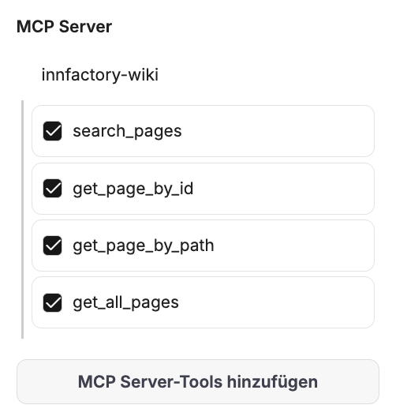
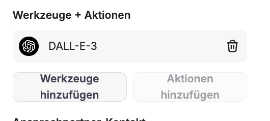
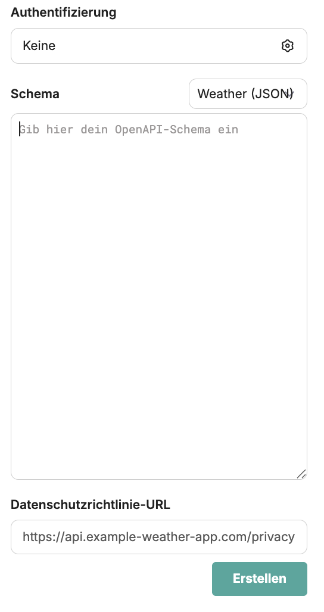
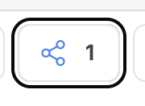
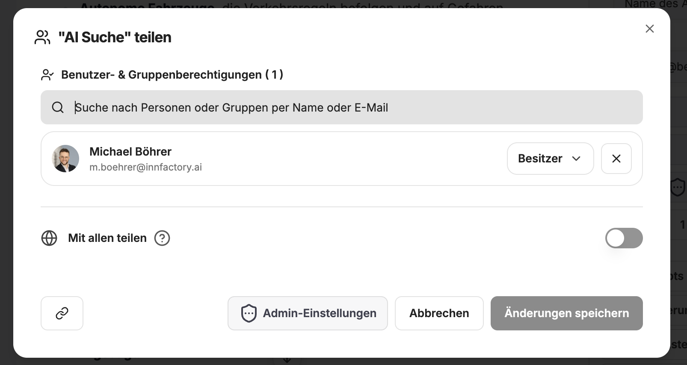
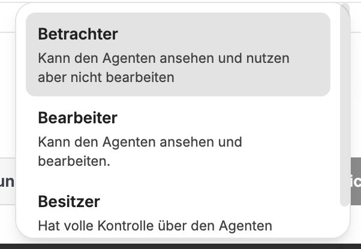

Agenten im CompanyGPT sind fortgeschrittene Systeme, die dafür ausgelegt sind, mehr als nur Text zu generieren. Sie analysieren die Anfrage des Benutzers, erstellen einen Plan zur Erledigung, benutzen Werkzeuge (Tools), um Informationen zu beschaffen und die Anfrage zu beantworten.

Fähigkeiten:
- **Reasoning**: Können komplexe Probleme in kleinere Einheiten zerlegen und bearbeiten
- **Tool Usage**: Können entscheiden, welche Tools für welche Aufgabe genutzt werden sollen
- **Action**: Können Tools ausführen, um Informationen zu beschaffen

## Bestandteile von Agenten

### Name und Beschreibung

Agenten sollten immer einen Namen haben, da sie über den Namen in der Modellauswahl ausgewählt werden können. Zusätzlich kann eine Beschreibung hinterlegt werden, die zusätzliche Informationen bietet.

### Kategorie

Jeder Agent kann einer Kategorie zugewiesen werden. Sollten Agenten innerhalb des Unternehmens zwischen Nutzern geteilt werden und der Agent Marketplace genutzt werden, kann dort nach Kategorien gefiltert werden.

### Anweisungen

Die Anweisungen sind der eigentliche Prompt des Agenten. Dieser beschreibt, was der Agent zu tun hat, wie er auftreten soll, usw. Informationen zu effektivem Prompting für Agenten finden Sie hier: [Prompt Engineering](../prompt-engineering/uebersicht.md). Besonders bei Agenten bietet es sich an, strukturierte und sauber formatierte Prompts zu verwenden. 

Es können außerdem Variablen wie das aktuelle Datum, die Uhrzeit oder der aktuelle Nutzer übergeben werden.

### KI Modell

Das KI Modell ist das Gehirn jedes Agenten, da es die Anfragen analysiert, die Tools auswählt und die Ergebnisse auswertet, zusammenfasst und zurückgibt. Hier kann der Ersteller zwischen allen verfügbaren Modellen wählen.

Zusätzlich zum Modell können die KI Parameter angepasst werden. Die ausführliche Beschreibung finden Sie hier: [KI Einstellungen](./ki-einstellungen.md)

### Fähigkeiten 

Jeder Agent hat eingebaute Fähigkeiten, die bei Bedarf aktiviert werden können. 

#### Websuche 

Gibt an, ob die Websuche für diesen Agenten aktiviert ist oder nicht. Die Informationen zur Websuche finden Sie hier: [Websuche](./integrationen/websuche.md).

#### Datei-Kontext (OCR)

Als „Kontext“ hochgeladene Dateien werden mit OCR verarbeitet, um Text zu extrahieren, der dann den Anweisungen des Agenten hinzugefügt wird. Ideal für Dokumente, Bilder mit Text oder PDFs, wenn Sie den vollständigen Textinhalt einer Datei benötigen. 

:::tip
Kontextdokumente sind immer vollständig im Kontext des Agenten / der Konversation. Hier sollten Sie sich auf das Wesentliche begrenzen, z.B. Anweisungen zur Tonalität oder vergangene Beispiele. Für sehr lange Dokumente könnte die **Dateisuche** besser geeignet sein.
:::

#### Artefakte

Aktiviert die Verwendung von Code-Artefakten für diesen Agenten. Standardmäßig werden zusätzliche, spezielle Anweisungen für die Nutzung von Artefakten hinzugefügt, es sei denn, der "Benutzerdefinierte Prompt-Modus" ist aktiviert.

Mehr Informationen zu Artefakten finden Sie hier: [Artefakte](./integrationen/artefakte.md).

#### Dateisuche

Wenn aktiviert, wird der Agent über die unten aufgelisteten exakten Dateinamen informiert und kann dadurch relevante Informationen aus diesen Dateien abrufen. Das Abrufen funktioniert als **RAG (Retrieval Augmented Generation)** mittels Ähnlichkeitssuche zwischen Abfrage und Inhalten. Dabei werden immer nur die relevanten Textstellen genutzt. Im Gegensatz hierzu steht der **Datei-Kontext**, bei dem immer der gesamte Inhalt im Kontext ist.

Weitere Informationen unter [Prompt Engineering / RAG](/prompt-engineering/prompt-techniken/rag)

#### MCP Server 

MCP Server Tools können pro Agent spezifiziert werden, auch welche Tools aus dem MCP Server der Agent nutzen kann.

#### Werkzeuge und Aktionen

Werkzeuge sind eingebaute Tools, die vom Agenten genutzt werden können. Diese können natürlich mit MCP-Tools kombiniert werden.

Aktionen sind externe API-Schnittstellen, die direkt über [OpenAPI kompatible Schemas](https://spec.openapis.org/oas/latest.html) angebunden werden können. 

:::tip
Diese Funktionalität ist sehr fortgeschritten, aber auch veraltet; besser ist es, API-Endpunkte über eigene MCP Server anzubinden.
:::

#### Kontaktdaten

Jeder Agent kann mit Kontaktdaten zum Ersteller versehen werden, was nützlich ist für Feedback bei geteilten Agenten.

### Erweiterte Einstellungen

#### Maximale Agentenschritte

Begrenzt, wie viele Schritte der Agent in einem Durchlauf ausführen kann, bevor er eine endgültige Antwort gibt. Der Standardwert ist 25 Schritte. Ein Schritt ist entweder eine KI-API-Anfrage oder eine Werkzeugnutzungsrunde. Eine einfache Werkzeuginteraktion umfasst beispielsweise 3 Schritte: die ursprüngliche Anfrage, die Werkzeugnutzung und die Folgeanfrage.

#### Agenten-Ketten

Ermöglicht das Erstellen von Agenten-Sequenzen. Jeder Agent kann auf die Ausgaben vorheriger Agenten in der Kette zugreifen. Basiert auf der "Mixture-of-Agents"-Architektur, bei der Agenten vorherige Ausgaben als zusätzliche Informationen verwenden.

### Version

Jedes Mal, wenn Änderungen an einem Agenten gespeichert werden, wird eine Version erzeugt. Über die Versionsanzeige können diese Versionen angezeigt und widerrufen werden. Das ist sinnvoll, wenn man Änderungen widerrufen möchte.

## Admin Einstellungen

Ein Admin-Benutzer kann einstellen, welche Rechte für **Admins** und **User** gelten:

- Teilen von Agenten erlaubt: `JA` oder `NEIN`
- Erlaube Agenten zu erstellen: `JA` oder `NEIN`
- Verwendung von Agenten erlauben: `JA` oder `NEIN`

## Teilen von Agenten

Wenn der Benutzer die entsprechenden Rechte hat, kann dieser Agenten teilen. Dazu muss auf den Teilen-Button neben dem Speichern-Button geklickt werden.

Dabei kann ausgesucht werden, ob der Agent global, mit bestimmten Nutzern oder Nutzergruppen geteilt werden soll.

Dabei kann ausgewählt werden, mit welchen Rechten die anderen Benutzer auf den Agenten zugreifen können.

