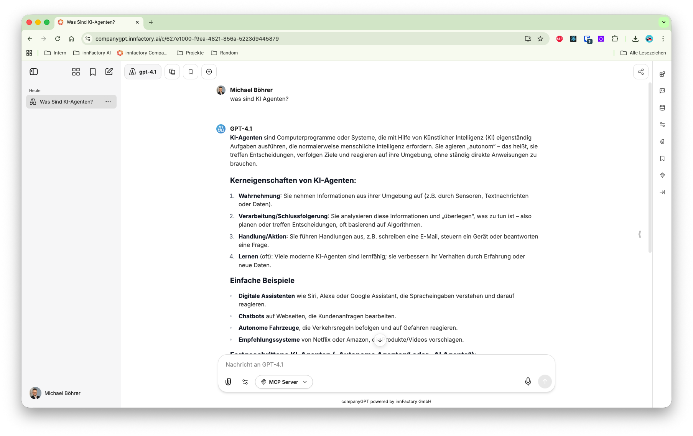

Der Chat ist das Hauptinterface zur Kommunikation mit den unterschiedlichen Sprachmodellen und Agenten.

Neben der eigentlichen Prompteingabe kann der Kontext zusätzlich erweitert werden durch:
- Websuche
- Dateisuche
- Artefakte
- MCP Server 