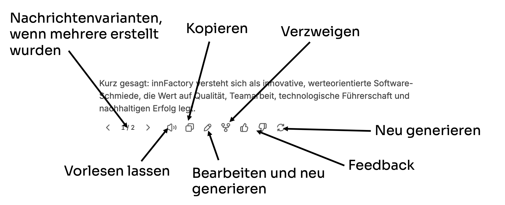
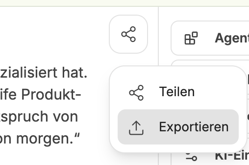
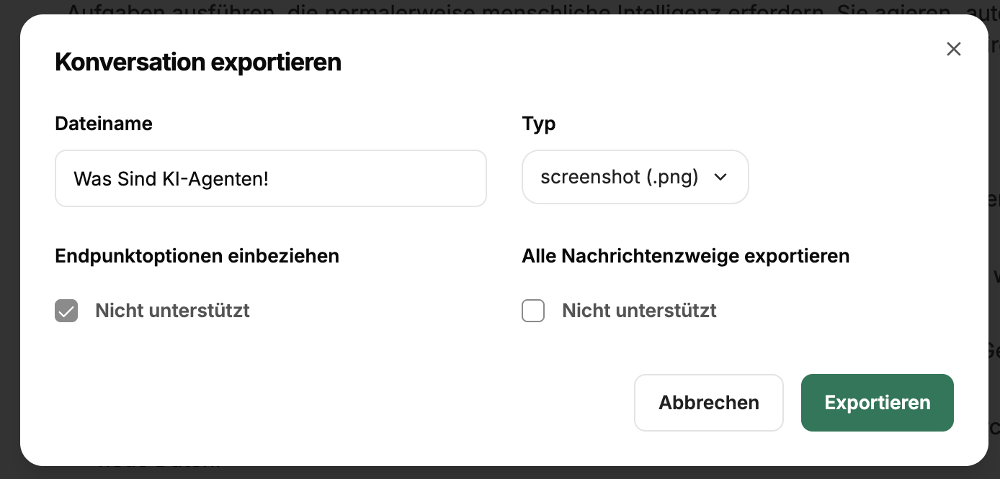

Der Chat ist das Hauptinterface zur Kommunikation mit den unterschiedlichen Sprachmodellen und Agenten.

:::caution[Immer zu beachten]
Alle im aktuellen Chat befindlichen Nachrichten und Dateien sind immer Teil des Kontextes. Es lohnt sich daher, für jedes Thema einen eigenen Chat zu verwenden.
:::

## Prompteingabe

Die Eingabe von Chatnachrichten bzw. Prompts erfolgt über das Eingabefeld.

:::tip
Informationen zum Prompt Engineering und Promptanleitungen finden Sie hier: [Prompt Engineering](/prompt-engineering/uebersicht)
:::

## Integrationen

Neben der eigentlichen Prompteingabe kann der Kontext zusätzlich erweitert werden durch:
- [Websuche](/company-gpt/integrationen/websuche)
- [Dateisuche](/company-gpt/integrationen/dateisuche)
- [Artefakte](/company-gpt/integrationen/artefakte)
- [MCP Server](/company-gpt/integrationen/mcp-server)

Diese können im jeweiligen Chat für einzelne Nachrichten aktiviert oder deaktiviert werden.

## Nachrichten

Der Nachrichtenverlauf entwickelt sich mit der Zeit innerhalb der Konversation zwischen User und KI-Modell(en). Der Benutzer kann nach jeder Nachricht ein anderes Modell oder einen anderen Agenten nutzen, welche natürlich immer den gesamten vorherigen Kontext bekommen. 

### Nachrichtenoptionen

Im Chat befindliche Nachrichten haben Schnellaktionen:

- **Neu generieren** und **Nachrichtenvarianten**: Über `Neu generieren` können mehrere Antwortvarianten generiert werden, zwischen denen umgeschalten werden kann.
- **Vorlesen**: Über [Text-zu-Sprache](/company-gpt/einstellungen/#text-zu-sprache) kann die Nachricht über die eingestellte Engine vorgelesen werden.
- **Kopieren**: Kopiert den gesamten Inhalt der Nachricht in die Zwischenablage.
- **Bearbeiten und neu generieren**: Die Nachricht kann nachträglich noch bearbeitet und entweder gespeichert oder mit Änderungen neu generiert werden. Das ist sinnvoll, wenn man dem Kontext noch Informationen hinzufügen oder ändern möchte.
- **Verzweigen**: Ermöglicht es, an einem bestimmten Punkt eine neue Konversation mit allen vorangegangenen Nachrichten abzuzweigen. Das ist hilfreich, wenn man beispielsweise in unterschiedliche Richtungen denken möchte.
- **Feedback**: Feedback zu Nachrichten bleibt nur im Kontext erhalten, so kann der Benutzer aber signalisieren, ob eine Nachricht gut war oder nicht.

## Teilen und Exportieren

Nachrichtenverläufe können öffentlich geteilt oder in unterschiedliche Dateiformate exportiert werden. 

### Teilen 

Nachrichtenverläufe können über Links geteilt werden. Dazu wird ein anonymisierter, öffentlich verfügbarer Link generiert, der von jedem abgerufen werden kann. Außerdem kann auch noch ein QR-Code erstellt werden. 

:::caution
"Öffentlich" versteht hier die gleiche Sichtbarkeit wie der CompanyGPT. Sollte der CompanyGPT nur aus dem Firmennetzwerk erreichbar sein, bedeutet "öffentlich" auch nur im Firmennetzwerk.
:::

### Export

Nachrichtenverläufe können auch exportiert werden. Das hat den Vorteil, dass sie in unterschiedlichen Formaten als Datei gespeichert werden können. Verläufe im JSON-Format können ebenfalls wieder [importiert](../einstellungen/#konversationen-importieren) werden.

Für den Export muss ein Dateiname sowie das Format ausgewählt werden.

Außerdem können, je nach Dateiformat folgende Einstellungen getätigt werden: 
- **Endpunktoptionen einbeziehen**: Die Modellnamen werden in den Informationen mitgespeichert.
- **Alle Nachrichtenzweige exportieren**: Falls Verzweigungen bestehen, können diese mitexportiert werden.
- **Sequenziell oder Rekursiv** (nur JSON): Darstellung der Nachrichten innerhalb des JSON-Objekts, entweder als flache Liste von Nachrichten oder als rekursive Liste mit verschachtelten Nachrichten.