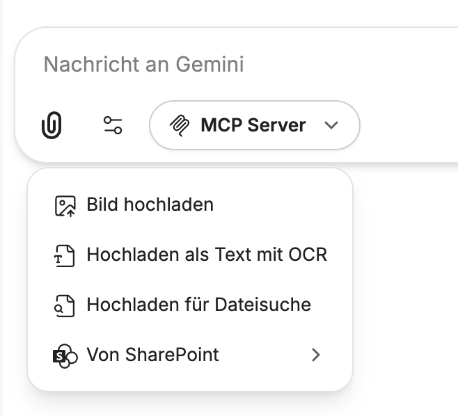
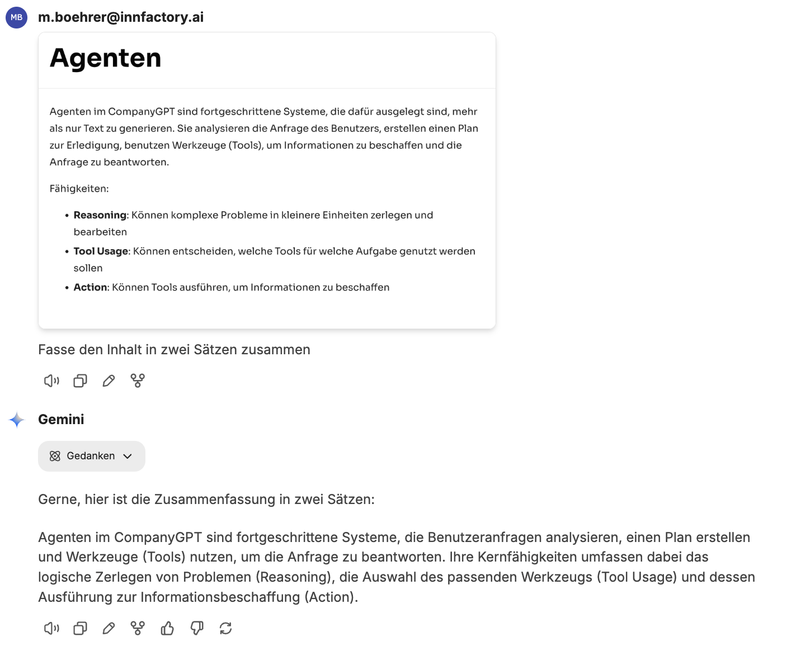
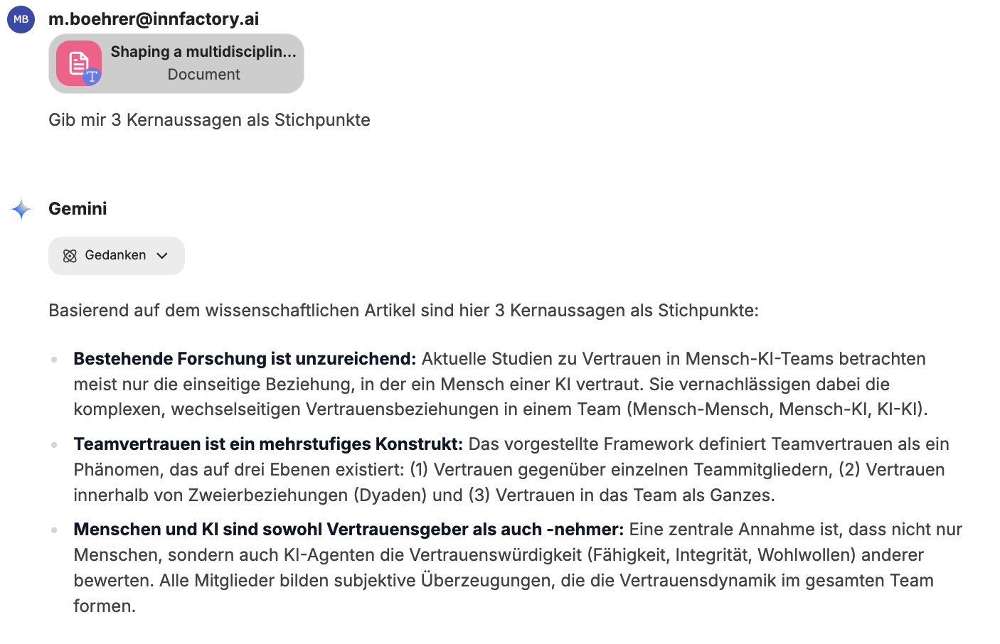

Im CompanyGPT können Dateien auf unterschiedliche Arten verarbeitet werden. Je nach Art stehen die Dateiinhalte dann als Ganzes im Kontext zur Verfügung oder es kann gezielt nach Inhalten gesucht werden.

## Im Kontext

Bei Dateien im Kontext steht immer der gesamte Inhalt des Dokuments im aktuellen Kontext zur Verfügung. Dies ist sehr hilfreich, um beispielsweise Inhalte zu extrahieren, Zusammenfassungen zu erstellen oder Inhalte zu vergleichen.

### Bild hochladen

Werden Bilder hochgeladen, dann können diese inhaltlich von den KI-Modellen analysiert und verstanden werden. Das können Screenshots, Bilder oder Ähnliches sein.

### Hochladen als Text mit OCR

Hierbei werden die Dateien, zum Beispiel PDFs, hochgeladen und mit Hilfe von OCR (Optical Character Recognition) durch ein KI-Modell alle Texte extrahiert und der Nachricht angehängt.

## Dateisuche

Dokumente können auch für die Dateisuche hochgeladen werden. Dabei werden die Inhalte indexiert und in der Datenbank gespeichert. Diese können dann durch die KI-Modelle bei Bedarf durchsucht und die Antworten durch die Ergebnisse angereichert werden. Informationen zur Funktionsweise finden Sie hier: [RAG - Retrieval Augmented Generation](/prompt-engineering/prompt-techniken/rag/#rag-workflow-für-die-dateiverarbeitung)

## SharePoint-Integration

Über die SharePoint-Integration stehen die gleichen Möglichkeiten für die Dateiverarbeitung zur Verfügung. Dabei müssen die Dateien nicht manuell hochgeladen werden, sondern können direkt aus allen dem Nutzer zugänglichen SharePoint-Speicherorten hinzugefügt werden, jeweils als [Bild](#bild-hochladen), [Text mit OCR](#hochladen-als-text-mit-ocr) oder für die [Dateisuche](#dateisuche).