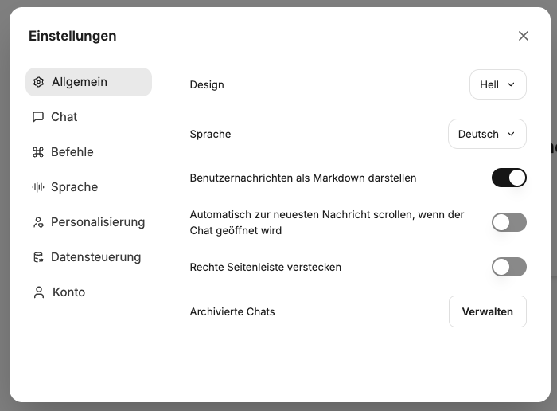

Die Einstellungen können über das Benutzermenü in der linken unteren Ecke aufgerufen werden.

## Allgemein

Unter **Allgemein** können grundlegende Einstellungen getätigt werden: 

### Design
- Hell
- Dunkel
- System

### Anzeigesprache

Sprache, in der die Benutzeroberfläche angezeigt wird. 

### Benutzernachrichten als Markdown

Regelt die Darstellung der Benutzernachrichten als Markdown. Markdown ist eine leichte Syntax zur Auszeichnung von Texten. KIs antworten ebenfalls in Markdown, und die Inhalte werden entsprechend dargestellt (z.B. fett). Diese Einstellung regelt, ob die Benutzernachrichten ebenfalls formatiert dargestellt werden sollen.

### Automatisch zur neuesten Nachricht scrollen 

Diese Einstellung regelt, ob vorhandene Chats automatisch nach ganz unten zur neuesten Nachricht scrollen sollen, wenn sie geöffnet werden.

### Rechte Seitenleiste verstecken 

Dauerhaftes Verstecken der rechten Seitenleiste.

### Archivierte Chats 

Ansicht der archivierten Chats mit Möglichkeit zur Wiederherstellung oder dauerhaftem Löschen.

## Chat 

### Schriftgröße

Auswahl der Schriftgröße, in der die Chatnachrichten dargestellt werden sollen.

### Chatrichtung 

- `ltr`: Links nach rechts 
- `rtl`: Rechts nach links

### Enter drücken, um Nachrichten zu senden

Wenn aktiviert, reicht `Enter` zum Senden von Nachrichten. Neue Zeilen können mit `Shift + Enter` hinzugefügt werden. Wenn deaktiviert, muss `Strg / Cmd + Enter` zum Senden von Nachrichten genutzt werden, `Enter` fügt dann eine neue Zeile hinzu.

### Chat-Eingabe im Willkommensbildschirm zentrieren

Chat-Eingabe im Willkommensbildschirm zentriert oder mittig unten.

### Denkprozess-Dropdowns standardmäßig öffnen

Wenn KI-Modelle nachdenken, kann der Denkprozess standardmäßig angezeigt oder hinter einem Dropdown verborgen und bei Bedarf geöffnet werden.

### Code immer anzeigen, wenn der Code-Interpreter verwendet wird

Code wird standardmäßig angezeigt.

### LaTeX in Nachrichten parsen (kann die Leistung beeinflussen)

Wenn aktiviert, wird LaTeX-Code in Nachrichten als mathematische Gleichungen gerendert. Das Deaktivieren kann die Leistung verbessern, wenn keine LaTeX-Darstellung benötigt wird.

### Entwürfe lokal speichern

Wenn aktiviert, werden der Text und die Anhänge, die in das Chat-Formular eingegeben werden, automatisch lokal als Entwürfe gespeichert. Diese Entwürfe sind auch verfügbar, wenn die Seite neu geladen oder zu einer anderen Konversation gewechselt wird. Entwürfe werden lokal auf dem Gerät gespeichert und werden gelöscht, sobald die Nachricht gesendet wird.

## Befehle

Befehle sind Kurzbefehle, die in der Nachrichteneingabe ausgeführt werden können und so schnell auf Modelle, Prompts, Mehrfachantworten zugreifen können.

### Befehl @ zum Wechseln von Modellen

Schaltet den Befehl "@" zum Wechseln von Endpunkten, Modellen, Voreinstellungen usw. um.

### Befehl + für Mehrfachantwort

Schaltet den Befehl "+" zum Hinzufügen einer Mehrfachantwort-Einstellung um.

### Befehl / für Promptvorlage

Schaltet den Befehl "/" zur Auswahl einer Promptvorlage über die Tastatur um.

## Sprache

Im CompanyGPT stehen sowohl Sprache zu Text (STT) als auch Text zu Sprache (TTS) zur Verfügung. Beides kann sowohl über die integrierte Browser-Engine als auch über LLMs genutzt werden (die LLMs müssen entsprechend konfiguriert sein). 

### Sprache zu Text 

Kann genutzt werden, um Prompteingaben zu diktieren, anstatt zu tippen. 

Engines:
- `Extern`: LLM
- `Browser`: Engine des aktuellen Browsers

Sprache: Die Sprache der Eingabe

Audio automatisch transkribieren

Text automatisch senden

### Text zu Sprache

Kann genutzt werden, um Nachrichten vorlesen zu lassen.

Engines:
- `Extern`: LLM
- `Browser`: Engine des aktuellen Browsers

Stimme: Verfügbare Stimmen, entweder der Browser-Engine oder KI

## Personalisierung

### Gespeicherte Erinnerungen verwenden

Erlaube der KI, bei den Antworten auf deine gespeicherten Erinnerungen zuzugreifen und sie zu verwenden.

## Datensteuerung

### Konversationen Importieren 

Konversationen können aus einer exportierten JSON-Datei importiert werden, um sie beispielsweise mit den Kollegen zu teilen.

### Geteilte Links 

Ansicht der über Links geteilten Konversationen. Die Links können wieder aufgerufen werden, die Quellchats können geöffnet werden, oder die geteilten Links können gelöscht werden. 

### Benutzer API-Keys 

Falls KI-API-Keys auf Benutzerebene vergeben wurden, können diese hier widerrufen werden.

### TTS-Cache-Speicher 

Der TTS-Cache-Speicher kann geleert werden, falls er verwendet wird.

### Alle Chats löschen

Löschen aller Chats. 

:::danger[Vorsicht]
Das Löschen aller Chats kann nicht rückgängig gemacht werden.
:::

## Konto

### Benutzernamen in Nachrichten anzeigen

Wenn aktiviert, wird der Benutzername des Absenders über jeder Nachricht angezeigt, die gesendet wird. Wenn deaktiviert, wird "Du" über den Nachrichten angezeigt.

### Profilbild

Ändern des Profilbildes

### Konto löschen 

Löschen des Benutzerkontos 

:::danger[Vorsicht]
Das Löschen des Benutzerkontos kann nicht rückgängig gemacht werden.
:::