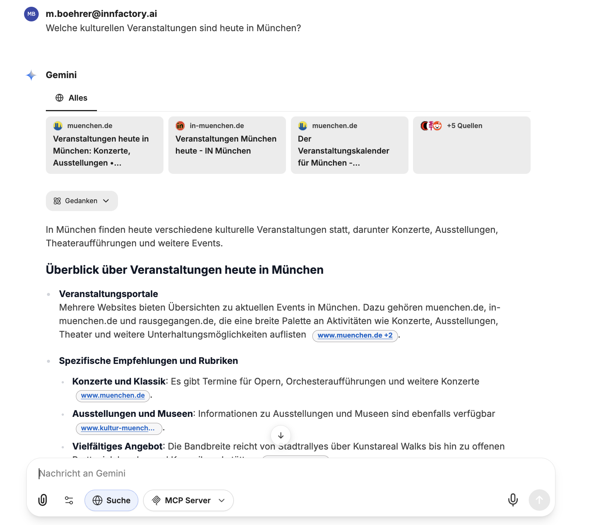
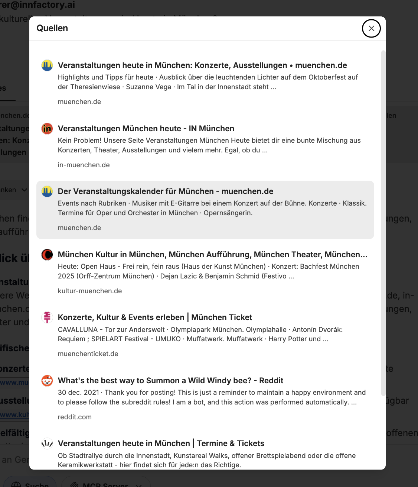

Die Websuche ermöglicht es dem CompanyGPT das Internet zu durchsuchen und aktuelle Inahlte wiederzugeben. Dabei werden die durchsuchten Webseiten als jeweilige Quellen angegeben. Die Suche muss vom Benutzer für die aktuelle Nachricht aktiviert werden.

Die durchsuchten Quellen können ebenfalls eingesehen werden, durch Klicken auf **Quellen**.

