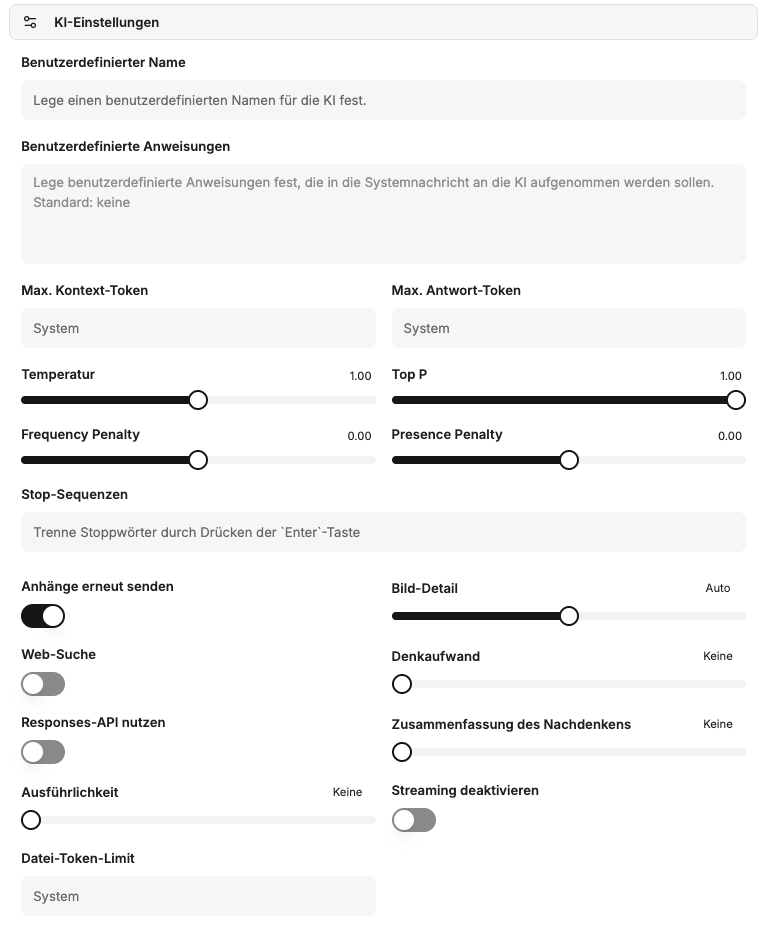

Unter **KI-Einstellungen** können benutzerdefinierte Profile erstellt und gespeichert werden. Diese Profile umfassen einen Namen, spezifische Anweisungen für die KI sowie detaillierte KI-Parameter. Dadurch lassen sich maßgeschneiderte Presets definieren, die in Konversationen flexibel eingesetzt werden können.



## Benutzerdefinierte Anweisung

In diesem Feld wird eine spezifische Anweisung hinterlegt, die das Verhalten der KI während einer Konversation steuert. Sie dient dazu, der KI eine Rolle, einen Stil oder bestimmte Aufgaben vorzugeben.

```text
Du bist ein hilfreicher Assistent, der die Fragen der Benutzer beantwortet und am Ende einen Witz macht.
```

## KI-Parameter

Die folgenden Parameter ermöglichen die detaillierte Steuerung des KI-Verhaltens und der Ressourcennutzung.

### Maximale Kontext-Token

Definiert die maximale Anzahl von Token, die im Kontext einer Anfrage an das Modell gesendet werden können. Dieser Parameter kontrolliert die Datenmenge, die der KI für jede Anforderung zur Verfügung steht. Wird kein Wert angegeben, kommen modellbasierte Systemstandards zum Einsatz. Höhere Werte können zu erhöhten Kosten und potenziellen Fehlern führen.

### Maximale Antwort-Token

Legt die maximale Anzahl von Token fest, die das Modell in einer Chat-Vervollständigung generieren darf. Die Gesamtanzahl der Eingabe-Token und der generierten Antwort-Token ist durch die maximale Kontextlänge des Modells begrenzt. Eine Überschreitung der maximalen Kontext-Token durch diesen Wert kann zu Fehlern führen.

### Temperatur

Dieser Parameter beeinflusst die Kreativität und Zufälligkeit der KI-Antworten.
*   **Höhere Werte:** Führen zu kreativeren und zufälligeren Ergebnissen.
*   **Niedrigere Werte:** Führen zu deterministischeren und weniger kreativen Antworten.
Es wird empfohlen, entweder die Temperatur *oder* den Top P-Wert anzupassen, nicht beide gleichzeitig. Werte über 1 sind in der Regel nicht empfehlenswert.

### Top P

Der Top P-Parameter steuert die Auswahl der Token durch das Modell auf Basis ihrer kumulativen Wahrscheinlichkeit. Das Modell wählt Token von den wahrscheinlichsten abwärts, bis die Summe ihrer Wahrscheinlichkeiten den festgelegten Top P-Wert erreicht. Dies beeinflusst die Vielfalt der möglichen Antwort-Token.

### Frequency Penalty (Häufigkeitsstrafe)

Ein Wert zwischen -2.0 und 2.0. Positive Werte reduzieren die Wahrscheinlichkeit, dass das Modell bereits häufig verwendete Token wiederholt. Dies fördert die Erzeugung neuer und vielfältigerer Formulierungen im Text.

### Presence Penalty (Anwesenheitsstrafe)

Ein Wert zwischen -2.0 und 2.0. Positive Werte bestrafen die Verwendung von Token, die bereits im bisherigen Text vorkommen. Dadurch wird die Tendenz des Modells erhöht, neue Themen anzusprechen oder Informationen zu diversifizieren.

### Stop-Sequenzen

Bis zu vier definierbare Zeichenketten, bei deren Auftreten die API die Generierung weiterer Token beendet. Dies ermöglicht eine präzise Steuerung des Antwortendes der KI.

### Anhänge erneut senden

Ist diese Option aktiviert, werden alle zuvor im Chat angehängten Dateien mit jeder neuen Nachricht erneut an das Modell gesendet.
**Hinweis:** Dies kann die Kosten einer Anfrage aufgrund der erhöhten Token-Anzahl erheblich steigern und bei vielen Anhängen zu Fehlern führen.

### Bild-Detail

Bestimmt die Auflösung für Bilderkennungsanfragen an das Modell:
*   **Niedrig:** Günstiger und schneller, bietet geringere Detailgenauigkeit.
*   **Hoch:** Detaillierter und präziser, aber teurer.
*   **Auto:** Wählt automatisch zwischen "Niedrig" und "Hoch" basierend auf der Auflösung des hochgeladenen Bildes.

### Web-Suche

Aktiviert die integrierte Websuchfunktion des Modells (z.B. über OpenAI). Dies ermöglicht es der KI, aktuelle Informationen aus dem Internet zu beziehen und somit präzisere und zeitgemäßere Antworten zu generieren.

### Denkaufwand

Gilt ausschließlich für Modelle, die einen internen Denkprozess (Reasoning) durchführen. Dieser Parameter begrenzt den Rechenaufwand für logische Schlussfolgerungen.
*   Eine Reduzierung des Denkaufwands führt zu schnelleren Antworten und einem geringeren Token-Verbrauch.
*   Die Einstellung „Minimal“ erzeugt sehr wenige Reasoning-Token, um eine maximale Reaktionsgeschwindigkeit (Time-to-First-Token) zu erzielen. Dies ist besonders nützlich für Aufgaben wie das Codieren oder das strikte Befolgen von Anweisungen.

### Responses API nutzen

Ermöglicht die Nutzung der Responses-API (anstelle von Chat Completions), die erweiterte Funktionen von OpenAI bereitstellt. Diese API ist für die Verwendung von Modellen wie o1-pro und o3-pro sowie zur Aktivierung von Zusammenfassungen des Denkprozesses erforderlich.

### Zusammenfassung des Denkprozesses

Nur verfügbar, wenn die Responses-API genutzt wird. Diese Option generiert eine Zusammenfassung des internen Denkprozesses des Modells. Dies kann zur Fehlersuche und zum besseren Verständnis der KI-Entscheidungen hilfreich sein. Wählbare Optionen sind: "keine", "automatisch", "kurz" oder "detailliert".

### Ausführlichkeit

Steuert die Länge und Detailtiefe der Modellantworten.
*   **Niedrigere Werte:** Führen zu kürzeren, prägnanteren Antworten.
*   **Höhere Werte:** Führen zu ausführlicheren und detaillierteren Antworten.
Derzeit werden die Stufen "niedrig", "mittel" und "hoch" unterstützt.

### Streaming deaktivieren

Deaktiviert das zeilenweise Streaming der Antworten, sodass die vollständige Antwort des Modells auf einmal empfangen wird. Diese Option kann für bestimmte Modelle (z.B. o3), die eine Organisationsverifizierung für Streaming voraussetzen, nützlich sein.

### Datei-Token-Limit

Definiert ein maximales Token-Limit für die Verarbeitung von angehängten Dateien. Dies dient der Kostenkontrolle und der effizienten Ressourcenverwaltung bei der Dateianalyse durch die KI.