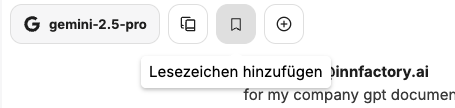

Lesezeichen können zu Konversationen hinzugefügt werden, um sie so schneller wiederzufinden. Dadurch können auch Chats zu bestimmten Themen gruppiert werden.

Diese können mit `Titel` und `Beschreibung` versehen werden.

Über den Lesezeichen-Button oberhalb der Konversationshistorie können alle gespeicherten Konversationen zu den Lesezeichen angezeigt werden.