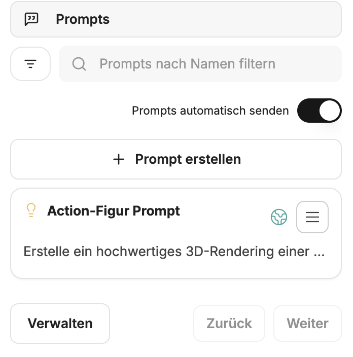
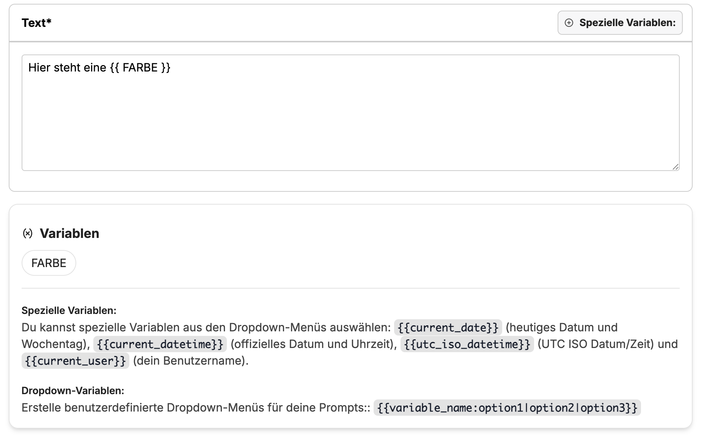
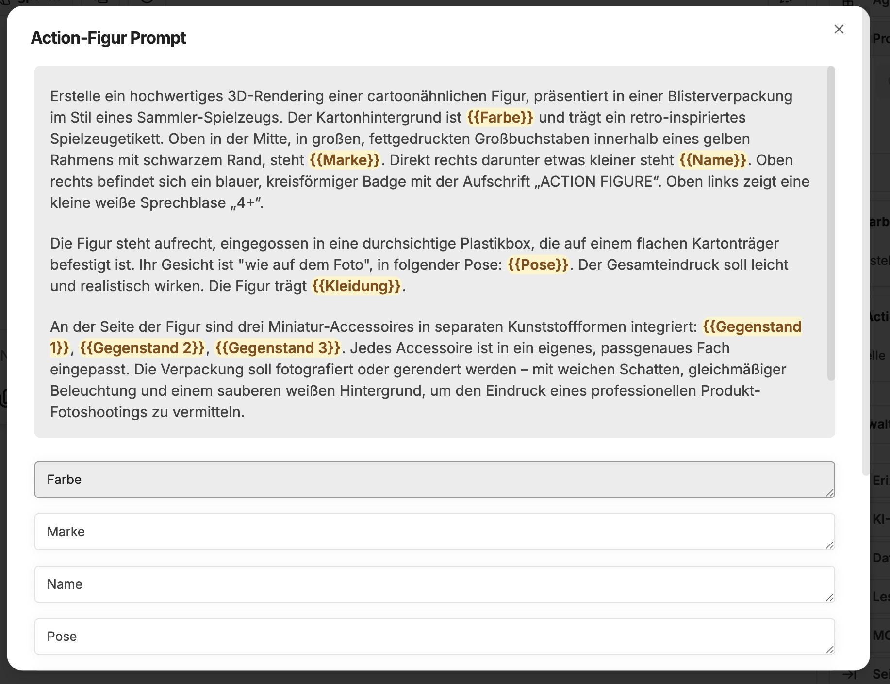
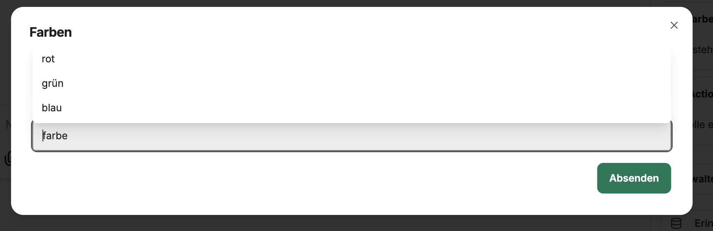

Prompts im CompanyGPT verstehen sich als Promptvorlagen, die gespeichert und jederzeit genutzt werden können. Die Vorlagen sind dabei unabhängig von KI Modell oder Agent und können auch mit jedem beliebigen, verfügbaren Modell oder Agent verwendet werden.

Promptvorlagen können auf der rechten Seitenleiste unter **Prompts** eingesehen, erstellt, verändert oder benutzt werden. 



## Bestandteile von Promptvorlagen

- **Prompt Name**: Der Name des Prompts, der auch in der Schnellauswahl angezeigt wird.
- **Kategorie**: Die Kategorie, welcher der Prompt zugeordnet ist, zum Beispiel **Ideen**, **Lernen**, **Schreiben**.
- **Text**: Der eigentliche Inhalt des Prompts. 
- **Variablen**: Variblen innerhalb des Textes, welche zum Ausführen mit entsprechenden Inhalten gefüllt werden können. 

### Variablen

- **Spezielle Variable**: Diese sind vordefiniert und müssen nicht manuell gesetzt werden, sondern werden automatisch befüllt. Diese sind **Datum**, **Uhrzeit**, **Nutzer**.
- **Eigene Variablen**: Innerhalb des Textes können eigene Variablen gesetzt werden. Diese werden über doppelte geschweifte Klammern markiert, z.B. `{{ FARBE }}` => erzeugt die Variable `FARBE`



Sobald der Prompt ausgeführt wird, öffnet sich ein Eingabefenster für die Variablen. 



Es können außerdem auch Dropdowns als Auswahlmenü für die Variablen ausgewählt werden. Dafür ist folgende Syntax notwendig:

```
{{variable_name:option1|option2|option3}}

# Beispiel
{{ farbe:rot|grün|blau}}
```


Promptvorlagen können sehr effektiv für wiederkehrende Aufgaben, für [Prompt Chaining](/prompt-engineering/prompt-techniken/prompt-chaining) oder in Verbindung mit [Agenten](/company-gpt/agenten/) genutzt werden.
