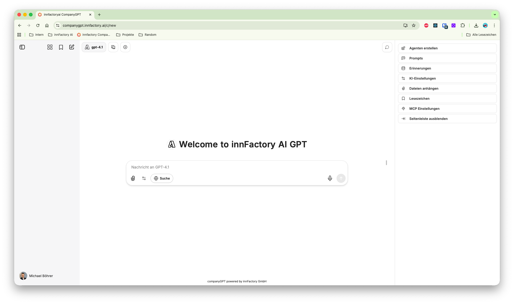

Das User Interface im CompanyGPT besteht aus den folgenden Elementen: 

1. Neuer Chat
2. Modellauswahl
3. Seitenleiste
4. Chatbereich
5. Prompteingabe
6. Auswahl MCP Server
7. Dateiupload
8. [Benutzermenü](/company-gpt/user-interface)
9. Nachrichtenverlauf
10. Agent Marketplace
11. Lesezeichen