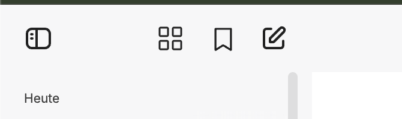
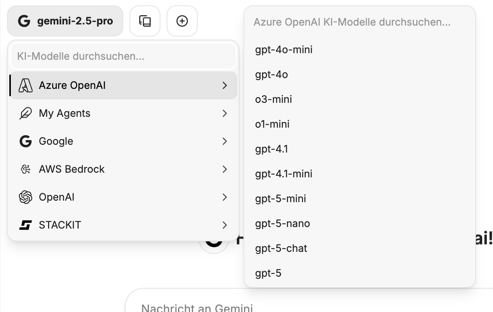
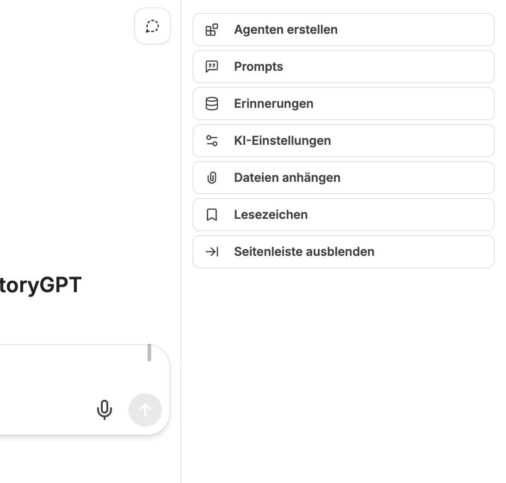
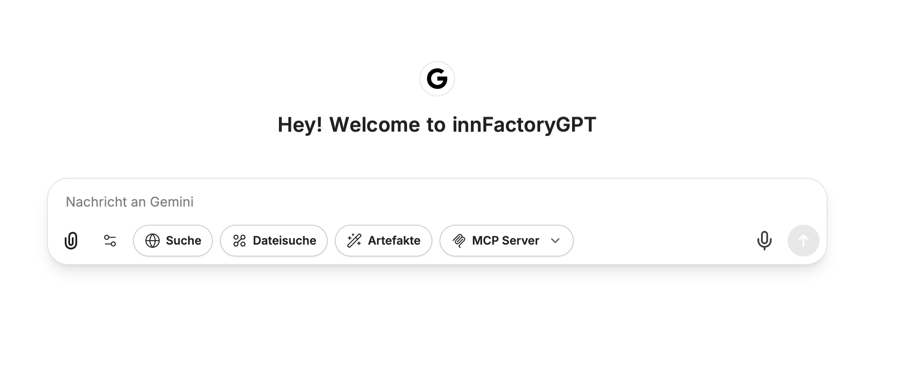

Das User Interface im CompanyGPT ermöglicht es, mit den unterschiedlichen KI-Modellen zu kommunizieren, Agenten zu erstellen, Promptvorlagen zu verwalten und vieles mehr. 

## Schnellauswahl 

- Seitenleiste verbergen
- [Agent Marketplace](/company-gpt/agenten/#agenten-marktplatz)
- [Lesezeichen](/company-gpt/lesezeichen)
- Neuer Chat

## Modellauswahl

## Rechte Seitenleiste

- [Erstellen und Bearbeiten von Agenten](/company-gpt/agenten/)
- [Promptvorlagen](/company-gpt/prompts/)
- [Erinnerungen](/company-gpt/erinnerungen/)
- [KI Einstellungen](/company-gpt/ki-einstellungen/)
- [Dateien](/company-gpt/dateiverarbeitung/)
- [Lesezeichen](/company-gpt/lesezeichen)
- Seitenleiste ausblenden

## Chateingabe

- Prompteingabe
- [Dateien](/company-gpt/dateiverarbeitung/)
- Einstellungen der Erweiterungen
- [Websuche](/company-gpt/integrationen/websuche/)
- [Dateisuche](/company-gpt/integrationen/dateisuche/)
- [Artefakte](/company-gpt/integrationen/artefakte/)
- Auswahl [MCP Server](/company-gpt/integrationen/mcp-server/)
