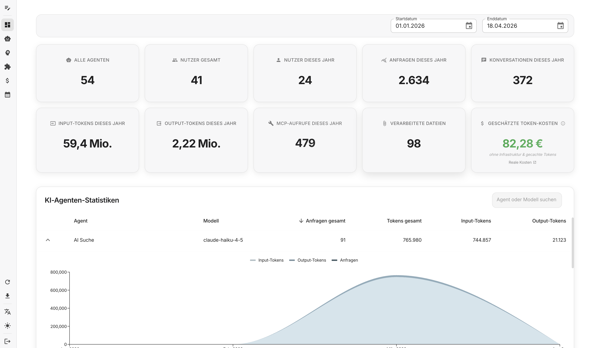
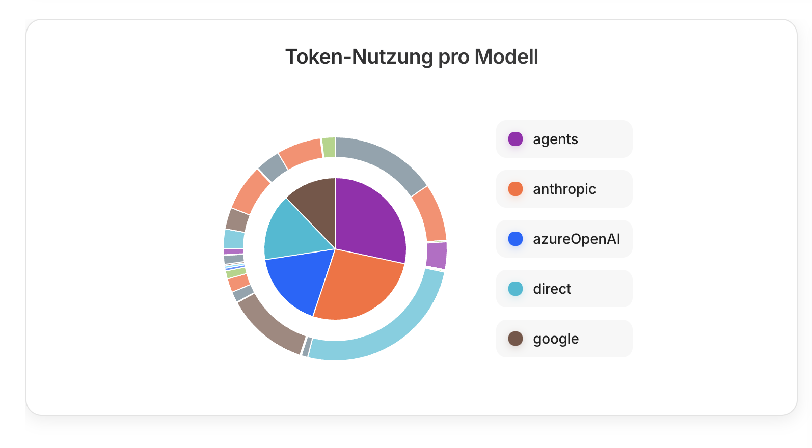
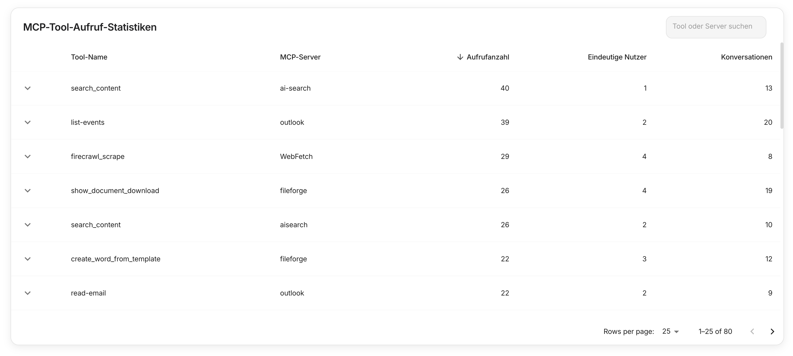

Das companyDASHBOARD ist ein Admin-Dashboard zur Auswertung der CompanyGPT-Nutzung im Unternehmen. Es stellt Metriken zu Nutzeraktivität, Token-Verbrauch, Agenten-Performance und Tool-Aufrufen bereit und unterstützt den Export für weitere Verarbeitung.

## KPIs im Überblick

Das Dashboard erfasst zehn zentrale Metriken, jeweils mit Trendvergleich zur Vorperiode. Alle Werte werden für den gewählten Zeitraum angezeigt und mit der entsprechenden Vorperiode verglichen.

### Systemweite Metriken

**Alle Agenten**
Gesamtanzahl der in CompanyGPT konfigurierten KI-Agenten. Diese Metrik zeigt die Breite Ihrer KI-Landschaft.

**Nutzer gesamt**
Alle registrierten Nutzer in Ihrem CompanyGPT-System, unabhängig von der Aktivität im gewählten Zeitraum.

**Nutzer dieses Jahr**
Anzahl der aktiven Nutzer im gewählten Zeitraum. Diese Metrik zeigt die tatsächliche Adoption Ihrer KI-Lösung.

### Aktivitäts-Metriken

**Anfragen dieses Jahr**
Gesamtanzahl der Anfragen an alle KI-Agenten im gewählten Zeitraum. Jede Nachricht an einen Agenten zählt als eine Anfrage.

**Konversationen dieses Jahr**
Anzahl der separaten Konversationen (Chat-Sessions) im gewählten Zeitraum. Eine Konversation kann mehrere Anfragen enthalten.

### Token-Metriken

**Input-Tokens dieses Jahr**
Anzahl der verarbeiteten Input-Tokens (eingehende Nachrichten und Kontext). Basis für die Kostenberechnung der KI-Modelle.

**Output-Tokens dieses Jahr**
Anzahl der generierten Output-Tokens (Antworten der KI-Agenten). Werden oft höher bewertet als Input-Tokens.

**Geschätzte Token-Kosten**
Geschätzte Kosten für alle Token-Aufrufe im gewählten Zeitraum. Basiert auf aktuellen Modell-Preisen, ohne Infrastruktur- und Cache-Optimierungen.

### Ressourcennutzung

**MCP-Aufrufe dieses Jahr**
Anzahl der Aufrufe externer Tools über das Model Context Protocol (MCP). Zeigt die Nutzung von Integrationen wie Websuche, E-Mail oder Dateisystemen.

**Verarbeitete Dateien**
Anzahl der hochgeladenen und verarbeiteten Dateien (PDF, Word, Excel u. a.). Umfasst OCR-Verarbeitung und Dokumentenanalyse.

:::tip[Kostenkontrolle]
Die geschätzten Token-Kosten geben Ihnen eine Orientierung für die laufenden KI-Kosten. Für präzise Abrechnungen sollten Sie die tatsächlichen Provider-Rechnungen heranziehen.
:::

## Token-Nutzung pro Modell

Die Token-Nutzungsvisualisierung zeigt den Verbrauch aufgeschlüsselt nach KI-Provider und Modelltyp. Das Donut-Diagramm ermöglicht es, auf einen Blick zu erkennen, welche Modelle die meisten Ressourcen beanspruchen.

### Aufbau der Visualisierung

**Innerer Ring (Input-Tokens)**
Zeigt die Verteilung der Input-Tokens nach Provider. Input-Tokens umfassen Ihre Nachrichten, Kontext-Dokumente und System-Prompts.

**Äußerer Ring (Output-Tokens)**
Zeigt die Verteilung der Output-Tokens nach Provider. Output-Tokens sind die generierten Antworten der KI-Agenten.

### Provider-Kategorien

**agents (violett)**
Tokens von Agenten-spezifischen Modellen und internen Verarbeitungen.

**anthropic (orange)**
Claude-Modelle von Anthropic (Claude 3.5 Sonnet, Claude 3 Haiku u. a.).

**azureOpenAI (blau)**
OpenAI-Modelle über Azure (GPT-4, GPT-3.5-Turbo u. a.).

**direct (cyan)**
Direkte API-Aufrufe an verschiedene Provider ohne Zwischenschicht.

**google (braun)**
Google-Modelle wie Gemini Pro und Gemini Flash.

:::tip[Kostenoptimierung]
Nutzen Sie diese Übersicht, um teure Modelle zu identifizieren und gegebenenfalls günstigere Alternativen für bestimmte Anwendungsfälle zu evaluieren.
:::

## MCP-Tool-Aufruf-Statistiken

Die MCP-Statistiken zeigen detailliert, welche externen Tools Ihre KI-Agenten nutzen. Diese Daten helfen bei der Bewertung der Integration-Effizienz und der Identifikation häufig genutzter Funktionen.

### Tabellen-Spalten

**Tool-Name**
Name des aufgerufenen MCP-Tools (z. B. `search_content`, `list-events`, `firecrawl_scrape`).

**MCP-Server**
Zugehöriger MCP-Server, der das Tool bereitstellt (z. B. `ai-search`, `outlook`, `WebFetch`).

**Aufrufanzahl**
Gesamtanzahl der Tool-Aufrufe im gewählten Zeitraum. Die Spalte ist sortierbar für eine schnelle Priorisierung.

**Eindeutige Nutzer**
Anzahl verschiedener Nutzer, die das Tool verwendet haben. Zeigt die Verbreitung des Tools im Unternehmen.

**Konversationen**
Anzahl der Konversationen, in denen das Tool verwendet wurde. Ein Tool kann mehrfach pro Konversation aufgerufen werden.

### Häufige MCP-Tools

**search_content (ai-search)**
Durchsucht interne Dokumente und Wissensdatenbanken.

**list-events / create-event (outlook)**
Integration mit Microsoft Outlook für Kalender-Funktionen.

**firecrawl_scrape (WebFetch)**
Extrahiert Inhalte von Webseiten für die KI-Verarbeitung.

**create_document (fileforge)**
Erstellt und bearbeitet Dokumente in verschiedenen Formaten.

:::hinweis[Performance-Monitoring]
Überwachen Sie Tools mit hohen Aufrufzahlen auf Performance-Probleme. Häufig genutzte Tools sollten optimal konfiguriert sein.
:::

## Agenten-Statistik

Die Agenten-Tabelle unterhalb der KPI-Karten listet alle KI-Agenten mit detaillierten Nutzungsmetriken. Diese Übersicht ermöglicht die Bewertung der Agenten-Performance und die Identifikation der am häufigsten genutzten Assistenten.

### Verfügbare Informationen

**Agenten-Name und Modell**
Name des Agenten und verwendetes KI-Modell (z. B. GPT-4, Claude 3.5 Sonnet, Gemini Pro).

**Anfragen-Statistiken**
Anzahl der Anfragen pro Agent im gewählten Zeitraum mit Vergleich zur Vorperiode.

**Token-Verbrauch**
Input- und Output-Tokens getrennt erfasst. Basis für die Kostenberechnung auf Agenten-Ebene.

**Drill-Down-Funktionen**
Klicken Sie auf einen Agenten für detaillierte Auswertungen und Nutzungsverläufe.

### Funktionen der Tabelle

**Sortierung**
Sortieren Sie die Tabelle nach Anfragen, Token-Verbrauch oder Agenten-Name für verschiedene Analyseperspektiven.

**Suchfunktion**
Filtern Sie die Agenten-Liste nach Namen oder Modelltyp für gezielte Auswertungen.

**Export-Integration**
Die Agenten-Daten sind im CSV-Export enthalten und können für weitere Analysen exportiert werden.

:::tip[Agenten-Optimierung]
Nutzen Sie die Token-Statistiken, um ineffiziente Agenten zu identifizieren. Agenten mit hohem Token-Verbrauch bei wenigen Anfragen sollten überprüft werden.
:::

## Zeitraumfilter und CSV-Export

Alle Metriken können für beliebige Zeiträume ausgewertet werden. Der flexible Zeitraumfilter ermöglicht Auswertungen von einzelnen Tagen bis hin zu mehrjährigen Vergleichen.

### Zeitraum-Optionen

**Vordefinierte Zeiträume**
Schnellauswahl für häufige Auswertungen: Heute, Diese Woche, Dieser Monat, Dieses Jahr.

**Benutzerdefinierte Zeiträume**
Wählen Sie Start- und Enddatum für spezifische Auswertungsperioden.

**Vorperioden-Vergleich**
Automatischer Vergleich mit der entsprechenden Vorperiode für Trend-Analysen.

### CSV-Export

**Vollständiger Datenexport**
Alle KPIs, Agenten-Statistiken und MCP-Tool-Daten können als CSV-Datei exportiert werden.

**Weiterverarbeitung**
Die exportierten Daten lassen sich direkt in Excel, Google Sheets oder andere Analyse-Tools importieren.

**Berichterstellung**
Nutzen Sie die Daten für interne Berichte, ROI-Analysen oder Compliance-Dokumentation.

:::tip[Regelmäßige Auswertungen]
Exportieren Sie monatliche oder quartalsweise Berichte für die kontinuierliche Überwachung Ihrer KI-Nutzung und Kostenentwicklung.
:::
