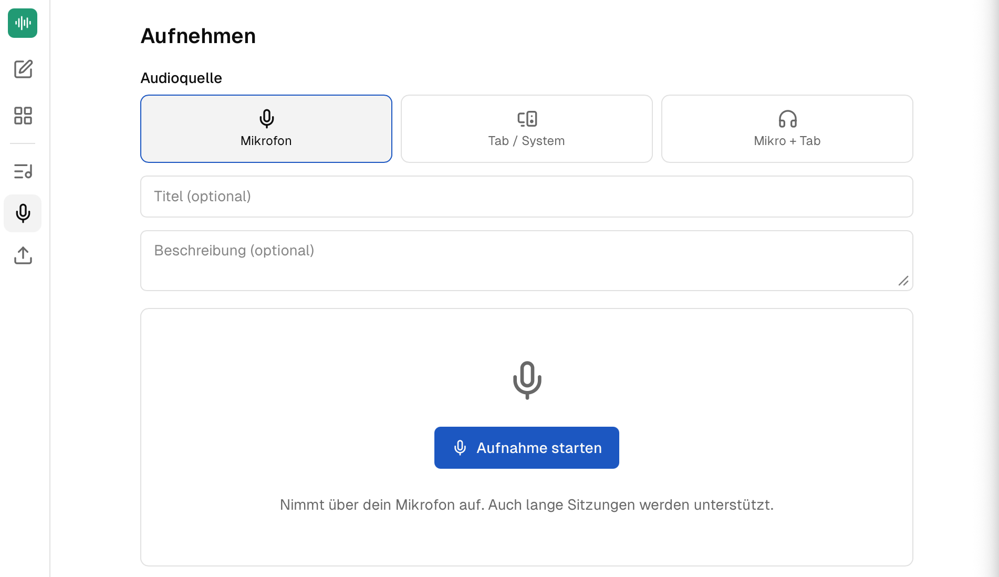

companyTRANSCRIBE ist eine Transkriptionsanwendung, die wie der CompanyGPT vollständig im Microsoft-Tenant des Unternehmens betrieben wird. Sie transkribiert Audio- und Videodateien sowie Aufnahmen direkt aus dem Browser und trennt dabei automatisch die einzelnen Sprecher. Die Verarbeitung erfolgt über den Azure Speech-Dienst im eigenen Tenant — es werden keine Daten an Drittanbieter außerhalb der Microsoft-Cloud übermittelt, sodass die Anforderungen der DSGVO erfüllt werden.

## Zugang und Authentifizierung

Der Zugang erfolgt ausschließlich über Microsoft Single Sign-On (SSO) mit dem bestehenden Firmenkonto. Es werden keine separaten Zugangsdaten benötigt.

## Transkription von Dateien und Aufnahmen

companyTRANSCRIBE unterstützt zwei Wege, ein Transkript zu erstellen:

- **Datei-Transkription**: Upload von gängigen Audio- und Videoformaten (z. B. .mp3, .wav, .m4a, .mp4, .webm) bis zu 75 MB — etwa zur Transkription aufgezeichneter Besprechungen. Bei Videodateien wird die Tonspur automatisch extrahiert.
- **Browser-Aufnahme**: Direkte Aufnahme über das Mikrofon des Endgeräts. Die Aufnahme wird fortlaufend in den Speicher des Tenants übertragen, sodass auch mehrstündige Sitzungen zuverlässig aufgezeichnet werden können. Die Transkription startet automatisch nach Abschluss der Aufnahme.

Die Transkription läuft als Auftrag im Hintergrund; der Fortschritt ist in der Anwendung sichtbar. Die Standardsprache ist Deutsch, beim Erstellen kann eine andere Sprache gewählt werden.

## Sprechererkennung

Die automatische Sprechererkennung (Diarization) unterscheidet bis zu 35 Stimmen in einer Aufnahme und ordnet die Textabschnitte den jeweiligen Sprechern zu. Die erkannten Sprecher lassen sich nachträglich umbenennen, sodass im fertigen Transkript die tatsächlichen Namen der Teilnehmenden stehen.

## Transkriptionshistorie und Export

Alle Transkriptionen werden in einer benutzerbezogenen Historie gespeichert und können dort eingesehen, bearbeitet oder gelöscht werden. Fertige Transkripte lassen sich als sprecherbeschriftete Markdown-Datei (.md) herunterladen. Sämtliche Daten verbleiben dabei in der Microsoft-Cloud des Unternehmens.

## Integration in den CompanyGPT

Über eine MCP-Schnittstelle stehen die eigenen Transkripte direkt im CompanyGPT-Chat zur Verfügung. Der Assistent kann Transkripte auflisten, abrufen und auswerten — so lassen sich aus einem Rohtranskript per Prompt strukturierte Meeting-Protokolle, Zusammenfassungen oder To-do-Listen im gewünschten Format erzeugen.
