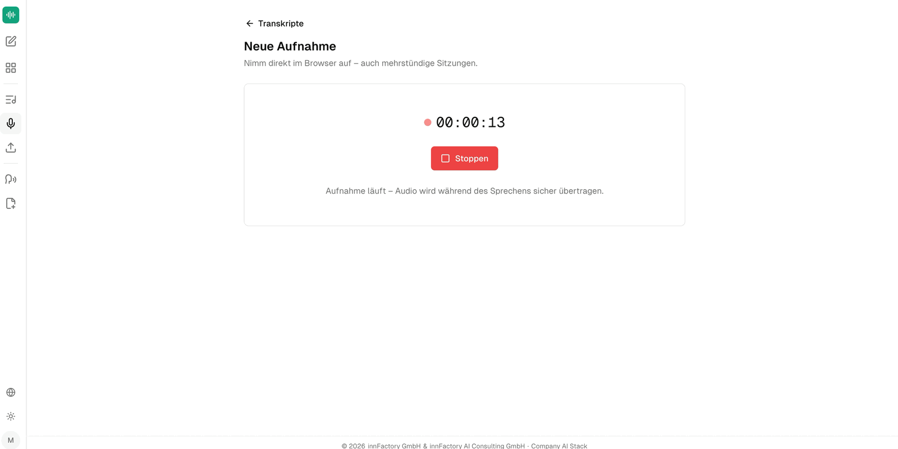

Ein Transkript entsteht in companyTRANSCRIBE auf zwei Wegen: Sie laden eine vorhandene Datei hoch oder nehmen direkt im Browser auf. Beide Wege starten über die Schaltflächen **Hochladen** und **Aufnehmen** in der Übersicht **Transkripte**.

## Aufnahme im Browser vorbereiten

Die Seite **Neue Aufnahme** trägt den Hinweis „Nimm direkt im Browser auf – auch mehrstündige Sitzungen.“ Vor dem Start legen Sie dort die folgenden Einstellungen fest.

### Audioquelle

| Option | Nimmt auf |
|---|---|
| **Mikrofon** | Nur das Mikrofon des Endgeräts |
| **Tab / System** | Nur den Ton des Browser-Tabs beziehungsweise des Systems |
| **Mikro + Tab** | Mikrofon und Systemton gemeinsam |

**Mikrofon** ist vorausgewählt. **Tab / System** und **Mikro + Tab** eignen sich für Online-Besprechungen, bei denen auch die Gegenseite aufgezeichnet werden soll.

### Sprechererkennung

Der Schalter **Sprechererkennung** entscheidet, ob das Transkript nach Sprechern getrennt wird. Die Anwendung beschreibt beide Zustände selbst:

| Zustand | Hinweis in der Oberfläche | Geeignet für |
|---|---|---|
| Aus | „Fortlaufender Text ohne Sprecherzuordnung – passend für eigene Diktate.“ | Eigene Diktate und längere Aufnahmen, die nur für Sie selbst transkribiert werden |
| Ein | „Erkennt mehrere Sprecher und trennt sie im Transkript.“ | Besprechungen mit mehreren Teilnehmenden vor Ort oder online |

:::note
Die Sprechererkennung lässt sich nur vor dem Start der Aufnahme festlegen. Ob sie aktiv war, steht später in den Metadaten des Transkripts im Feld **Sprechererkennung** (`Aktiv` oder `Aus`).
:::

### Titel und Beschreibung

**Titel (optional)** und **Beschreibung (optional)** können vor der Aufnahme gesetzt werden; beide Felder lassen sich später in der Detailansicht des Transkripts noch ändern. Ohne Titel legt die Anwendung den Eintrag unter einer Standardbezeichnung ab.

## Aufnahme starten und beenden

Ein Klick auf **Aufnahme starten** beginnt die Aufzeichnung — der Hinweis unter der Schaltfläche lautet „Nimmt über dein Mikrofon auf. Auch lange Sitzungen werden unterstützt.“

Während der Aufnahme zeigt die Anwendung einen laufenden Timer und die Schaltfläche **Stoppen**. Der Hinweis „Aufnahme läuft – Audio wird während des Sprechens sicher übertragen.“ verweist darauf, dass das Audio fortlaufend in den Speicher des Tenants übertragen wird und nicht erst am Ende der Sitzung.

Nach **Stoppen** wird der Eintrag angelegt und im Hintergrund transkribiert. Sie müssen die Seite dabei nicht offen halten.

:::note
Zur maximalen Länge einer einzelnen Aufnahme nennt die Oberfläche keinen Wert, sondern nur „Auch lange Sitzungen werden unterstützt.“ In der Schulungsaufnahme wird die Grenze mit „knapp drei Stunden“ angegeben. Bitte prüfen Sie den genauen Grenzwert, bevor Sie ihn nach außen kommunizieren.
:::

## Datei hochladen

Über **Hochladen** transkribieren Sie eine bereits vorhandene Aufnahme — etwa eine Besprechung, die mit einem Raummikrofon, einem Aufnahmegerät oder dem Telefon mitgeschnitten wurde. Unterstützt werden gängige Audio- und Videoformate bis 75 MB; bei Videodateien wird die Tonspur automatisch extrahiert.

:::note
Der Upload-Dialog selbst ist in der zugrunde liegenden Aufnahme nicht zu sehen. Dieser Abschnitt beschreibt daher nur den Einstieg über die Schaltfläche **Hochladen** und die bekannten Formatgrenzen, nicht die einzelnen Felder des Dialogs.
:::

## Wie geht es weiter?

Sobald die Transkription abgeschlossen ist, öffnen Sie den Eintrag in der Übersicht. Wie Sie den Text korrigieren, Sprecher benennen und das Ergebnis exportieren, beschreibt [Transkripte bearbeiten](/de/company-gpt/addons/company-transcribe/transkripte/).
