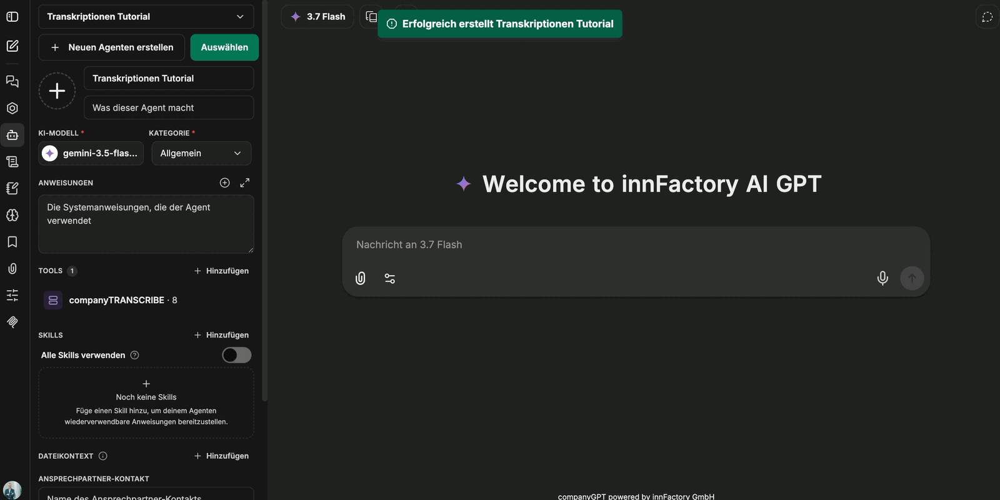

Transkripte müssen nicht manuell weiterverarbeitet werden. Über den MCP-Server **companyTRANSCRIBE** erhält ein Agent im CompanyGPT Zugriff auf Ihre eigenen Transkripte und Sprachausgaben — er listet sie auf, ruft Inhalte ab, fasst zusammen und erzeugt auf Wunsch neue Sprachausgaben.

## Agenten einrichten

1. Im CompanyGPT über **Neuen Agenten erstellen** einen Agenten anlegen und benennen.
2. Ein KI-Modell und eine Kategorie wählen. Für das reine Auflisten und Zusammenfassen genügt ein kleines, schnelles Modell; umfangreiche Anweisungen sind nicht erforderlich.
3. Unter **Tools** auf **Hinzufügen** klicken und in der **Tool-Bibliothek** unter **MCP-Server** den Eintrag **companyTRANSCRIBE** auswählen.
4. Im Dialog auf **companyTRANSCRIBE verbinden** klicken. Nach erfolgreicher Verbindung meldet die Oberfläche „MCP-Server ‚companyTRANSCRIBE’ erfolgreich initialisiert.“
5. Den Agenten speichern.

Im Dialog lassen sich die Tools des Servers einzeln aktivieren oder über **Alle auswählen** gemeinsam übernehmen. Nach dem Speichern erscheint der Server in der Tool-Liste des Agenten mit der Anzahl der eingebundenen Tools.

:::tip[Hinweis]
Da der Server nur wenige Tools mitbringt, können Sie das verzögerte Laden der Tools („Lazy Loading“) für diesen Agenten deaktivieren. Alle Werkzeuge stehen dem Agenten dann unmittelbar zur Verfügung.
:::

## Verfügbare Tools

Der Server stellt acht Tools bereit — drei für Transkripte, fünf für Sprachausgaben:

| Tool | Zweck |
|---|---|
| `list_transcripts` | Vorhandene Transkripte auflisten |
| `get_transcript` | Vollständigen Inhalt eines Transkripts abrufen |
| `get_transcript_stats` | Kennzahlen zu einem Transkript abrufen |
| `list_voiceovers` | Vorhandene Sprachausgaben auflisten |
| `get_voiceover` | Eine einzelne Sprachausgabe abrufen |
| `create_voiceover` | Neue Sprachausgabe erzeugen |
| `update_voiceover` | Bestehende Sprachausgabe aktualisieren |
| `regenerate_voiceover` | Audio einer Sprachausgabe neu erzeugen |

## Typische Anwendungen

Sobald der Agent verbunden ist, genügt eine Anweisung im Chat:

- **Auflisten** — der Agent nennt die vorhandenen Transkripte samt Anzahl der erkannten Sprecher.
- **Zusammenfassen** — auf eine Aufforderung wie „Fasse die Aufnahme *&lt;Titel&gt;* zusammen“ ruft der Agent das Transkript ab und fasst den vollständigen Inhalt zusammen.
- **Protokoll erzeugen** — aus einem Rohtranskript entstehen so strukturierte Besprechungsprotokolle, Zusammenfassungen oder To-do-Listen im gewünschten Format.
- **Sprachausgabe erzeugen** — der Agent legt über `create_voiceover` eine neue Sprachausgabe an und liefert einen Link, über den sich die Audiodatei herunterladen lässt. Je nach Länge dauert die Erzeugung einen Moment; anschließend erscheint die Sprachausgabe auch in der Übersicht **Sprachausgaben**.

:::note
Der Zugriff ist benutzerbezogen: Ein Agent sieht über den MCP-Server nur die Transkripte und Sprachausgaben des jeweils angemeldeten Benutzers.
:::

## Wie geht es weiter?

Wie Transkripte entstehen und wie Sie sie vor der Auswertung korrigieren, beschreiben [Aufnehmen und transkribieren](/de/company-gpt/addons/company-transcribe/aufnehmen/) und [Transkripte bearbeiten](/de/company-gpt/addons/company-transcribe/transkripte/). Allgemeine Hinweise zu MCP-Servern im CompanyGPT finden Sie unter [MCP Server](/de/company-gpt/integrationen/mcp-server/).
