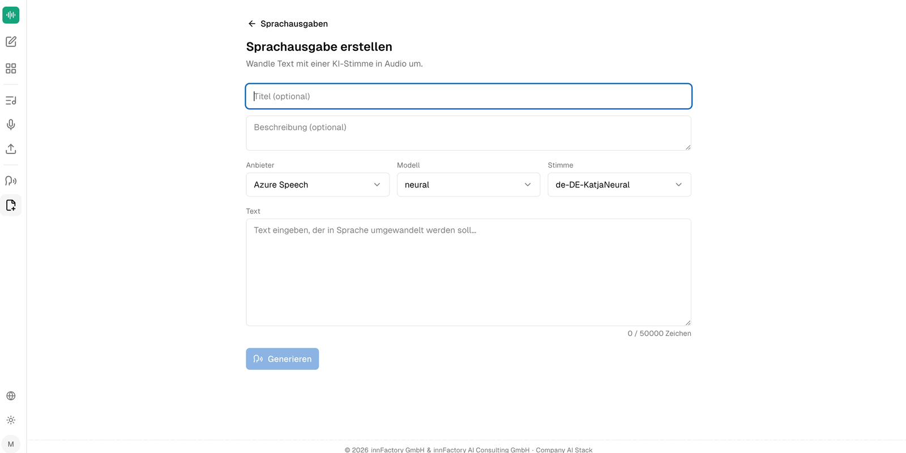
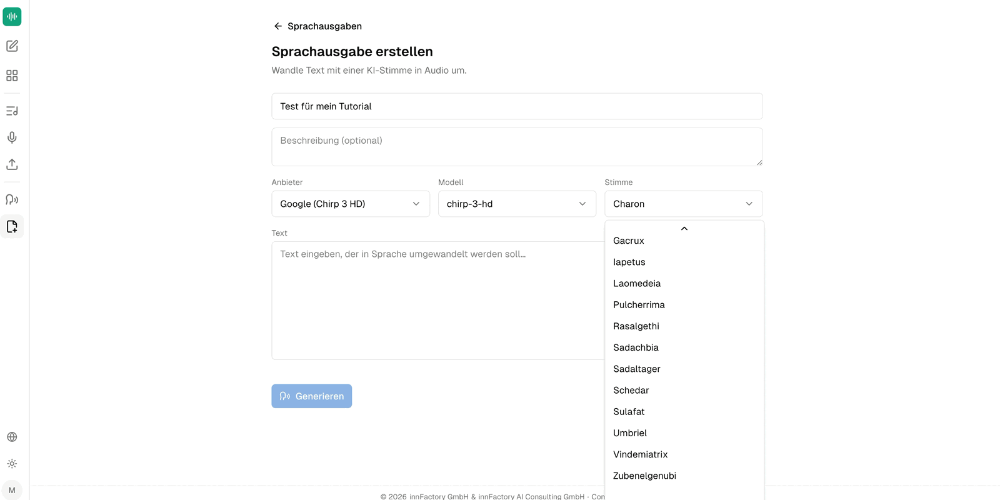

companyTRANSCRIBE geht auch den umgekehrten Weg: Neben Audio zu Text erzeugt die Anwendung aus Text wieder Audio. Der Bereich liegt in der Seitenleiste unter **Sprachausgaben** und verwaltet alle erzeugten Audiodateien.

## Sprachausgabe erstellen

Die Maske **Sprachausgabe erstellen** ist mit „Wandle Text mit einer KI-Stimme in Audio um.“ überschrieben.

| Feld | Bedeutung |
|---|---|
| **Titel (optional)** | Bezeichnung der Sprachausgabe in der Übersicht |
| **Beschreibung (optional)** | Freitext zur Einordnung |
| **Anbieter** | Dienst, der die Stimme erzeugt |
| **Modell** | Stimmmodell des gewählten Anbieters |
| **Stimme** | Konkrete Stimme des gewählten Modells |
| **Text** | Der Text, der vorgelesen werden soll |

Das Textfeld trägt den Platzhalter „Text eingeben, der in Sprache umgewandelt werden soll…“ und unter dem Feld steht ein Zeichenzähler mit der Obergrenze **50 000 Zeichen**. Ein Klick auf **Generieren** startet die Erzeugung; die Schaltfläche bleibt inaktiv, solange kein Text eingegeben ist.

## Anbieter, Modelle und Stimmen

Zur Auswahl stehen zwei Anbieter mit jeweils eigenem Modell und eigener Stimmenliste:

| Anbieter | Modell | Beispielstimme |
|---|---|---|
| **Azure Speech** | `neural` | `de-DE-KatjaNeural` |
| **Google (Chirp 3 HD)** | `chirp-3-hd` | `Charon`, `Algieba` |

Die Stimmen von Azure Speech folgen dem Schema `<Sprache>-<Region>-<Name>Neural`, sodass die Sprache der Stimme direkt am Namen erkennbar ist. Die Stimmen von Google Chirp 3 HD tragen dagegen Eigennamen ohne Sprachkennung.

Die Liste für Google Chirp 3 HD umfasst unter anderem `Gacrux`, `Iapetus`, `Laomedeia`, `Pulcherrima`, `Rasalgethi`, `Sadachbia`, `Sadaltager`, `Schedar`, `Sulafat`, `Umbriel`, `Vindemiatrix` und `Zubenelgenubi`.

:::note
Die Stimmenliste ist im Auswahlfeld scrollbar; die oben genannten Namen sind der sichtbare Ausschnitt und nicht zwingend die vollständige Auswahl. Welche Stimme zu welcher Sprache gehört, ist bei Google Chirp 3 HD am Namen nicht ablesbar — hier hilft nur das Anhören des Ergebnisses.
:::

## Ergebnis prüfen und neu erzeugen

Die fertige Sprachausgabe zeigt im Kopfbereich Status, Anbieter, Modell, Stimme, Audiolänge sowie Erstellungs- und Fertigstellungszeitpunkt.

Unter dem Audiospieler steht der verwendete Text weiterhin bearbeitbar zur Verfügung, darunter erneut die Auswahl von **Anbieter**, **Modell** und **Stimme**. Der Hinweis „Audio aus dem aktuellen Text und der Stimme neu erzeugen.“ beschreibt, was **Neu generieren** tut: Sie ändern Text oder Stimme und erzeugen daraus eine neue Fassung, ohne die Sprachausgabe neu anlegen zu müssen.

Über den Audiospieler lässt sich das Ergebnis direkt anhören; die Datei kann zudem als Audiodatei heruntergeladen werden.

:::tip[Hinweis]
Frühere Fassungen bleiben nach einem **Neu generieren** erhalten und lassen sich weiterhin anhören und herunterladen — eine neue Version verwirft die alte also nicht.
:::

## Wie geht es weiter?

Sprachausgaben lassen sich auch ohne die Oberfläche erzeugen: Ein Agent im CompanyGPT kann sie über den MCP-Server anlegen, abrufen und neu generieren. Siehe [Zugriff über den CompanyGPT](/de/company-gpt/addons/company-transcribe/mcp-integration/).
