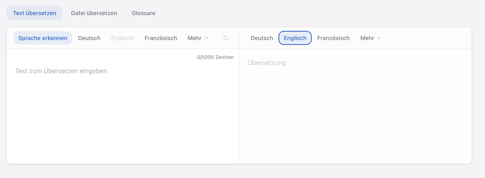

companyTRANSLATE ist eine Übersetzungsanwendung, die wie der CompanyGPT vollständig im Microsoft-Tenant des Unternehmens betrieben wird. Sie unterstützt Text- und Dokumentübersetzung sowie ein zweistufiges Glossarsystem. Da keine Daten an externe Dienste übermittelt werden, erfüllt die Anwendung die Anforderungen der DSGVO.

## Zugang und Authentifizierung

Der Zugang erfolgt ausschließlich über Microsoft Single Sign-On (SSO) mit dem bestehenden Firmenkonto. Es werden keine separaten Zugangsdaten benötigt, und es findet keine Datenübertragung an Drittanbieter statt.

## Text- und Dokumentübersetzung

companyTRANSLATE unterstützt zwei Übersetzungsmodi:

- **Textübersetzung**: Bis zu 5.000 Zeichen direkt in der Benutzeroberfläche
- **Dokumentübersetzung**: PDF-, Word- (.docx) und PowerPoint-Dateien (.pptx) bis zu 40 MB; Formatierung und Layout werden beibehalten

## Übersetzungshistorie und OneDrive-Integration

Alle Übersetzungen werden automatisch in einer benutzerbezogenen Historie protokolliert. Übersetzte Dokumente können direkt in OneDrive gespeichert werden. Ein lokales Caching außerhalb der Microsoft-Cloud findet nicht statt.

## Zweistufiges Glossarsystem

Das Glossarsystem arbeitet auf zwei Ebenen:

- **Globales Glossar**: Wird zentral von Administratoren verwaltet und legt verbindliche Terminologie für das gesamte Unternehmen fest
- **Persönliches Glossar**: Jeder Nutzer kann ein eigenes Glossar für projektspezifische Begriffe anlegen

Beide Glossare können per CSV-Import befüllt werden.

