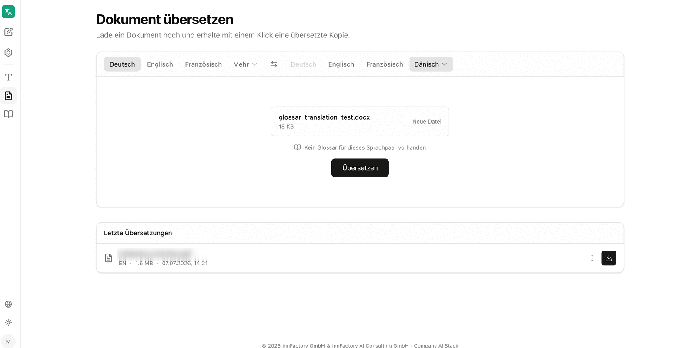

Der Bereich **Dokument übersetzen** übersetzt vollständige Dateien und gibt sie im Ausgangsformat zurück. Die Anwendung beschreibt den Bereich mit „Lade ein Dokument hoch und erhalte mit einem Klick eine übersetzte Kopie."

## Unterstützte Formate

Der Ablagebereich nennt die zulässigen Formate direkt: **PDF, DOCX, PPTX bis 40 MB**. Dateien werden per Drag-and-drop abgelegt oder über **Datei auswählen** aus dem Dateisystem geladen.

:::note
Anders als bei der [Textübersetzung](/de/company-gpt/addons/company-translate/text-uebersetzen/) gibt es hier keine automatische Spracherkennung. Ausgangs- und Zielsprache müssen vor der Übersetzung gesetzt werden.
:::

## Sprachen und Glossar wählen

Nach dem Upload zeigt companyTRANSLATE die Datei mit Namen und Größe an. Über **Neue Datei** lässt sich eine andere Datei wählen. Unterhalb der Datei steht der Glossarstatus für die gewählte Sprachkombination – entweder der Hinweis **Kein Glossar für dieses Sprachpaar vorhanden** oder die Auswahl **Glossar auswählen** mit den passenden Glossaren als Kontrollkästchen.

Die Schaltfläche **Übersetzen** startet den Vorgang.

## Ergebnis herunterladen

Nach Abschluss meldet die Anwendung **Übersetzung abgeschlossen** und bietet **Übersetzung herunterladen** an. **Neue Datei** setzt den Bereich für den nächsten Vorgang zurück.

Die übersetzte Kopie behält Aufbau und Formatierung der Ausgangsdatei: Überschriften, Absätze, Hervorhebungen und Seitenumbrüche bleiben erhalten, sodass Ausgangs- und Zieldokument nebeneinander vergleichbar sind.

## Letzte Übersetzungen

Unterhalb des Ablagebereichs listet **Letzte Übersetzungen** die bisherigen Vorgänge mit Dateiname, Zielsprache, Dateigröße und Zeitpunkt. Je Eintrag stehen ein Kontextmenü und eine Schaltfläche zum erneuten Herunterladen bereit.

Noch laufende Vorgänge sind mit **In Bearbeitung** gekennzeichnet und bieten keinen Download an.

:::tip[Hinweis]
Bei größeren Dokumenten kann die Übersetzung einen Moment dauern. Der Eintrag in **Letzte Übersetzungen** wechselt von **In Bearbeitung** auf die Download-Schaltfläche, sobald das Ergebnis bereitsteht.
:::

## Weiterführende Themen

- [Glossare](/de/company-gpt/addons/company-translate/glossare/) – einheitliche Terminologie für Dokumentübersetzungen
- [Text übersetzen](/de/company-gpt/addons/company-translate/text-uebersetzen/) – kurze Texte direkt in der Oberfläche übersetzen
