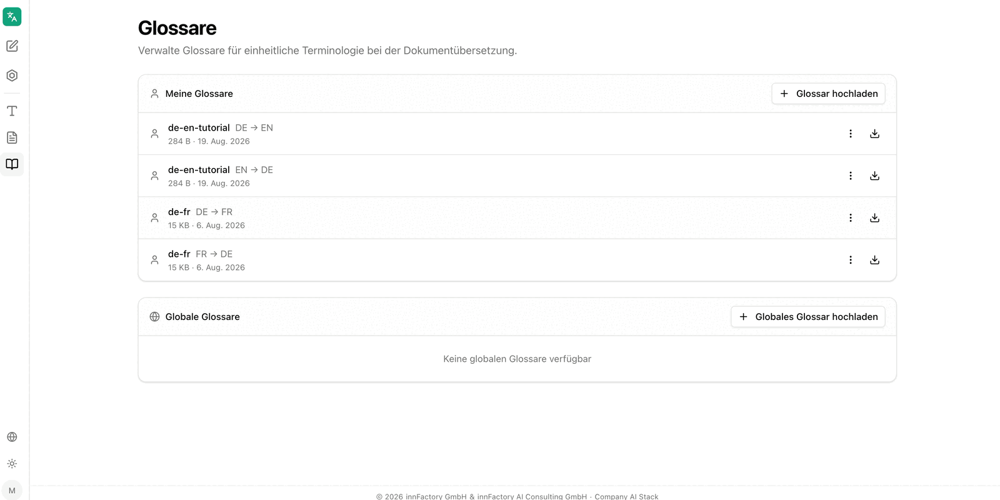

Glossare legen fest, wie einzelne Begriffe übersetzt werden. Sie sichern damit verbindliche Terminologie – etwa Produktnamen, Rollenbezeichnungen oder feststehende Formulierungen –, die sonst je nach Kontext unterschiedlich übersetzt würden. Glossare gelten sowohl für die [Textübersetzung](/de/company-gpt/addons/company-translate/text-uebersetzen/) als auch für die [Dokumentübersetzung](/de/company-gpt/addons/company-translate/dokument-uebersetzen/).

## Meine Glossare und Globale Glossare

Die Übersicht trennt zwei Ebenen:

- **Meine Glossare** – Glossare des angemeldeten Nutzers, anzulegen über **Glossar hochladen**. Jeder berechtigte Nutzer kann hier eigene Glossare hinterlegen
- **Globale Glossare** – unternehmensweit gültige Glossare, anzulegen über **Globales Glossar hochladen**; ohne Einträge erscheint **Keine globalen Glossare verfügbar**

:::note
Globale Glossare können ausschließlich von Administratoren angelegt und verwaltet werden. Eigene Glossare unter **Meine Glossare** stehen allen berechtigten Nutzern offen.
:::

Jeder Eintrag zeigt Name, Sprachrichtung als Paar aus Quell- und Zielsprache, Dateigröße und Anlagedatum sowie ein Kontextmenü und eine Schaltfläche zum Herunterladen.

## Aufbau einer Glossardatei

Eine CSV- oder TSV-Datei benötigt genau zwei Spalten – Quelle und Ziel – mit einer Kopfzeile, in der die Sprachkürzel stehen. Jede weitere Zeile bildet ein Begriffspaar:

| de | en |
|---|---|
| Umsatz | Money Explosion |
| Geschäftsjahr | Year of the Potato |
| Vorstand | Council of Wizards |
| Besprechung | Nap Time |

:::note
Die Beispielwerte stammen aus einem Schulungsglossar und sind bewusst überzeichnet, damit die Wirkung des Glossars in der Übersetzung sofort sichtbar wird.
:::

Über **Beispiel-CSV herunterladen** stellt der Upload-Dialog eine Vorlage im erwarteten Aufbau bereit.

## Glossar hochladen

**Glossar hochladen** öffnet einen Dialog mit allen Angaben zum neuen Glossar.

| Feld | Bedeutung |
|---|---|
| **Glossarname** | Frei wählbarer Name, unter dem das Glossar später zur Auswahl steht |
| **Quellsprache** | Sprache der linken Spalte |
| **Zielsprache** | Sprache der rechten Spalte |
| **Zusätzlich die Gegenrichtung anlegen** | Legt aus derselben Datei ein zweites Glossar für die umgekehrte Richtung an |
| **Datei auswählen (CSV, TSV, XLIFF, TMX)** | Auswahl der Glossardatei |

Der Dialog nennt die zulässigen Formate ausdrücklich: eine **CSV-, TSV- (`.tsv`/`.tab`), XLIFF- (`.xlf`) oder TMX-Datei**. TMX-Dateien werden automatisch in XLIFF konvertiert.

:::note
Glossare gelten immer nur in eine Richtung. Ein Glossar Deutsch → Englisch greift nicht bei einer Übersetzung Englisch → Deutsch. Mit **Zusätzlich die Gegenrichtung anlegen** entstehen beide Richtungen in einem Schritt; in der Übersicht erscheinen sie danach als zwei Einträge mit gleichem Namen und unterschiedlicher Sprachrichtung.
:::

### Grenzen bei TMX-Dateien

Der Dialog weist auf eine Größenbeschränkung hin: Übersetzungsanbieter begrenzen Glossare auf 10 MB. TMX-Dateien, deren Inhalt in dieses Limit passt, werden vollständig für die Dokumentübersetzung verwendet. Bei größeren Dateien wird automatisch ein Termglossar extrahiert – nur kurze, termartige Einträge mit höchstens 5 Wörtern beziehungsweise 50 Zeichen bleiben erhalten, ganze Sätze werden verworfen, und die häufigsten Begriffe werden bis zum 10-MB-Limit übernommen, maximal 50.000 Einträge.

## Glossare anwenden

Ein hochgeladenes Glossar steht in beiden Übersetzungsbereichen zur Verfügung, sobald die gewählte Sprachkombination zur Sprachrichtung des Glossars passt:

- Bei der [Textübersetzung](/de/company-gpt/addons/company-translate/text-uebersetzen/) über das Auswahlfeld unter dem Eingabefeld und das Kontrollkästchen **Glossar automatisch anwenden**
- Bei der [Dokumentübersetzung](/de/company-gpt/addons/company-translate/dokument-uebersetzen/) über **Glossar auswählen** vor dem Start der Übersetzung

Passt kein Glossar zur Sprachkombination, meldet die Oberfläche **Kein Glossar für dieses Sprachpaar**. Die Anwendung eines Glossars ist optional: Auch bei vorhandenem Glossar lässt sich ohne übersetzen.

:::danger
Glossare berücksichtigen Groß- und Kleinschreibung. Ein Eintrag greift nur bei identischer Schreibweise. Begriffe, die in mehreren Schreibweisen vorkommen sollen, müssen als separate Einträge im Glossar stehen.
:::

## Weiterführende Themen

- [Text übersetzen](/de/company-gpt/addons/company-translate/text-uebersetzen/) – Glossare in der Echtzeitübersetzung
- [Dokument übersetzen](/de/company-gpt/addons/company-translate/dokument-uebersetzen/) – Glossare bei Dateiübersetzungen
