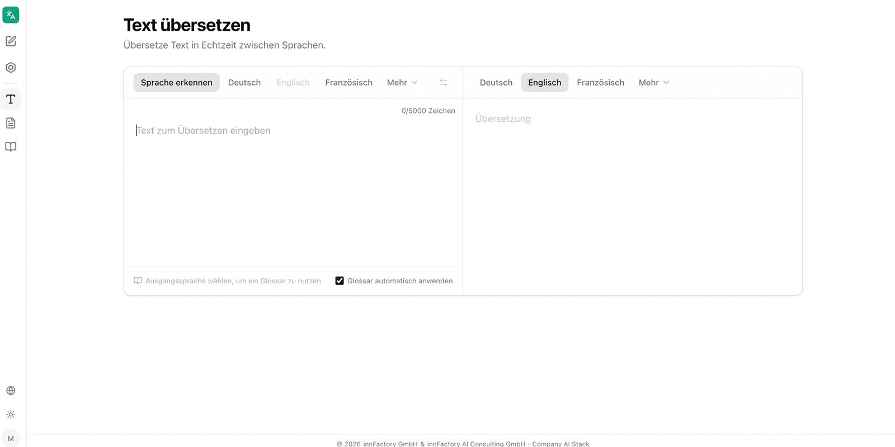
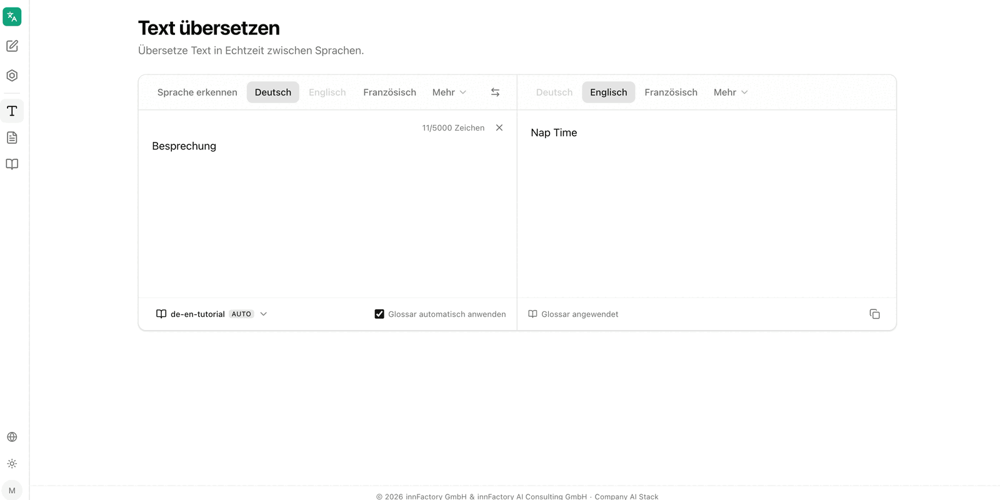

Der Bereich **Text übersetzen** übersetzt eingegebenen Text unmittelbar zwischen zwei Sprachen. Die Oberfläche stellt Ausgangs- und Zieltext nebeneinander dar; die Übersetzung wird während der Eingabe aktualisiert. Die Anwendung beschreibt den Bereich selbst mit „Übersetze Text in Echtzeit zwischen Sprachen."

## Sprachen wählen

Über der Eingabe stehen zwei Sprachleisten: links die Ausgangssprache, rechts die Zielsprache. Beide bieten **Deutsch**, **Englisch** und **Französisch** direkt an; alle weiteren Sprachen liegen hinter **Mehr**. Die gewählte Sprache aus dem Menü **Mehr** rückt anschließend als Schaltfläche in die Leiste, im Beispiel **Dänisch**.

Links steht zusätzlich **Sprache erkennen**. Ist diese Option aktiv, ermittelt die Anwendung die Ausgangssprache aus dem eingegebenen Text und zeigt das Ergebnis als **Erkannt: Deutsch** an. Die Schaltfläche zwischen den beiden Leisten vertauscht Ausgangs- und Zielsprache.

## Zeichenlimit

Über dem Eingabefeld zählt die Anwendung die verbrauchten Zeichen mit, etwa `22/5000 Zeichen`. Pro Übersetzung sind damit 5.000 Zeichen möglich. Ein Kreuz neben dem Zähler leert das Eingabefeld; unter dem Ergebnis kopiert eine Schaltfläche die Übersetzung in die Zwischenablage.

:::note
Längere Inhalte übersetzen Sie über [Dokument übersetzen](/de/company-gpt/addons/company-translate/dokument-uebersetzen/). Dort gilt statt des Zeichenlimits eine Dateigrößengrenze von 40 MB.
:::

## Glossar anwenden

Am unteren Rand des Eingabefelds zeigt companyTRANSLATE an, welches [Glossar](/de/company-gpt/addons/company-translate/glossare/) für die aktuelle Sprachkombination greift. Der Text wechselt je nach Situation:

| Anzeige | Bedeutung |
|---|---|
| **Ausgangssprache wählen, um ein Glossar zu nutzen** | Es ist noch keine Ausgangssprache gesetzt, etwa bei aktiver Spracherkennung |
| **Kein Glossar für dieses Sprachpaar** | Für die gewählte Kombination existiert kein Glossar |
| Glossarname mit Kennzeichen **AUTO** | Ein Glossar ist ausgewählt und wird angewendet |

Ist ein Glossar vorhanden, lässt es sich über das Auswahlfeld setzen. Das Kontrollkästchen **Glossar automatisch anwenden** übernimmt das passende Glossar ohne weiteres Zutun. Über dem Ergebnis erscheint dann der Hinweis **Glossar angewendet**.

Im Beispiel übersetzt companyTRANSLATE „Besprechung" mit dem Glossareintrag **Nap Time** statt mit der sonst üblichen Entsprechung „Meeting".

## Weiterführende Themen

- [Glossare](/de/company-gpt/addons/company-translate/glossare/) – Glossare anlegen, hochladen und anwenden
- [Dokument übersetzen](/de/company-gpt/addons/company-translate/dokument-uebersetzen/) – ganze Dateien mit erhaltener Formatierung übersetzen
