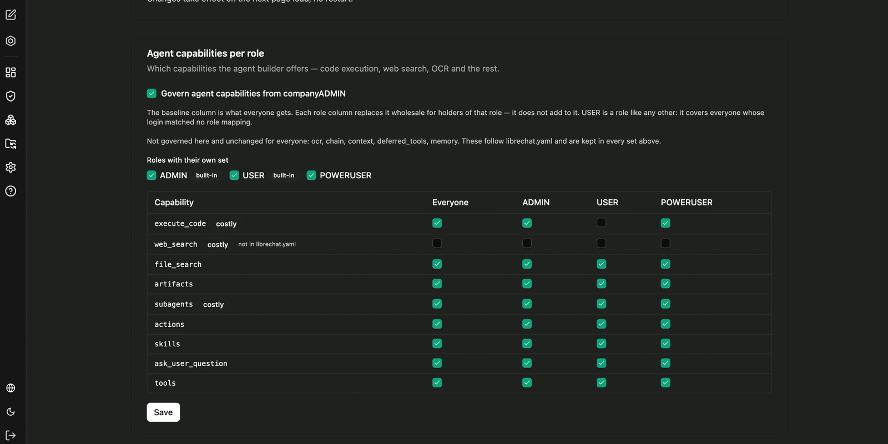

Agent-Capabilities bestimmen, welche Fähigkeiten der Agent-Builder anbietet – etwa Code-Ausführung, Websuche, Dateisuche oder Subagenten. Die Freigabe erfolgt pro Rolle.

## So liest sich die Matrix

Die Spalte **Everyone** ist der Basissatz, den alle erhalten. Jede Rollenspalte **ersetzt** diesen Basissatz für die Mitglieder dieser Rolle vollständig – sie addiert sich nicht dazu. Über **Roles with their own set** legen Sie fest, welche Rollen überhaupt einen eigenen Satz erhalten.

`USER` ist dabei eine Rolle wie jede andere: Sie umfasst alle Nutzer, deren Anmeldung keinem Rollen-Mapping entsprochen hat.

## Verfügbare Capabilities

| Capability | Hinweis |
|---|---|
| `execute_code` | Code-Ausführung; als kostenintensiv gekennzeichnet |
| `web_search` | Websuche; kostenintensiv |
| `file_search` | Dateisuche im Dateikontext des Agenten |
| `artifacts` | Artefakte als Ausgabeformat |
| `subagents` | Subagenten; kostenintensiv |
| `actions` | Aktionen über externe Schnittstellen |
| `skills` | Verwendung von Skills |
| `ask_user_question` | Rückfragen an den Nutzer |
| `tools` | Verwendung von Tools |

:::note
Nicht über diese Seite gesteuert und für alle unverändert sind `ocr`, `chain`, `context`, `deferred_tools` und `memory`. Diese folgen der Serverkonfiguration und bleiben in jedem der oben definierten Sätze enthalten.
:::

:::tip[Hinweis]
Kostenintensive Capabilities wie Code-Ausführung, Websuche und Subagenten lassen sich auf diesem Weg gezielt auf einzelne Rollen begrenzen, ohne sie für alle zu sperren.
:::

Diese Einstellung betrifft den Baukasten für Agenten. Welche Funktionen ein Nutzer in CompanyGPT allgemein verwenden darf, regeln die Funktionsrechte unter [Rollen und Rechte](/de/company-gpt/addons/companyadmin/rollen-und-rechte/).
