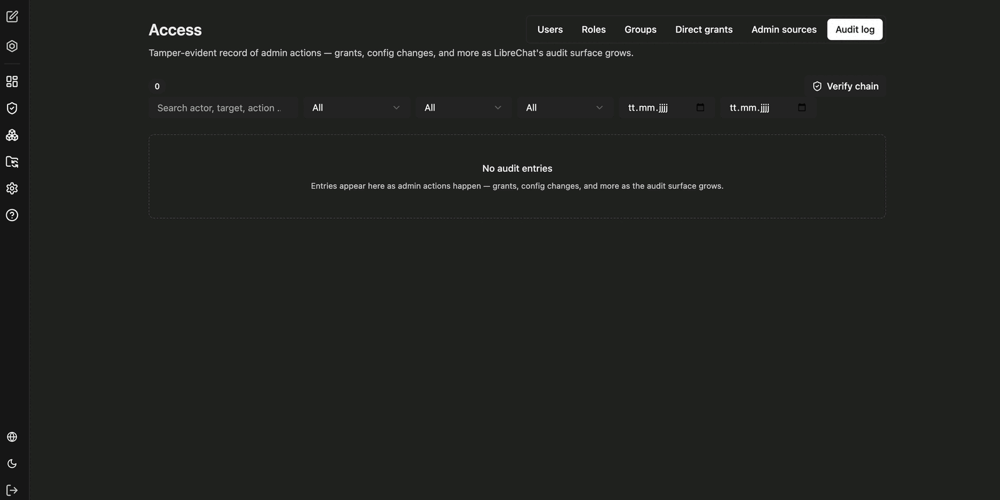

Das Audit-Log unter **Access** protokolliert Administrationsvorgänge manipulationssicher – etwa erteilte Berechtigungen und Konfigurationsänderungen. Es dient der Nachvollziehbarkeit und der Fehlersuche.

Zur Einschränkung stehen bereit:

- **Suche** nach Akteur, Ziel oder Aktion
- **Filter** für Art des Eintrags
- **Zeitraum** über Von- und Bis-Datum

Über **Verify chain** prüfen Sie die Integrität der Protokollkette. Die Einträge sind so verkettet, dass nachträgliche Änderungen auffallen – ein bestandener Test bedeutet, dass das Protokoll seit dem ersten Eintrag unverändert ist.

:::note
Der Umfang der protokollierten Vorgänge wächst mit dem Ausbau des Administrationsbereichs. Solange keine Administrationsvorgänge stattgefunden haben, bleibt die Liste leer.
:::

Wer welche Berechtigungen erhalten hat, sehen Sie unter [Direkte Berechtigungen](/de/company-gpt/addons/companyadmin/direkte-berechtigungen/); die Herkunft von Administrationszugriff zeigt der Reiter **Admin sources** unter [Benutzer und Gruppen](/de/company-gpt/addons/companyadmin/benutzer-und-gruppen/).
