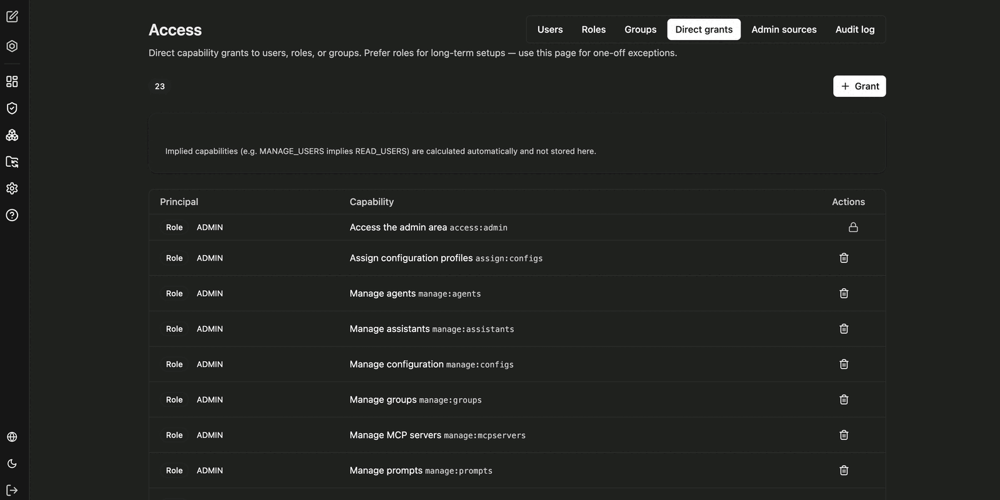
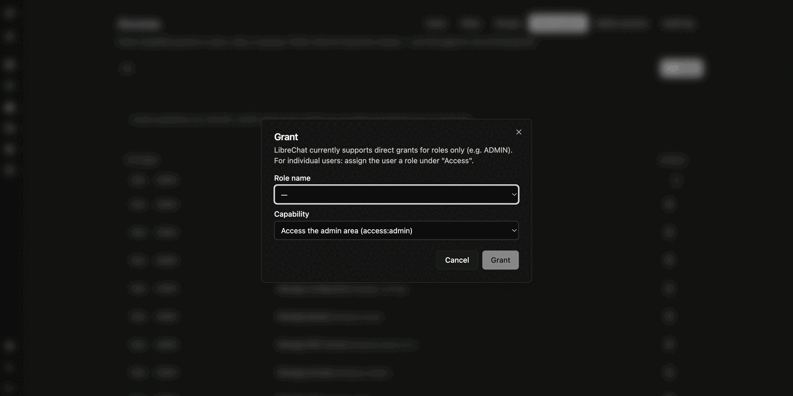

Direkte Berechtigungen (**Direct grants**) erteilen eine einzelne Capability gezielt, ohne dafür eine eigene Rolle anzulegen. Sie sind für einmalige Ausnahmen gedacht; für dauerhafte Zuständigkeiten sind [Rollen](/de/company-gpt/addons/companyadmin/rollen-und-rechte/) der richtige Weg.

Über **Grant** erteilen Sie eine Berechtigung. Der Dialog fragt zwei Angaben ab:

- **Role name** – die Rolle, für die die Capability gilt
- **Capability** – die zu erteilende Berechtigung, zum Beispiel `access:admin` (Zugang zum Administrationsbereich) oder `manage:roles` (Rollen verwalten)

:::note
Direkte Berechtigungen werden derzeit nur für Rollen unterstützt, nicht für einzelne Personen. Um einer einzelnen Person eine Berechtigung zu geben, weisen Sie ihr unter **Access** eine passende Rolle zu.
:::

Jede erteilte und entzogene Berechtigung wird im [Audit-Log](/de/company-gpt/addons/companyadmin/audit-log/) protokolliert. Wer aktuell Administrationszugriff hat, zeigt der Reiter **Admin sources** unter [Benutzer und Gruppen](/de/company-gpt/addons/companyadmin/benutzer-und-gruppen/).
