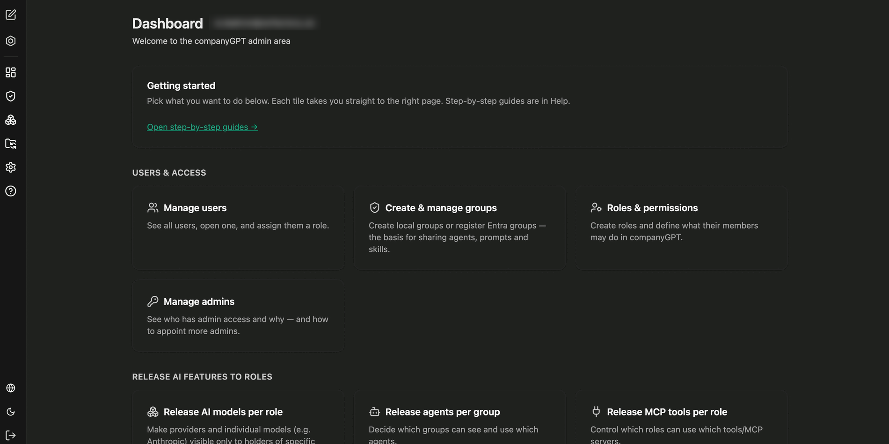

companyADMIN ist der Administrationsbereich von CompanyGPT. Hier legen Sie fest, wer welche Funktionen nutzen darf, welche Modelle und Agenten für welche Rollen und Gruppen sichtbar sind und wie die Inhaltsbibliothek – Agenten, Prompts und Skills – mit einem Git-Repository synchronisiert wird.

Erreichbar ist der Bereich über das Anwendungsmenü unter **Admin**. Voraussetzung ist die Berechtigung `access:admin`, die über eine [Rolle](/de/company-gpt/addons/companyadmin/rollen-und-rechte/) oder eine [direkte Berechtigung](/de/company-gpt/addons/companyadmin/direkte-berechtigungen/) erteilt wird.

:::note
companyADMIN befindet sich in der Beta-Phase. Bezeichnungen und Aufbau einzelner Seiten können sich noch ändern.
:::

## Dashboard

Die Startseite bündelt die häufigsten Aufgaben als Kacheln, die jeweils direkt auf die passende Seite führen.

**Nutzer & Zugriff**

| Kachel | Zweck |
|---|---|
| Nutzer verwalten | Alle Nutzer einsehen, einzelne öffnen und ihnen eine Rolle zuweisen |
| Gruppen erstellen und verwalten | Lokale Gruppen anlegen oder Entra-Gruppen registrieren – die Grundlage für das Teilen von Agenten, Prompts und Skills |
| Rollen & Rechte | Rollen anlegen und festlegen, was ihre Mitglieder in CompanyGPT dürfen |
| Admins verwalten | Einsehen, wer Administrationszugriff hat und warum – und weitere Admins ernennen |

**KI-Funktionen für Rollen freigeben**

| Kachel | Zweck |
|---|---|
| KI-Modelle pro Rolle freigeben | Provider und einzelne Modelle nur für bestimmte Rollen sichtbar machen |
| Agenten pro Gruppe freigeben | Festlegen, welche Gruppen welche Agenten sehen und nutzen können |
| MCP-Tools pro Rolle freigeben | Steuern, welche Rollen welche Tools und MCP-Server verwenden dürfen |

## Bereiche im Überblick

- [Rollen und Rechte](/de/company-gpt/addons/companyadmin/rollen-und-rechte/) – Rollen anlegen und Funktionsrechte je Rolle setzen
- [Benutzer und Gruppen](/de/company-gpt/addons/companyadmin/benutzer-und-gruppen/) – Rollen zuweisen, Gruppen und Entra-Gruppen verwalten
- [Direkte Berechtigungen](/de/company-gpt/addons/companyadmin/direkte-berechtigungen/) – einzelne Capabilities gezielt erteilen
- [Audit-Log](/de/company-gpt/addons/companyadmin/audit-log/) – manipulationssicheres Protokoll der Administrationsvorgänge
- [Inhalte und Sichtbarkeit](/de/company-gpt/addons/companyadmin/inhalte/) – Agenten, Prompts, Skills und MCP-Tools freigeben
- [Kategorien](/de/company-gpt/addons/companyadmin/kategorien/) – Kategorien für den Agenten-Marktplatz pflegen
- [Modelle und Provider](/de/company-gpt/addons/companyadmin/modelle/) – Modellzugriff pro Rolle und eigene Modellbezeichnungen
- [Agent-Capabilities](/de/company-gpt/addons/companyadmin/agent-capabilities/) – Fähigkeiten des Agent-Builders pro Rolle
- [Library Sync](/de/company-gpt/addons/companyadmin/library-sync/) – Inhaltsbibliothek mit GitHub synchronisieren

## Rollen, Gruppen und Sichtbarkeit

Drei Konzepte greifen im Administrationsbereich ineinander:

- **Rollen** bündeln Rechte und Capabilities. Ein Nutzer hat genau **eine** Rolle; Freigaben verschiedener Rollen addieren sich nicht.
- **Gruppen** bündeln Nutzer. Sie sind die Grundlage für das Teilen von Inhalten.
- **Sichtbarkeit** entscheidet pro Inhalt, wer ihn sieht – nur der Eigentümer, alle Nutzer der Umgebung oder ausgewählte Gruppen.

:::tip[Hinweis]
Weil ein Nutzer genau eine Rolle hat, braucht eine Personengruppe, die die Freigaben zweier Rollen zusammen benötigt, eine eigene Rolle.
:::
