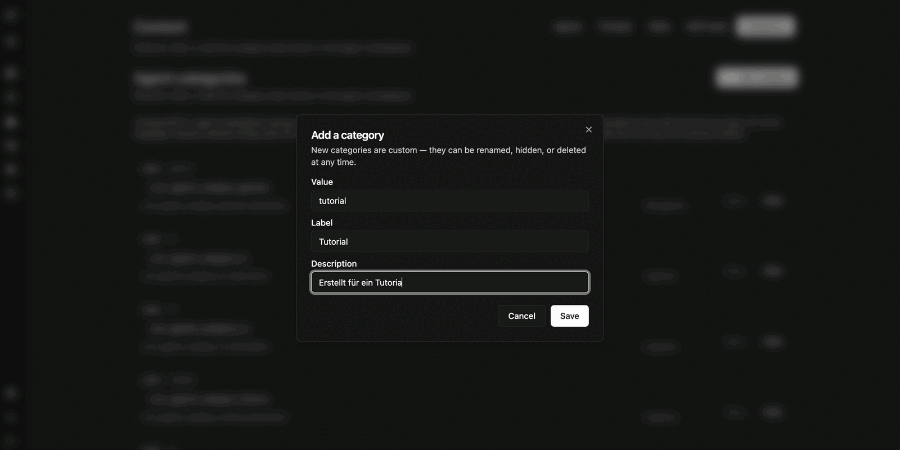
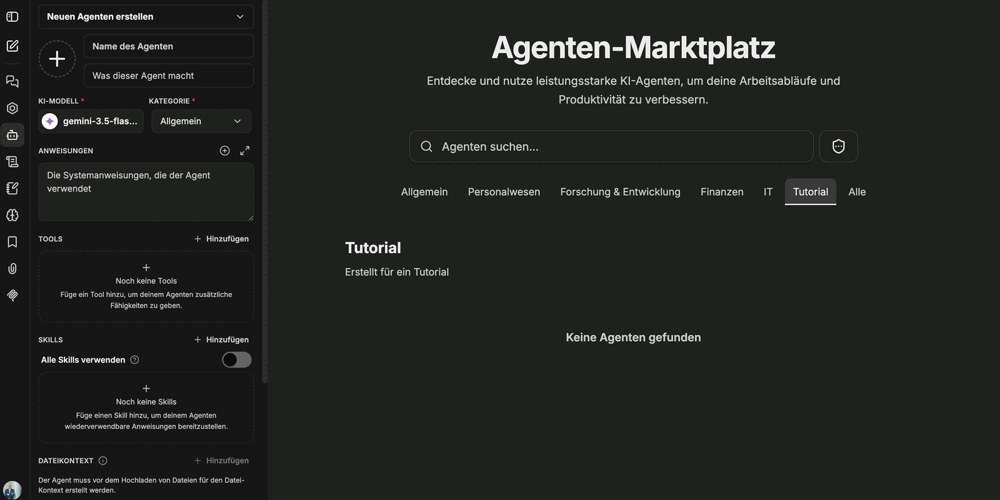

Kategorien strukturieren den **Agenten-Marktplatz**. Sie werden unter **Content** im Reiter **Categories** gepflegt und erscheinen anschließend als Filter im Marktplatz sowie als Auswahlfeld im Agent-Builder.

## Kategorie anlegen

Eine neue Kategorie besteht aus drei Angaben:

| Feld | Bedeutung |
|---|---|
| **Value** | Technischer Schlüssel, klein geschrieben – zum Beispiel `tutorial` |
| **Label** | Angezeigter Name im Marktplatz – zum Beispiel `Tutorial` |
| **Description** | Kurze Beschreibung, die im Marktplatz unter dem Namen erscheint |

Selbst angelegte Kategorien sind **custom**: Sie können jederzeit umbenannt, ausgeblendet oder gelöscht werden.

## Ergebnis im Marktplatz

Nach dem Speichern erscheint die Kategorie als Reiter im Agenten-Marktplatz – mit Label und Beschreibung. Solange ihr kein Agent zugeordnet ist, bleibt die Liste leer.

Im Agent-Builder wählen Nutzer die Kategorie über das Feld **Kategorie** aus. Erst diese Zuordnung stellt den Agenten im entsprechenden Reiter des Marktplatzes dar.

:::tip[Hinweis]
Ob Nutzer den Marktplatz überhaupt sehen, steuert das Recht **Marketplace → Use** unter [Rollen und Rechte](/de/company-gpt/addons/companyadmin/rollen-und-rechte/). Wer welchen Agenten im Marktplatz sieht, ergibt sich aus der [Sichtbarkeit](/de/company-gpt/addons/companyadmin/inhalte/).
:::
