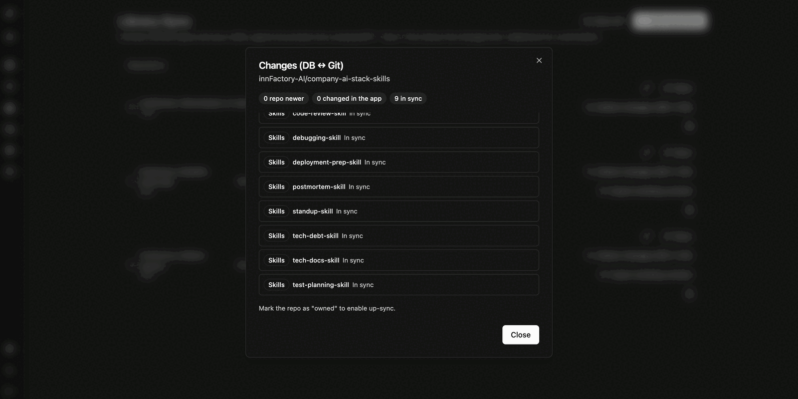
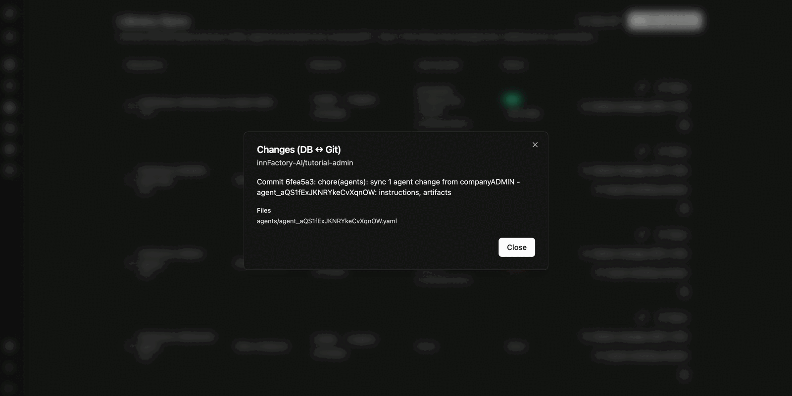
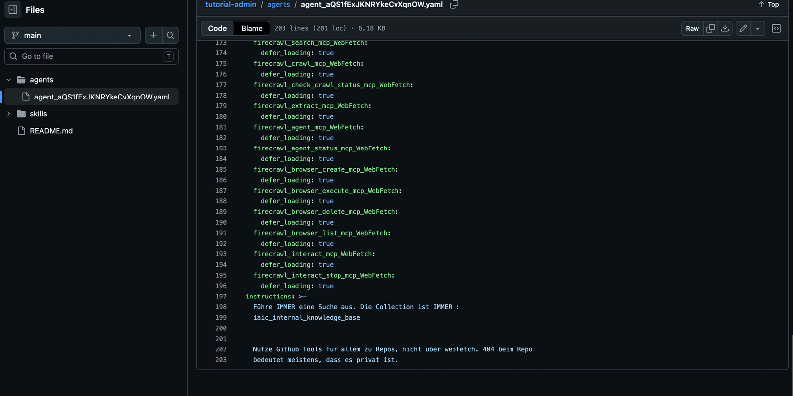

Library Sync verbindet CompanyGPT mit GitHub-Repositories und synchronisiert **Skills, Agenten und Prompts** in beide Richtungen. Damit lässt sich die Inhaltsbibliothek versionieren, im Team prüfen und zwischen Umgebungen übertragen.

Ein Synchronisationslauf zeigt die Änderungen – einschließlich Löschungen – zunächst zur Bestätigung an.

Die Übersicht zeigt je Repository:

| Spalte | Inhalt |
|---|---|
| **Repository** | Repository und Branch |
| **Detected** | Erkannte Inhalte als Anzahl Skills, Agenten und Prompts; zusätzlich, ob ein Token hinterlegt ist |
| **Last synced** | Zeitpunkt, Commit und auslösende Person des letzten Laufs |
| **Status** | `OK` mit Zusatz „Up to date" oder `Error` |

Je Repository stehen bereit: **Sync**, **Detect changes (DB ↔ Git)**, **Export existing content**, Bearbeiten und Löschen. **Sync all** synchronisiert alle Repositories nacheinander.

## Repository verbinden

Über **Add repository** verbinden Sie ein Repository. Neben Repository, Branch und Authentifizierung über einen GitHub-Token legen Sie fest, wo die Inhalte im Repository liegen.

- **Analyze with AI** – ein Sprachmodell schlägt anhand des Dateibaums vor, welche Ordner Skills, Agenten und Prompts enthalten. Der Vorschlag füllt nur die Struktur vor; synchronisiert wird dabei nichts.
- **Detected content** – Anzahl der erkannten Skills, Agenten und Prompts.
- **Structure (sources)** – je Eintrag ein Inhaltstyp und der zugehörige Pfad, zum Beispiel `skills`, `agents` und `prompts`. Über **Add source** ergänzen Sie weitere Pfade, etwa `library/agents`.
- **Visibility** – Standardsichtbarkeit der importierten Inhalte. Voreingestellt ist `Owner / system`; alternativ geben Sie sie für alle oder für bestimmte Gruppen frei.
- **We own this repo (allow write-back/up-sync)** – erlaubt das Zurückschreiben aus CompanyGPT in das Repository. Dafür wird ein GitHub-Token (PAT) mit `repo`-Berechtigung benötigt.

:::note
Ohne die Kennzeichnung als eigenes Repository ist die Synchronisation einseitig: Inhalte kommen aus Git nach CompanyGPT, Änderungen in CompanyGPT werden nicht zurückgeschrieben.
:::

## Änderungen prüfen

**Detect changes (DB ↔ Git)** vergleicht den Stand in CompanyGPT mit dem Repository und fasst das Ergebnis zusammen: wie viele Einträge im Repository neuer sind, wie viele in der Anwendung geändert wurden und wie viele übereinstimmen. Je Eintrag wird der Status einzeln ausgewiesen.

## Inhalte nach Git exportieren

**Export existing content** schreibt Inhalte, die in CompanyGPT entstanden und noch nie aus einem Repository synchronisiert wurden, erstmalig in das Repository.

Sie wählen die gewünschten Agenten und Skills einzeln aus oder übernehmen alle, und erhalten anschließend über **Preview** eine Vorschau der zu schreibenden Dateien.

Beim Zurückschreiben erzeugt CompanyGPT einen Commit mit sprechender Nachricht und listet die geschriebenen Dateien auf.

Im Repository liegen die Inhalte anschließend als YAML-Dateien in den konfigurierten Ordnern – ein Agent samt Anweisungen, Tools und Artefakt-Einstellungen also als eine Datei je Agent.

## Zusammenspiel mit der Sichtbarkeit

Synchronisierte Inhalte tragen unter [Inhalte und Sichtbarkeit](/de/company-gpt/addons/companyadmin/inhalte/) die Kennzeichnung `synced`. Wird ein solcher Inhalt in CompanyGPT bearbeitet, weist die Liste ihn zusätzlich als geändert aus – ein Hinweis darauf, dass Anwendung und Repository auseinanderlaufen. Ein erneuter Lauf gleicht beides wieder ab.

:::tip[Hinweis]
Prüfen Sie die Änderungsvorschau vor jedem Lauf. Sie enthält auch Löschungen: Inhalte, die im Repository entfernt wurden, verschwinden bei der Synchronisation auch aus CompanyGPT.
:::
