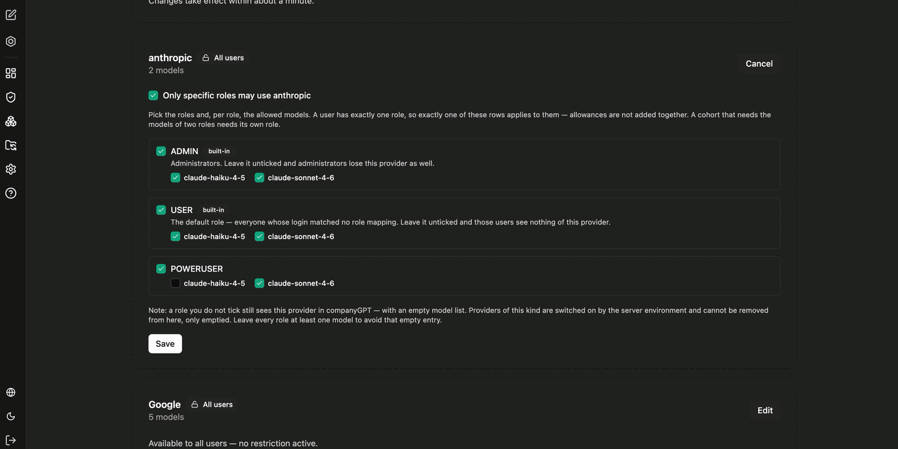
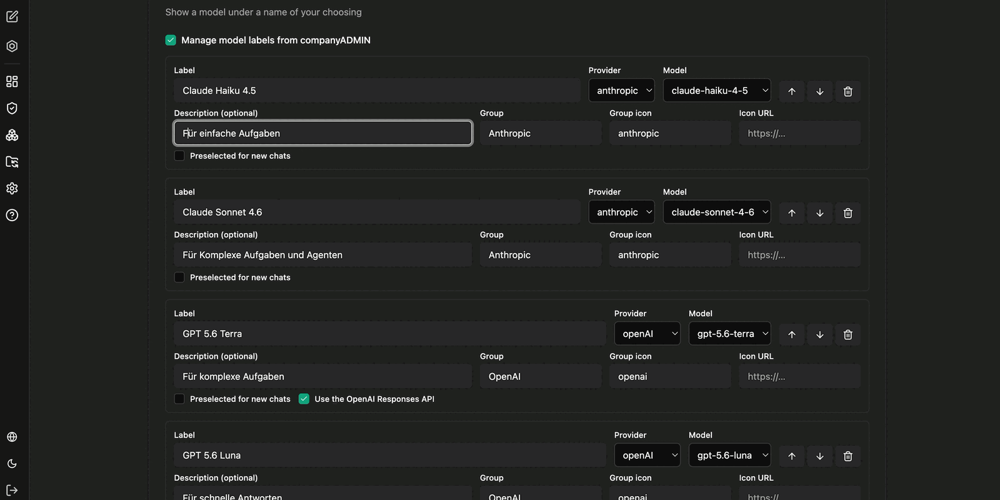

Im Administrationsbereich legen Sie fest, welche Provider und welche einzelnen Modelle eine Rolle verwenden darf – und unter welchem Namen ein Modell den Nutzern angezeigt wird.

## Modellzugriff pro Rolle

Standardmäßig ist ein Provider für alle Nutzer verfügbar. Mit **Only specific roles may use …** schränken Sie ihn auf ausgewählte Rollen ein und bestimmen je Rolle die erlaubten Modelle.

Weil ein Nutzer genau **eine** Rolle hat, greift auch genau eine dieser Zeilen für ihn. Die Freigaben mehrerer Rollen addieren sich nicht: Eine Personengruppe, die die Modelle zweier Rollen zusammen benötigt, braucht eine eigene Rolle.

Zu beachten:

- Wird die Rolle **ADMIN** nicht angehakt, verlieren auch Administratoren diesen Provider.
- **USER** ist die Standardrolle für alle, deren Anmeldung keinem Rollen-Mapping entsprochen hat. Ohne Häkchen sehen diese Nutzer nichts von dem Provider.
- Eine nicht angehakte Rolle sieht den Provider weiterhin, jedoch mit leerer Modellliste. Provider werden über die Serverumgebung aktiviert und können hier nicht entfernt, sondern nur geleert werden. Lassen Sie deshalb je Rolle mindestens ein Modell aktiv.

:::note
Änderungen an den Modellfreigaben werden innerhalb etwa einer Minute wirksam.
:::

## Eigene Modellbezeichnungen

Mit **Manage model labels from companyADMIN** zeigen Sie ein Modell unter einem Namen Ihrer Wahl an – etwa „Claude Sonnet 4.6" statt der technischen Modell-ID.

Je Eintrag konfigurieren Sie:

| Feld | Bedeutung |
|---|---|
| **Label** | Angezeigter Name des Modells |
| **Provider** und **Model** | Technische Zuordnung zum tatsächlichen Modell |
| **Description** | Kurzer Hinweis zum Einsatzzweck, zum Beispiel „Für einfache Aufgaben" |
| **Group** und **Group icon** | Gruppierung in der Modellauswahl, zum Beispiel nach Provider |
| **Icon URL** | Optionales eigenes Symbol |
| **Preselected for new chats** | Modell ist in neuen Unterhaltungen vorausgewählt |

Bei OpenAI-Modellen steht zusätzlich **Use the OpenAI Responses API** zur Verfügung. Über die Pfeile ändern Sie die Reihenfolge der Einträge in der Auswahl.

## Ergebnis für Nutzer

In der Modellauswahl der Unterhaltung sehen Nutzer anschließend nur die für ihre Rolle freigegebenen Provider und Modelle – gruppiert und mit den vergebenen Bezeichnungen.

Welche Modelle in der [Modellauswahl](/de/company-gpt/modellauswahl/) generell zur Verfügung stehen, hängt zusätzlich von der Serverkonfiguration ab.
