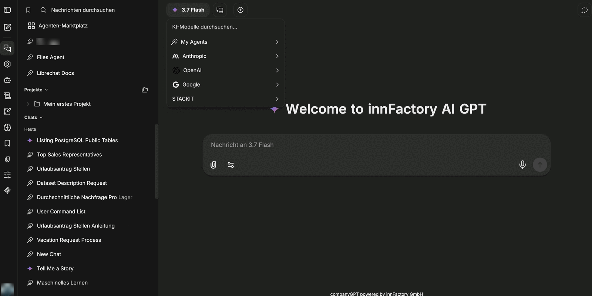

Unter **Konfiguration** legen Sie fest, welche Anbieter und Modelle Personen in CompanyGPT sehen und unter welchem Namen. Drei Seiten gehören dazu:

- **Provider und Modelle** – Zugriff je Anbieter, eine Rolle nach der anderen
- **Modellzugriff** – alle Rollen und Anbieter in einer Tabelle
- **Labels** – lesbare Namen für Modelle und die Darstellung in der Modellauswahl

Modelle hängen an **Rollen**, nicht an Gruppen. Eine Entra-Gruppe bekommt ihre Modelle über die Rolle, die ihr der Rollen-Sync gibt. Weil jede Person genau eine Rolle hat, ist das Ergebnis eindeutig.

Ansehen brauchen Sie das Recht **Konfiguration ansehen**, zum Ändern das Recht **Konfiguration bearbeiten**.

## Provider und Modelle

Ohne Einschränkung gilt die Grundkonfiguration: Alle sehen alle Anbieter und Modelle. Die Tabelle **Zugriff je Anbieter** zeigt, was gilt:

| Spalte | Inhalt |
|---|---|
| **Anbieter** | Der Anbieter, gegebenenfalls mit Badge |
| **Modelle** | Anzahl der Modelle |
| **Zugriff** | **Alle Modelle**, „x von y Modellen“ oder **Kein Zugriff** für die im Filter gewählte Rolle |
| **Quelle** | **librechat.yaml** (Grundkonfiguration, offen für alle) oder **companyADMIN** (hier eingeschränkt) |

Der Filter **Rolle** zeigt, was eine bestimmte Rolle bekommt. Mit **Anbieter oder Modell suchen …** finden Sie einen Eintrag.

Badges an einem Anbieter:

- **Eigener Endpoint** – ein eigener (custom) Anbieter. Eine Einschränkung gilt nur für diesen Endpoint. Für eine Rolle ohne Zugriff ist er in CompanyGPT ganz ausgeblendet.
- **Liste live** – die Modellliste wird beim Anbieter abgefragt. Hier lässt sich nur der ganze Anbieter sperren, nicht einzelne Modelle.
- **Neu speichern** – eine ältere Einschränkung wirkt nicht wie angezeigt. Prüfen Sie sie und speichern Sie sie erneut.

### Zugriff für eine Rolle ändern

1. Klappen Sie den Anbieter auf. Sie sehen, welche Rolle welches Modell hat.
2. Wählen Sie unter **Rolle bearbeiten:** die Rolle.
3. Setzen oder entfernen Sie das Häkchen „*Rolle* nutzt *Anbieter*“ und die Häkchen der einzelnen Modelle.
4. Klicken Sie auf **Speichern**. Nehmen Sie Modelle weg, fragt companyADMIN vorher nach und nennt die Modelle, die danach nicht mehr verfügbar sind.

Wird ein bisher offener Anbieter für eine Rolle eingeschränkt, behalten alle anderen Rollen alle Modelle, die es in diesem Moment gibt. Neue Rollen sehen den Anbieter aber erst, nachdem Sie ihn ihnen freigegeben haben. **Für alle öffnen** hebt die Einschränkung wieder auf.

:::caution[Neue Modelle bei eingeschränkten Anbietern]
**Alle Modelle** beschreibt den Stand beim Speichern. Sobald ein Anbieter eingeschränkt ist, speichert companyADMIN für jede Rolle eine feste Modellliste. Kommt später mit einem Update ein neues Modell dazu, sieht es bei diesem Anbieter keine Rolle, bis jemand es anhakt. Ausgenommen sind Anbieter mit **Liste live**.
:::

Zu beachten:

- Mindestens eine Rolle muss den Anbieter behalten.
- ADMIN ist eine Rolle wie jede andere. Nehmen Sie ADMIN den Zugriff, verlieren auch Administratoren den Anbieter.
- Bei eingebauten Anbietern sieht eine Rolle ohne Zugriff den Anbieter in CompanyGPT weiterhin, aber mit leerer Modellliste. Lassen Sie jeder Rolle mindestens ein Modell, dann tritt der leere Eintrag nicht auf.
- Nach einer Änderung laden Personen CompanyGPT neu, um die neue Auswahl zu sehen.

### AI Gateway

Ist in Ihrer Umgebung das innFactory AI Gateway eingerichtet, zeigt die Seite **Provider, Modelle und Budgets verwaltet das AI Gateway.** Hier legen Sie dann nur noch fest, welche Rolle welche Modelle im Chat sieht. **Gateway öffnen** führt zum Gateway; öffnen können es Administratoren mit Konfigurationsrechten.

:::note[Nicht in allen Umgebungen verfügbar]
Ob diese Funktion in Ihrer Umgebung zur Verfügung steht, legt Ihr Unternehmen fest. Wenden Sie sich bei Fragen an Ihren Administrator.
:::

## Modellzugriff

**Modellzugriff** zeigt alle Rollen und Anbieter in einer Tabelle: Anbieter als Zeilen, Rollen als Spalten, ADMIN und USER zuerst.

- Ein Haken heißt: Die Rolle hat den Anbieter bzw. das Modell. Ein Strich heißt: nur einige Modelle. Aufklappen zeigt die einzelnen Modelle; **Alle Modelle zeigen** klappt alle Anbieter auf.
- Je Anbieter steht, ob er **offen für alle (librechat.yaml)** oder **eingeschränkt durch companyADMIN** ist.
- Ein Klick auf den Spaltenkopf öffnet die Modelle dieser Rolle.

So ändern Sie den Zugriff:

1. Setzen oder entfernen Sie Haken. Geänderte Anbieter sind markiert.
2. Klicken Sie in der Speicherleiste auf **Speichern** oder auf **Verwerfen**.
3. Nehmen Sie Modelle weg, fragt **Modelle wegnehmen?** nach und listet je Rolle, was wegfällt. Bestätigen Sie mit **Speichern und wegnehmen**.

Auch hier muss mindestens eine Rolle jeden Anbieter behalten. Hat jemand anderes einen Anbieter inzwischen geändert, speichert companyADMIN nichts und zeigt **Inzwischen geändert – neu laden**. Prüfen Sie dann den gespeicherten Stand und speichern Sie erneut.

## Modelle je Rolle und Person

- **Rolle** → Reiter **Modelle & Provider** zeigt und ändert die Modelle einer Rolle, siehe [Rollen](/de/company-gpt/addons/companyadmin/rollen-und-rechte/).
- **Nutzer** → Reiter **Modelle** zeigt, welche Modelle eine Person sieht, siehe [Nutzer](/de/company-gpt/addons/companyadmin/nutzer/).

:::note[Nur für Superadmins]
Die Nutzerliste und damit den Reiter **Modelle** einer Person sehen nur Superadmins. Ohne Superadmin-Funktionen sehen Sie die Modelle einer Person über ihre Rolle im Reiter **Modelle & Provider**.
:::

## Labels

Labels geben Modellen lesbare Namen in der Modellauswahl, etwa „Claude schnell“ statt der technischen Modell-ID. Ein Label kann auch auf einen bestimmten Agent zeigen.

### Verwaltung

Mit **Modell-Labels in companyADMIN verwalten** übernimmt companyADMIN die Labels. Solange das Häkchen fehlt, gelten die Labels aus der Grundkonfiguration, sonst die technischen Modell-IDs. Schon das Anlegen des ersten Labels übernimmt die vorhandenen Labels aus der Grundkonfiguration zur Bearbeitung.

Um die Verwaltung zu beenden, entfernen Sie das Häkchen **Modell-Labels in companyADMIN verwalten**. Der Dialog **Verwaltung beenden?** fragt nach; bestätigen Sie mit **Verwaltung beenden**. Danach gelten wieder die Labels der Grundkonfiguration, und alle hier angelegten oder geänderten Labels gehen verloren.

### Alle Labels

Die Liste **Alle Labels** zeigt **Label**, **Modell**, **Quelle** und **Wirksam**. In dieser Reihenfolge erscheinen die Labels auch in der Modellauswahl. **Vorausgewählt** markiert das Label, das in neuen Chats vorausgewählt ist. Steht bei **Wirksam** „Nein“, gibt es das Modell nicht mehr; CompanyGPT blendet ein solches Label aus.

**Label hinzufügen** und ein Klick auf ein Label öffnen die Detailseite:

| Abschnitt | Felder |
|---|---|
| **Anzeige** | **Label** (höchstens 128 Zeichen), **Beschreibung (optional)** – erscheint in der Auswahl unter dem Label, **Gruppe** und **Gruppen-Symbol** – gruppieren die Auswahl, **Symbol-URL**, **Für neue Chats vorausgewählt** |
| **Ziel** | **Anbieter** und **Modell**, oder als Anbieter **Agent (ein bestimmter Agent)** und dann der **Agent** |

Bei OpenAI-Modellen gibt es zusätzlich **OpenAI Responses API verwenden**. Mit **Nach oben** und **Nach unten** ändern Sie die Reihenfolge. **Label entfernen** in der Gefahrenzone nimmt das Label für alle aus der Auswahl. Laufende Chats behalten ihr Modell, solange **Nur Modelle mit Label dürfen verwendet werden** aus ist. Ist der Schalter an, funktionieren laufende Chats mit diesem Label danach nicht mehr; dort muss ein neues Modell gewählt werden.

Die Karte **Modelle ohne Label (N)** listet Modelle, die noch mit ihrer technischen ID erscheinen. Dort legen Sie für einzelne Modelle ein Label an oder übernehmen mit **Alle übernehmen** alle auf einmal.

### Auswahl im Chat

Solange companyADMIN die Labels verwaltet, steuern Sie hier, wie die Modellauswahl aussieht. Übernehmen Sie die Einstellungen dieses Abschnitts mit **Speichern**.

- **Labels in der Auswahl zuerst anzeigen** – Labels stehen oben.
- **Anbieter, die auswählbar bleiben** – angehakte Anbieter behalten neben den Labels ihren eigenen Eintrag in der Auswahl. Alle anderen sind nur noch über Labels erreichbar. Ist kein Anbieter angehakt, zeigt CompanyGPT alle Anbieter. Das ist nur eine Anzeige-Einstellung und sperrt kein Modell. Eine Gruppe darf nicht so heißen wie ein angehakter Anbieter, sonst verschwinden ihre Labels aus der Auswahl.
- **Nur Modelle mit Label dürfen verwendet werden** – Personen sehen nur noch Labels, die freie Modellauswahl blendet CompanyGPT aus. Sind zusätzlich Anbieter angehakt, erscheinen diese, aber ihre Modelle ohne Label scheitern beim Senden. Das Einschalten fragt nach (**Nur noch Modelle mit Label erlauben?**).

:::caution
**Nur Modelle mit Label dürfen verwendet werden** gilt auch für Agents: Jeder Agent ohne passendes Label funktioniert ab dem Speichern nicht mehr. Legen Sie für jeden Agent, den Personen wirklich nutzen, ein Label mit dem Anbieter **Agent** an. companyADMIN warnt außerdem, wenn eine Rolle danach kein einziges nutzbares Modell mehr hätte, und verlangt mindestens ein Label.
:::

### Einstieg für neue Chats

Der **Einstieg für neue Chats** macht einen öffentlichen Agent zum Start jedes neuen Chats, etwa einen vorkonfigurierten Assistenten mit allem, was Ihre Teams brauchen. Technisch ist das ein Label, das auf den Agent zeigt und für neue Chats vorausgewählt ist. Die Seite **Labels** zeigt den Einstieg, seinen Modus und Probleme und kann ihn mit **Einstieg entfernen** zurücknehmen; das Label bleibt dabei in der Liste.

**Setzen:** Öffnen Sie den Agent unter **Inhalte** → **Agents** im Reiter **Überblick** und klicken Sie auf **Als Einstieg setzen**. Wählen Sie den Modus und bestätigen Sie. Der Einstieg gilt für die ganze Umgebung. Es gibt immer nur einen; ein bisheriger Einstieg wird ersetzt. Sie brauchen dafür das Recht **Agenten verwalten**.

| Modus | Wirkung |
|---|---|
| **fest** | Jeder neue Chat startet bei diesem Agent, auch bei Personen, die zuletzt ein anderes Modell gewählt haben |
| **weich** | Neue Chats starten bei diesem Agent, bis eine Person in ihrem Browser selbst ein anderes Modell oder einen anderen Agent wählt |

Den Modus stellen Sie auch unter **Auswahl im Chat** mit **Standard vorauswählen** ein. Er gilt für jedes vorausgewählte Label, nicht nur für Agents.

companyADMIN prüft vor dem Setzen:

- **Der Agent muss öffentlich sein.** Ist er es nicht, gibt companyADMIN ihn beim Setzen für alle frei (Lesen). Das ist nur möglich, wenn Sie das Recht **Agenten verwalten** haben und der Agent aus dem Bibliotheks-Sync stammt; den Agent einer anderen Person kann nur ein innFactory-Superadmin freigeben, sonst der Besitzer selbst im Chat. Andernfalls bleibt der Knopf gesperrt, mit Begründung.
- **Das Modell des Agents muss für alle Rollen freigegeben sein.** Sonst lehnt CompanyGPT die erste Nachricht dieser Rollen ab. Die Seite nennt die betroffenen Rollen. Geben Sie das Modell unter **Modellzugriff** frei.
- Als Hinweis, ohne Sperre, nennt companyADMIN Rollen ohne Recht auf Agents (sie behalten ihren bisherigen Start) und nicht öffentliche Skills des Agents (Personen ohne Zugriff bekommen den Agent ohne sie).

:::caution[Wenn der Einstieg ausfällt]
Wird der Einstiegs-Agent gelöscht oder wieder privat, landen alle anderen Personen bei jedem neuen Chat auf einem Fehler. Die Seite **Labels** und die Agent-Seite warnen davor. Entfernen Sie vorher den Einstieg oder setzen Sie einen anderen Agent.
:::

**Einstieg pro Rolle oder Gruppe:** Unter **Einstieg pro Rolle oder Gruppe** legen Sie eine geordnete Liste von Regeln an. Jede Regel verbindet eine **Rolle** oder **Gruppe** mit einem **Agent**; **Regel hinzufügen** ergänzt eine Zeile, **Nach oben** und **Nach unten** ändern die Reihenfolge, **Regeln speichern** übernimmt sie. Die erste passende Regel bestimmt den Einstieg einer Person; wer keine Regel trifft, bekommt den Einstieg für alle. Bei einer Rollen-Regel muss das Modell des Agents nur für diese Rolle freigegeben sein, bei einer Gruppen-Regel für alle Rollen. Die Regeln gelten ab dem nächsten Laden von CompanyGPT. Ohne die nötige Aktualisierung in Ihrem CompanyGPT zeigt die Seite stattdessen nur einen Hinweis, und der Einstieg für alle gilt für alle; fragen Sie dann innFactory.

## Ergebnis für Nutzer

In der Modellauswahl sehen Personen nur die Anbieter und Modelle, die ihre Rolle nutzen darf, gruppiert und mit den vergebenen Labels.

Welche Modelle es in Ihrer Umgebung grundsätzlich gibt, beschreibt die [Modellauswahl](/de/company-gpt/modellauswahl/).
