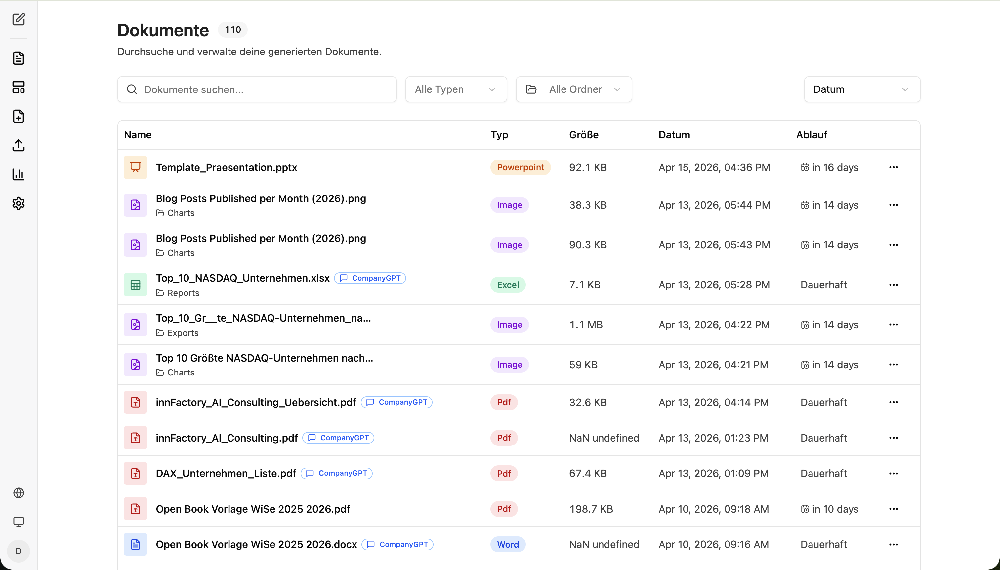
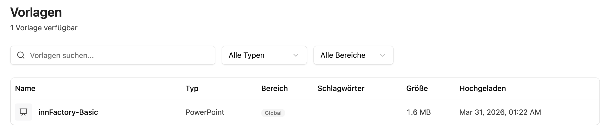
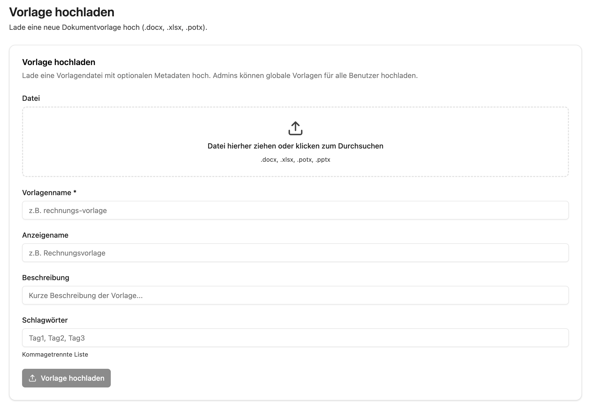
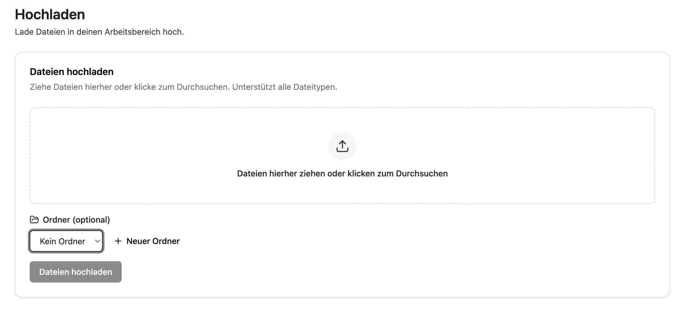
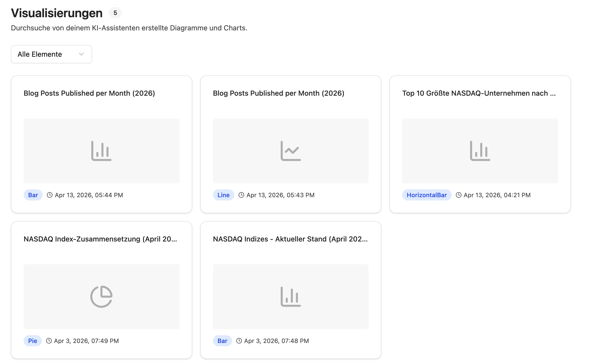
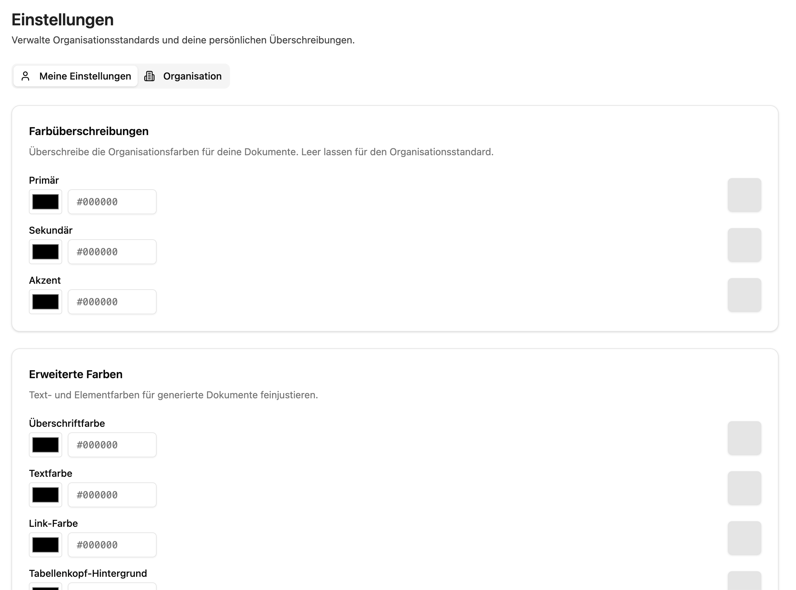

import sidebarImg from './companyfiles-sidebar.png';

Mit companyFILES erstellen, konvertieren und verwalten Sie Dokumente direkt in CompanyGPT. Das Addon verbindet Datei-Workflows, Vorlagen und Visualisierungen in einer zentralen Oberfläche.

## Die companyFILES Oberfläche

Die companyFILES Oberfläche ist klar in Navigationspunkte und Arbeitsbereiche gegliedert. Über die linke Seitenleiste wechseln Sie zwischen allen zentralen Funktionen.

  
  

Von oben nach unten finden Sie in der Seitenleiste folgende Bereiche:

1. **Zurück zum Chat** – Leitet zurück zum CompanyGPT Chat
2. **[Dokumente](#dokumente)** – Zeigt alle generierten und hochgeladenen Dokumente an
3. **[Vorlagen](#vorlagen)** – Zeigt alle verfügbaren Vorlagen an
4. **[Vorlage Hochladen](#vorlage-hochladen)** – Ermöglicht das Hochladen einer neuen Vorlage
5. **[Hochladen](#hochladen)** – Ermöglicht das Hochladen von Dateien
6. **[Visualisierungen](#visualisierungen)** – Zeigt alle erstellten Diagramme und Charts an
7. **[Einstellungen](#einstellungen)** – Dokumenteneinstellungen die automatisch angewendet werden
8. **Sprache** – Sprachänderung der Oberfläche
9. **Design Umschalten** – Toggle für Dark/Light Mode
10. **Account** – Kontoverwaltung

  

### Dokumente

Hier finden Sie alle generierten und hochgeladenen Dateien an einem Ort.

Über die **Suchleiste** und die Filter **Alle Typen** und **Alle Ordner** finden Sie Dateien schnell. Die Tabelle zeigt Name, Typ, Größe, Datum und Ablauf. Dateien mit einem **CompanyGPT**-Badge wurden direkt aus dem Chat heraus generiert. Über das **Drei-Punkte-Menü** (⋯) können Sie Dokumente herunterladen, eine Vorschau anzeigen, das Ablaufdatum bearbeiten oder löschen. Dokumente lassen sich in Ordnern organisieren und haben ein konfigurierbares Ablaufdatum.

### Vorlagen

Hier sehen Sie alle verfügbaren Vorlagen für die Dokumentenerstellung.

Vorlagen können nach **Typ** und **Bereich** (z. B. Global oder persönlich) gefiltert werden. Die Tabelle zeigt Name, Typ, Bereich, Schlagwörter, Größe und Upload-Datum. Verfügbare Vorlagen lassen sich direkt im Chat für die Dokumentengenerierung verwenden.

### Vorlage Hochladen

Hier laden Sie neue Dokumentvorlagen hoch.

Ziehen Sie eine Vorlagendatei (`.docx`, `.xlsx`, `.potx`, `.pptx`) per Drag & Drop in den Upload-Bereich. Füllen Sie den **Vorlagennamen** (Pflichtfeld) aus und optional **Anzeigename**, **Beschreibung** und **Schlagwörter**. Admins können globale Vorlagen hochladen, die für alle Benutzer sichtbar sind. Klicken Sie auf **„Vorlage hochladen"**, um den Upload abzuschließen.

### Hochladen

Hier laden Sie beliebige Dateien in Ihren Arbeitsbereich hoch.

Ziehen Sie Dateien per Drag & Drop in den Upload-Bereich oder klicken Sie zum Durchsuchen. Es werden alle Dateitypen unterstützt. Optional können Sie einen **Ordner** auswählen oder über **„+ Neuer Ordner"** einen neuen anlegen. Klicken Sie auf **„Dateien hochladen"**, um den Upload zu starten.

### Visualisierungen

Hier sehen Sie alle durch CompanyGPT erzeugten Diagramme und Charts.

Alle im Chat erstellten Visualisierungen werden hier gesammelt angezeigt. Über den Filter **„Alle Elemente"** können Sie nach Diagrammtyp filtern (z. B. Bar, Line, Pie). Jede Karte zeigt den Titel, eine Vorschau, den Typ und das Erstellungsdatum.

### Einstellungen

Hier definieren Sie Standardwerte für das Erscheinungsbild generierter Dokumente.

Über die Tabs **Meine Einstellungen** und **Organisation** legen Sie Farbwerte fest, die automatisch auf alle neu generierten Dokumente angewendet werden. Unter **Farbüberschreibungen** passen Sie die Primär-, Sekundär- und Akzentfarbe an. Unter **Erweiterte Farben** steuern Sie Überschrift-, Text-, Link- und Tabellenkopf-Farben. Zusätzlich können Sie ein **Firmenlogo** hinterlegen, das in generierten Dokumenten verwendet wird. Lassen Sie Felder leer, um den Organisationsstandard zu verwenden.

## Dokumente erstellen mit CompanyGPT

Nachdem Sie die Oberfläche und Bereiche von companyFILES kennen, zeigen die folgenden Abschnitte, wie Sie über den CompanyGPT Chat konkrete Dokumente und Visualisierungen erstellen und Vorlagen produktiv einsetzen.

:::tip
Eine Video-Anleitung für das Nutzen von companyFILES in Verbindung mit CompanyGPT finden Sie unter:
- Deutsches Video: [https://www.youtube.com/watch?v=CWYTURftXHI](https://www.youtube.com/watch?v=CWYTURftXHI)
- Englisches Video: [https://www.youtube.com/watch?v=DSJNlRxC9nI](https://www.youtube.com/watch?v=DSJNlRxC9nI)
:::

## Umfassende Dokumentenerstellung

Native Word- (.docx), Excel- (.xlsx), PowerPoint- (.pptx) und PDF-Dateien lassen sich erstellen.

- **Excel:** Tabellen können aus CSV, JSON und Arrays generiert oder erweiterte Vorlagen inklusive Formeln genutzt werden.
- **Word:** Markdown, HTML, JSON oder Templates werden nahtlos in fertige Dokumente umgewandelt.
- **PowerPoint:** Präsentationen können direkt aus Markdown-Texten oder Vorlagen erstellt werden.
- **PDF:** PDFs lassen sich direkt aus Markdown oder HTML generieren.

**Beispiel: JSON zu Excel**

Chatverlauf:

Ergebnis:

## Datenverarbeitung & Code-Export

Strukturierte Daten wie JSON oder CSV können direkt in saubere Excel-Tabellen oder Word-Dokumente konvertiert werden. Außerdem lassen sich beliebige textbasierte Dateien und Code-Skripte erzeugen (z. B. SQL, JSON, YAML, XML, HTML, Python oder JS).

**Beispiel: Meeting-Protokoll in PDF-Dokument**

Chatverlauf:

Ergebnis:

## Visuelle Diagramme & Charts

Rohe Zahlen können direkt als aussagekräftige Grafiken visualisiert werden.

- **Interaktive Charts:** Balken-, Linien-, Torten-, Scatter-, Bubble- oder Radar-Diagramme inklusive Zoom-Funktion und Bild-Export lassen sich erstellen.
- **Mermaid-Diagramme:** Per Prompt können Flowcharts, Sequenzdiagramme, Klassendiagramme und State-Machines generiert werden.

**Beispiel: Tortendiagramm**

**Beispiel: Mermaid-Flowchart**

## Dateikonvertierung & Datenextraktion

- **Konvertierung:** Es kann flexibel zwischen Formaten gewechselt werden (Excel ↔ CSV/JSON, Word ↔ PDF, Markdown ↔ HTML etc.).
- **Extraktion:** Daten und Texte können gezielt aus bestehenden Excel-, Word- und PDF-Dateien ausgelesen und extrahiert werden.
- **Bildbearbeitung:** Die Größe von Bildern lässt sich ändern und in andere Grafikformate konvertieren.

## Intelligentes Vorlagen-Management

Vorlagen ermöglichen die wiederverwendbare Dokumentenerstellung. Sie können jedoch nicht einfach ein fertiges Dokument hochladen – das Dokument muss zuerst mit Platzhaltern vorbereitet werden.

### Vorlagen vorbereiten

Vorlagen verwenden die doppelte geschweifte Klammer-Syntax: `{{Platzhalter}}`. Sie müssen das Dokument (Word, Excel, PowerPoint) in der nativen Anwendung öffnen und Platzhalter wie `{{Firmenname}}`, `{{Datum}}`, `{{Adresse}}` an den Stellen einfügen, wo CompanyGPT dynamische Inhalte einsetzen soll. Die Platzhalternamen können Sie frei wählen, sie sollten jedoch aussagekräftig sein.

- **Word (.docx):** Platzieren Sie `{{Platzhalter}}` direkt im Dokumenttext. Beispiel: "Sehr geehrte/r `{{Anrede}}` `{{Nachname}}`, ..." oder eine Tabellenzelle mit `{{Rechnungsbetrag}}`
- **Excel (.xlsx):** Platzieren Sie `{{Platzhalter}}` in einzelne Zellen. Beispiel: Zelle A1 enthält `{{Mitarbeitername}}`, Zelle B1 enthält `{{Abteilung}}`
- **PowerPoint (.pptx / .potx):** Platzieren Sie `{{Platzhalter}}` in Textfelder auf Folien. Beispiel: Titelfolie mit `{{Projektname}}`, Inhaltsfolie mit `{{Zusammenfassung}}`

:::tip
Verwenden Sie aussagekräftige Platzhalternamen wie `{{Kundenname}}` statt `{{K1}}`. So erkennt CompanyGPT den Kontext und kann die Platzhalter zuverlässiger mit den richtigen Daten befüllen.
:::

:::caution
Ein normales, fertig ausgefülltes Dokument ohne Platzhalter kann nicht als Vorlage verwendet werden. CompanyGPT benötigt die `{{Platzhalter}}`-Markierungen, um zu erkennen, welche Stellen dynamisch ersetzt werden sollen.
:::

### Vorlage hochladen

Vorlagen können Sie im Tab **Vorlagen** einsehen und im Tab **Vorlage hochladen** hochladen. Unterstützte Formate: `.docx`, `.xlsx`, `.potx`, `.pptx`.

Upload-Felder:
- **Vorlagenname** (Pflichtfeld): Eindeutiger technischer Name (z. B. `rechnungs-vorlage`)
- **Anzeigename**: Benutzerfreundlicher Name (z. B. `Rechnungsvorlage`)
- **Beschreibung**: Kurze Beschreibung des Verwendungszwecks
- **Schlagwörter**: Kommagetrennte Tags zur besseren Auffindbarkeit

:::note
Admins können globale Vorlagen hochladen, die für alle Benutzer sichtbar sind.
:::

### Vorlage im Chat verwenden

Nach dem Hochladen referenzieren Sie die Vorlage im Chat und geben die Daten für die Platzhalter an. CompanyGPT ersetzt alle `{{Platzhalter}}` mit den bereitgestellten Werten und generiert das fertige Dokument.

Beispiel-Prompt: "Erstelle eine Rechnung mit der Vorlage 'Rechnungsvorlage'. Kundenname: Muster GmbH, Rechnungsbetrag: 1.500 €, Datum: 15.04.2026"

## Dateiverwaltung & Organisation

- **Datentransfer:** Dateien können hochgeladen und generierte Dokumente direkt heruntergeladen werden.
- **Strukturierung:** Dateien lassen sich übersichtlich in Ordnern organisieren; zudem können ZIP-Archive zum gebündelten Download mehrerer Dokumente erstellt werden.
- **Verwaltung:** Der Überblick über die Dokumentenorganisation bleibt erhalten, während Systemeinstellungen und hinterlegte Unternehmensinformationen direkt im Addon geprüft werden können.
