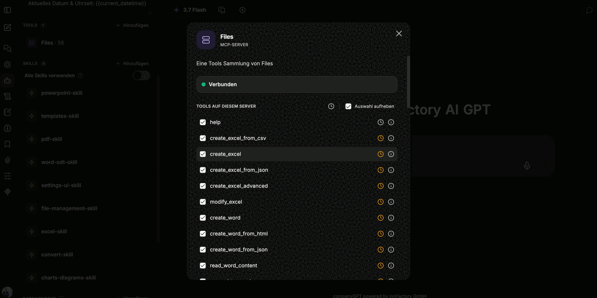

Die Werkzeuge von companyFILES stehen in jedem Chat zur Verfügung. Für alles, was über eine einzelne Datei hinausgeht, lohnt sich trotzdem ein eigener Agent: Er bringt das Werkzeug **Files** und die passenden Skills schon mit, sodass Sie im Prompt nur noch das Ziel nennen müssen. Angelegt wird er wie jeder andere Agent über **Agenten → Neuen Agenten erstellen**.

## Grundeinstellungen

| Feld | Empfehlung |
|---|---|
| Name | sprechender Name, zum Beispiel der Zweck des Agenten |
| Was dieser Agent macht | kurze Beschreibung; optional |
| KI-Modell | ein kleines, schnelles Modell genügt – die Arbeit besteht überwiegend aus Werkzeugaufrufen |
| Kategorie | `Allgemein`, sofern keine eigene Kategorie vorgesehen ist |
| Anweisungen | knapp halten; die Regeln liefern die Skills |

Große Systemanweisungen braucht ein companyFILES-Agent nicht. Bewährt haben sich zwei Kontextvariablen, die über das Plus-Symbol am Feld **Anweisungen** eingesetzt werden und beim Aufruf gefüllt werden:

| Variable | Zweck |
|---|---|
| `{{current_user}}` | wer das Dokument anfordert – landet zum Beispiel im Absenderfeld eines Briefs |
| `{{current_datetime}}` | Datum und Uhrzeit für Dokumentenköpfe, Protokolle und Dateinamen |

## Werkzeug Files

Unter **Tools → Hinzufügen** kommt das Werkzeug **Files** dazu. Es ist ein MCP-Server und bringt **56 Werkzeuge** mit; der Zähler in der Seitenleiste zeigt sie als `Files · 56`. Im Dialog steht der Verbindungsstatus (**Verbunden**) und darunter die Liste **Tools auf diesem Server**, in der einzelne Werkzeuge ab- und über **Auswahl aufheben** gesammelt abgewählt werden können.

Jede Zeile hat neben dem Namen ein Uhr-Symbol. Es markiert das verzögerte Laden (Lazy Loading): Das Werkzeug wird erst dann in den Kontext geholt, wenn es gebraucht wird. Das spart Kontext und ist für nahezu alle Werkzeuge sinnvoll. Ausgenommen bleibt `help` – es ist dauerhaft aktiv, damit der Agent die übrigen Werkzeuge überhaupt nachschlagen kann.

:::note
Das Uhr-Symbol ist in der Aufnahme nicht mit Beschriftung oder Tooltip zu sehen. Beschrieben ist hier die Wirkung, die in der Aufnahme erläutert wird – nicht der Text der Oberfläche.
:::

### Die 56 Werkzeuge im Überblick

**Excel:** `create_excel`, `create_excel_from_csv`, `create_excel_from_json`, `create_excel_advanced`, `modify_excel`, `read_excel`, `read_excel_detailed`, `create_excel_from_template`, `fill_excel_template`

**Word und OpenDocument:** `create_word`, `create_word_from_html`, `create_word_from_json`, `read_word`, `read_word_content`, `append_to_word`, `replace_word_content`, `create_word_from_template`, `create_word_from_template_with_images`, `create_odt`, `create_odt_from_html`, `create_odt_from_template`

**PDF:** `create_pdf`, `create_pdf_from_html`, `read_pdf`, `list_pdf_form_templates`, `fill_pdf_form`, `fill_and_flatten_pdf_form`, `read_pdf_form_fields`, `fill_pdf_form_fields`

**PowerPoint:** `create_powerpoint`, `read_powerpoint_slides`, `append_slides_to_powerpoint`, `update_powerpoint_slide`, `create_powerpoint_from_template`, `describe_pptx_template`, `create_powerpoint_from_layouts`, `add_slides_from_layouts`, `set_powerpoint_slide_fields`

**Text, Konvertierung, Archive:** `create_text_file`, `convert_document`, `get_supported_conversions`, `create_zip_from_stored_files`

**Dateiverwaltung:** `upload_file`, `download_stored_file`, `list_documents`, `search_documents`, `list_templates`, `list_my_files`, `get_settings`, `open_companyfiles_ui`

**Visualisierung:** `create_chart_document`, `embed_chart_in_document`, `show_interactive_chart`, `show_interactive_diagram`, `show_interactive_map`

**Hilfe:** `help`

## Skills

Zu companyFILES gehören mitgelieferte Skills. Sie enthalten keine Inhalte, sondern die Regeln, wie mit den Werkzeugen zu arbeiten ist – welches Werkzeug für welches Format zuständig ist, in welcher Reihenfolge gearbeitet wird und woran ein Ergebnis zu prüfen ist. Ausgewählt werden sie unter **Skills → Hinzufügen**.

| Skill | Zuständig für |
|---|---|
| [`excel-skill`](/de/tutorials/skills/files/excel-skill/) | Excel-Tabellen, Formeln und Formatierungen |
| [`word-odt-skill`](/de/tutorials/skills/files/word-odt-skill/) | Word- und OpenDocument-Dokumente |
| [`pdf-skill`](/de/tutorials/skills/files/pdf-skill/) | PDF-Erstellung und PDF-Formulare |
| [`powerpoint-skill`](/de/tutorials/skills/files/powerpoint-skill/) | Präsentationen erstellen und überarbeiten |
| [`templates-skill`](/de/tutorials/skills/files/templates-skill/) | Dokumente aus Vorlagen erzeugen |
| [`charts-diagrams-skill`](/de/tutorials/skills/files/charts-diagram-skill/) | Charts, Diagramme und Karten |
| [`convert-skill`](/de/tutorials/skills/files/convert-skill/) | Konvertierung zwischen Formaten |
| [`file-management-skill`](/de/tutorials/skills/files/file-management-skill/) | Dateien ablegen, suchen, herunterladen |
| [`settings-ui-skill`](/de/tutorials/skills/files/settings-ui-skill/) | Einstellungen lesen und in Dokumenten anwenden |

Der Schalter **Alle Skills verwenden** oberhalb der Liste gibt dem Agenten Zugriff auf sämtliche Skills der Organisation. Für einen Dokumenten-Agenten genügt die gezielte Auswahl der companyFILES-Skills.

:::tip[Hinweis]
Jeder Skill ist in dieser Dokumentation einzeln beschrieben – die Tabelle verlinkt direkt dorthin. Wer einen eigenen Agenten baut, kann dort nachlesen, welcher Skill welche Arbeitsweise vorgibt.
:::

Im Chat ist beides sichtbar: Über der Antwort steht, wie viele Werkzeuge benutzt wurden und welche Quelle sie hatten – zum Beispiel *„2 Tools benutzt · skill, Files"*, darunter der ausgeführte Skill und das aktive Werkzeug.

## Maximale Agenten-Schritte

Unter **Erweitert → Grundlagen** steht das Feld **Maximale Agenten-Schritte**. Es begrenzt, wie viele Werkzeugaufrufe ein Agent in einem Durchgang machen darf. Für einzelne Dokumente ist der Standardwert ausreichend; für größere Umbauten – etwa das Überarbeiten einer ganzen Präsentation – reicht er nicht, weil dabei schnell dutzende Aufrufe zusammenkommen.

:::note
Bevor Sie eine umfangreiche Änderung starten, setzen Sie den Wert hoch – in der Aufnahme auf **100**. Läuft der Agent mitten in der Bearbeitung ins Limit, bleibt das Dokument in einem halbfertigen Zustand zurück.
:::

Darunter liegt der Bereich **Multi-Agenten-Orchestrierung** mit **Unteragenten** (Beta), **Übergaben** (Beta) und der **Agentenkette**. Für companyFILES sind sie nicht erforderlich.

## Weitere Werkzeuge kombinieren

companyFILES lässt sich mit anderen Werkzeugen desselben Agenten verbinden. Im Beispiel der Karte kommt eine **Websuche** hinzu: Erst recherchiert der Agent die Standorte, dann zeichnet er sie über `show_interactive_map` ein. Ohne Websuche kennt er nur die Orte aus dem Prompt.

Als Nächstes: [Dokumente erstellen](/de/company-gpt/addons/companyfiles/dokumente-erstellen/).
