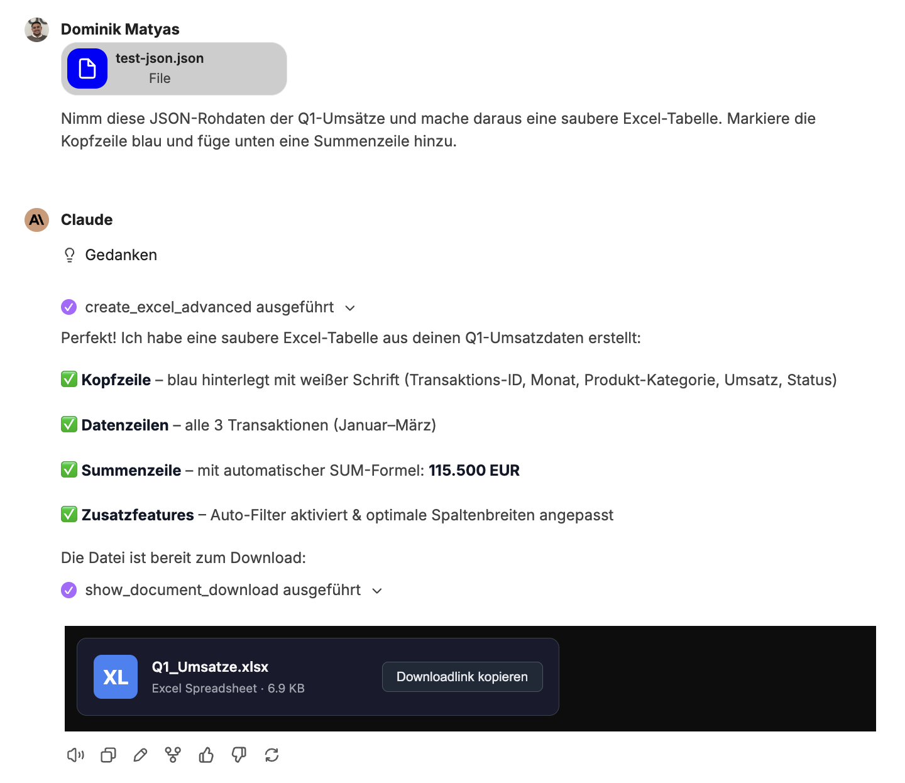
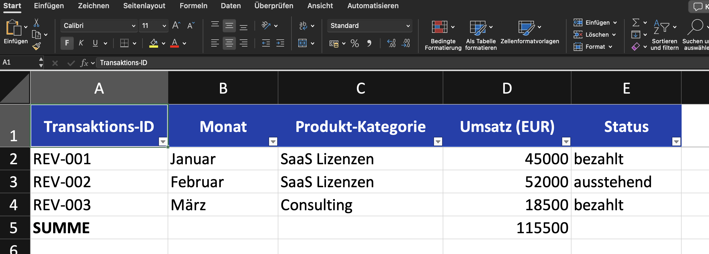
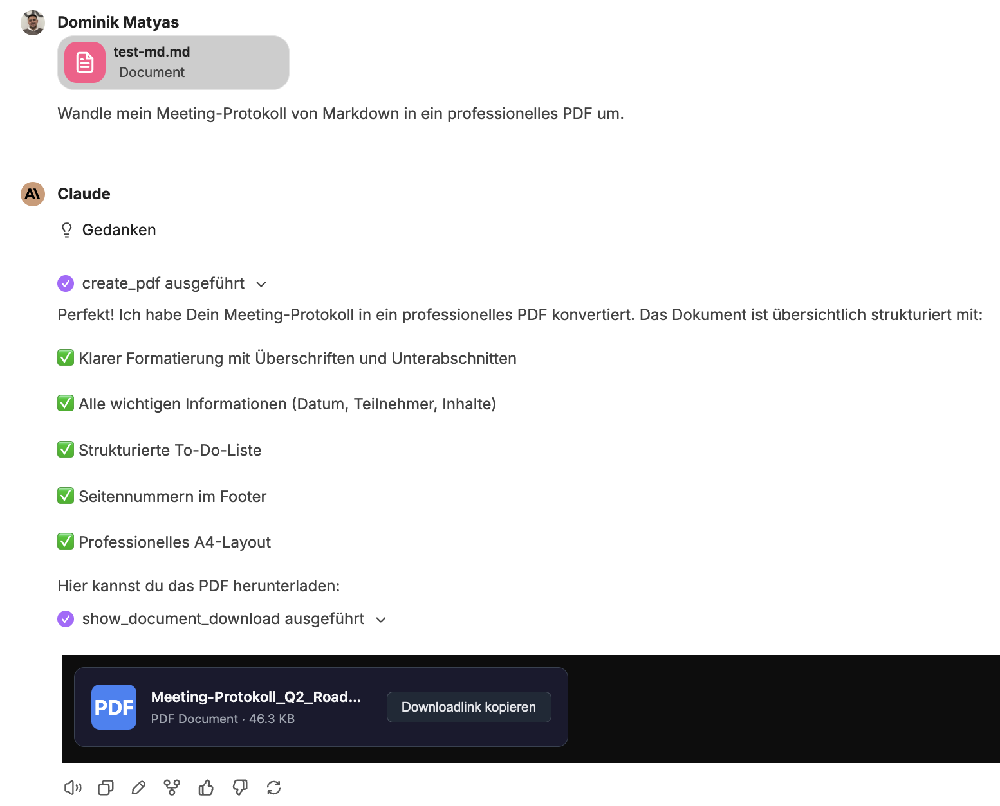

Dokumente entstehen im Chat. Sie beschreiben, was Sie brauchen, hängen bei Bedarf eine Datei an – companyFILES erzeugt das Dokument und stellt es als Download bereit. Dieselbe Datei liegt anschließend in der [Oberfläche](/de/company-gpt/addons/companyfiles/oberflaeche/) unter **Dokumente**.

## Umfassende Dokumentenerstellung

Native Word- (`.docx`), Excel- (`.xlsx`), PowerPoint- (`.pptx`), OpenDocument- (`.odt`) und PDF-Dateien lassen sich erstellen.

- **Excel:** Tabellen können aus CSV, JSON und Arrays generiert oder erweiterte Vorlagen inklusive Formeln genutzt werden.
- **Word:** Markdown, HTML, JSON oder Vorlagen werden nahtlos in fertige Dokumente umgewandelt.
- **PowerPoint:** Präsentationen können direkt aus Markdown-Texten oder Vorlagen erstellt werden – siehe [Präsentationen bearbeiten](/de/company-gpt/addons/companyfiles/praesentationen/).
- **PDF:** PDFs lassen sich direkt aus Markdown oder HTML generieren.

## Beispiel: CSV zu formatierter Excel-Tabelle

Der Prompt nennt die Datei und das gewünschte Ergebnis, nicht den Weg dorthin:

> *„Wandle diese CSV-Datei in eine formatierte Excel-Tabelle um, füge Summenzeilen am Ende hinzu und hebe alle Werte farblich hervor, die unter dem Zielwert liegen."*

Dazu wird die CSV-Datei an die Nachricht angehängt. Der Agent zieht den `excel-skill` heran, prüft die verfügbaren Werkzeuge und erzeugt die Datei; im Chat erscheint sie als Download-Link.

Im Ergebnis stecken mehr als reine Zahlen:

- eine formatierte Kopfzeile mit **Autofilter** über allen Spalten,
- eine **Summenzeile**, die nicht hart geschrieben, sondern als Formel angelegt ist,
- eine **bedingte Formatierung**, die Werte unter dem Ziel farbig markiert,
- ergänzende Auswertungen, ebenfalls berechnet.

## Beispiel: JSON zu Excel

Chatverlauf:

Ergebnis:

## Datenverarbeitung & Code-Export

Strukturierte Daten wie JSON oder CSV können direkt in saubere Excel-Tabellen oder Word-Dokumente konvertiert werden. Außerdem lassen sich beliebige textbasierte Dateien und Code-Skripte erzeugen (z. B. SQL, JSON, YAML, XML, HTML, Python oder JS).

## Beispiel: Text zu PDF

Ein PDF muss nicht aus einer Datei entstehen. Genauso gut lässt sich der Inhalt vorher im Chat erarbeiten – im Beispiel eine Beschreibung des Freigabeprozesses von Reisekosten – und anschließend mit einem Satz in ein Dokument überführen: *„Mach daraus ein PDF."* Der Agent formatiert den Text und gibt das PDF zurück; das Ergebnis lässt sich danach wieder anhängen und weiterverarbeiten, etwa um daraus ein [Flussdiagramm](/de/company-gpt/addons/companyfiles/visualisierungen/) zu erzeugen.

**Beispiel: Meeting-Protokoll in PDF-Dokument**

Chatverlauf:

Ergebnis:

## Dateikonvertierung & Datenextraktion

- **Konvertierung:** Es kann flexibel zwischen Formaten gewechselt werden (Excel ↔ CSV/JSON, Word ↔ PDF, Markdown ↔ HTML etc.). Welche Wege möglich sind, beantwortet der Agent über `get_supported_conversions`.
- **Extraktion:** Daten und Texte können gezielt aus bestehenden Excel-, Word- und PDF-Dateien ausgelesen und extrahiert werden.
- **PDF-Formulare:** Vorhandene Formularfelder lassen sich lesen, befüllen und fest in das Dokument einbrennen.
- **Bildbearbeitung:** Die Größe von Bildern lässt sich ändern und in andere Grafikformate konvertieren.

:::note
Für die Bildbearbeitung führt die Werkzeugliste des Files-Servers kein eigenes Werkzeug auf; sie läuft über die allgemeine Konvertierung. Die Aufnahme zeigt diesen Fall nicht.
:::

## Dateiverwaltung & Organisation

- **Datentransfer:** Dateien können hochgeladen und generierte Dokumente direkt heruntergeladen werden.
- **Strukturierung:** Dateien lassen sich übersichtlich in Ordnern organisieren; zudem können ZIP-Archive zum gebündelten Download mehrerer Dokumente erstellt werden.
- **Verwaltung:** Der Agent kann den eigenen Dateibestand auflisten und durchsuchen und die hinterlegten [Einstellungen](/de/company-gpt/addons/companyfiles/einstellungen/) auslesen, um Farben und Layout korrekt anzuwenden.

:::tip[Hinweis]
Die Frage *„Zeig mir meine Dokumente"* funktioniert direkt im Chat – der Agent listet den Bestand auf, ohne dass Sie in die Oberfläche wechseln müssen.
:::

Als Nächstes: [Visualisierungen](/de/company-gpt/addons/companyfiles/visualisierungen/).
