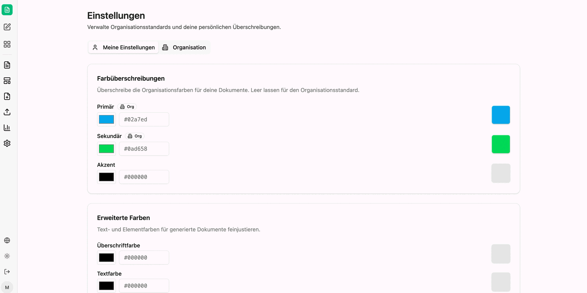
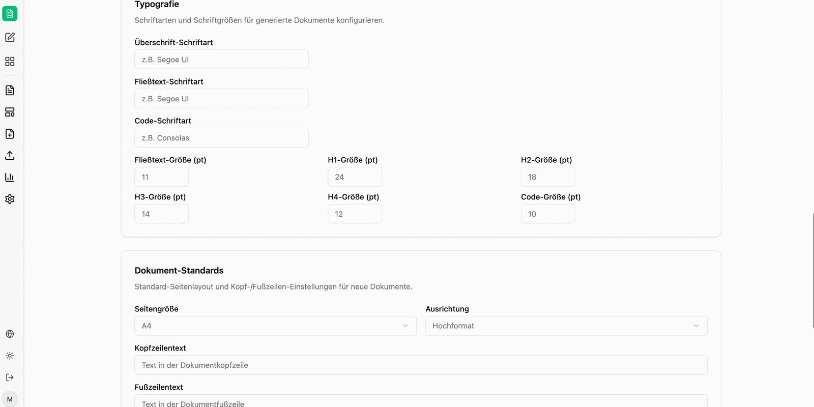

Die Einstellungen legen fest, wie generierte Dokumente aussehen, wenn **keine Vorlage** verwendet wird. Sie werden einmal gesetzt und danach auf jedes neu erzeugte Dokument, jedes Chart und jede Präsentation angewendet.

Der Bereich ist zweigeteilt, sichtbar an den Tabs oberhalb der Karten:

| Tab | Wirkung |
|---|---|
| **Meine Einstellungen** | persönliche Überschreibungen; leere Felder verwenden den Organisationsstandard |
| **Organisation** | Standard für alle Benutzer; nur mit Administratorrechten bearbeitbar |

## Organisation

Unter **Organisationsinformationen** stehen **Firmenname** und **Firmen-URL**. Der Hinweis im Dialog lautet: *„Bearbeite die Organisationsdetails. Änderungen wirken sich auf alle Benutzer aus."*

Unter **Organisationsfarben** setzen Sie die drei Grundfarben **Primär**, **Sekundär** und **Akzent** – jeweils über einen Farbwähler oder als Hex-Wert. Diese Farben tauchen anschließend nicht nur in Dokumenten auf, sondern auch in den im Chat erzeugten Charts.

## Meine Einstellungen

**Farbüberschreibungen** übernimmt dieselben drei Farben für die eigenen Dokumente: *„Überschreibe die Organisationsfarben für deine Dokumente. Leer lassen für den Organisationsstandard."* Eine Marke **Org** neben dem Feldnamen zeigt, dass der aktuelle Wert aus dem Organisationsstandard stammt.

**Erweiterte Farben** justiert Text- und Elementfarben feiner – **Überschriftfarbe**, **Textfarbe**, Link- und Tabellenkopf-Farbe.

## Typografie

*„Schriftarten und Schriftgrößen für generierte Dokumente konfigurieren."*

| Feld | Beispielwert im Feld |
|---|---|
| Überschrift-Schriftart | z. B. Segoe UI |
| Fließtext-Schriftart | z. B. Segoe UI |
| Code-Schriftart | z. B. Consolas |
| Fließtext-Größe (pt) | 11 |
| H1-Größe (pt) | 24 |
| H2-Größe (pt) | 18 |
| H3-Größe (pt) | 14 |
| H4-Größe (pt) | 12 |
| Code-Größe (pt) | 10 |

## Dokument-Standards

*„Standard-Seitenlayout und Kopf-/Fußzeilen-Einstellungen für neue Dokumente."*

| Feld | Bedeutung |
|---|---|
| Seitengröße | Papierformat, zum Beispiel A4 |
| Ausrichtung | Hoch- oder Querformat |
| Kopfzeilentext | Text in der Dokumentkopfzeile |
| Fußzeilentext | Text in der Dokumentfußzeile |
| Seitenzahlen anzeigen | schaltet die Seitennummerierung ein |
| Seitenzahl-Position | zum Beispiel Fußzeile |
| Seitenzahl-Format | Muster der Seitenzahl, zum Beispiel `{page} / {pages}` |
| Logo in Kopfzeile | bindet das Organisationslogo in die Kopfzeile ein |
| Logo-Höhe (cm) | Höhe des Logos, zum Beispiel 1.2 |

Unter **Organisationslogo** hinterlegen Sie über **Logo hochladen** die Bilddatei, die in generierten Dokumenten verwendet wird.

Gespeichert wird über **Organisationseinstellungen speichern**. Darunter steht, wann und von wem der Stand zuletzt geändert wurde.

:::tip[Hinweis]
Die Farben lohnen sich als Erstes: Sobald Primär- und Sekundärfarbe gesetzt sind, kommen auch die im Chat erzeugten Charts in den Unternehmensfarben – ohne dass Sie das im Prompt erwähnen müssen.
:::

Als Nächstes: [Agent einrichten](/de/company-gpt/addons/companyfiles/agent/).
