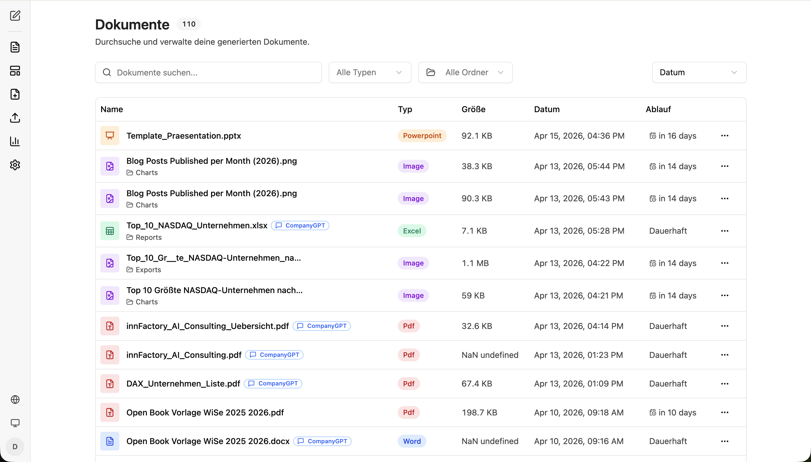
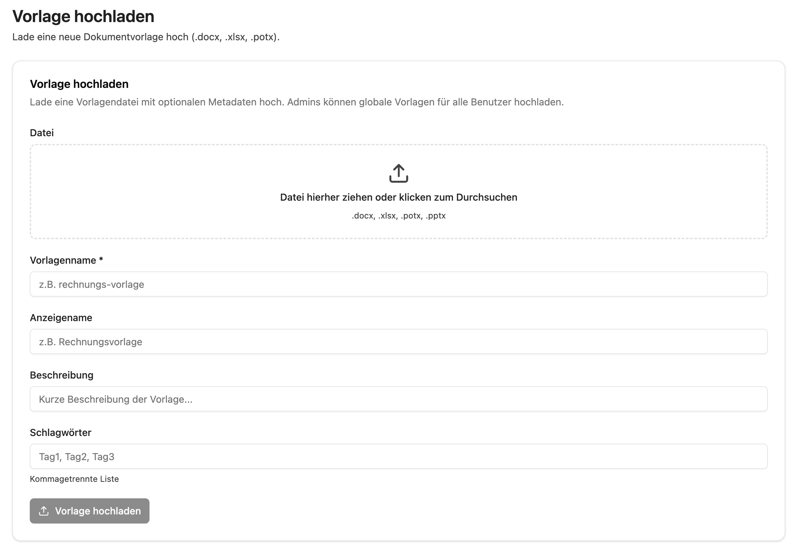
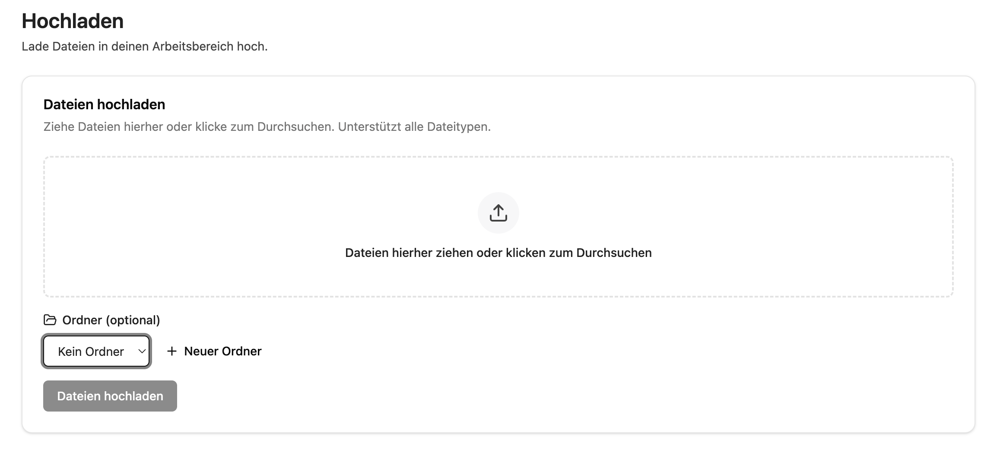
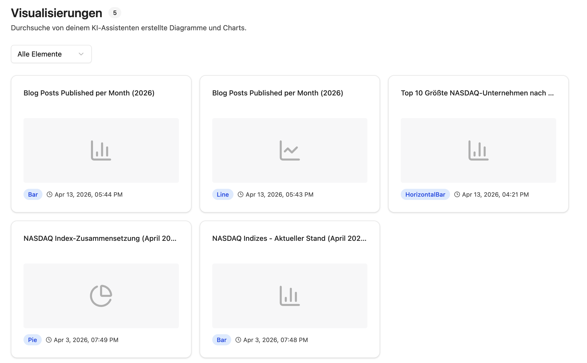

import sidebarImg from "./companyfiles-sidebar.png";

Die companyFILES Oberfläche ist klar in Navigationspunkte und Arbeitsbereiche gegliedert. Über die linke Seitenleiste wechseln Sie zwischen allen zentralen Funktionen. Sie erreichen sie im CompanyGPT über **Apps → Files**.

  
  

Von oben nach unten finden Sie in der Seitenleiste folgende Bereiche:

1. **Zurück zum Chat** – Leitet zurück zum CompanyGPT Chat
2. **Zurück zu den Tools** – Leitet zurück zur Übersicht der verfügbaren Tools
3. **[Dokumente](#dokumente)** – Zeigt alle generierten und hochgeladenen Dokumente an
4. **[Vorlagen](#vorlagen)** – Zeigt alle verfügbaren Vorlagen an
5. **[Vorlage Hochladen](#vorlage-hochladen)** – Ermöglicht das Hochladen einer neuen Vorlage
6. **[Hochladen](#hochladen)** – Ermöglicht das Hochladen von Dateien
7. **[Visualisierungen](#visualisierungen)** – Zeigt alle erstellten Diagramme und Charts an
8. **Einstellungen** – Dokumenteneinstellungen, die automatisch angewendet werden
9. **Sprache** – Sprachänderung der Oberfläche
10. **Design Umschalten** – Toggle für Dark/Light Mode
11. **Account** – Kontoverwaltung

  

Die Einstellungen sind eigenständig beschrieben unter [Einstellungen](/de/company-gpt/addons/companyfiles/einstellungen/).

## Dokumente

Hier finden Sie alle generierten und hochgeladenen Dateien an einem Ort.

Über die **Suchleiste** und die Filter **Alle Typen** und **Alle Ordner** finden Sie Dateien schnell. Die Tabelle zeigt Name, Typ, Größe, Datum und Ablauf. Der Typ steht als farbige Marke in der Zeile – zum Beispiel Excel, Word, Pdf, Powerpoint oder Image. Dateien mit einem **CompanyGPT**-Badge wurden direkt aus dem Chat heraus generiert. Über das **Drei-Punkte-Menü** (⋯) können Sie Dokumente herunterladen, eine Vorschau anzeigen, das Ablaufdatum bearbeiten oder löschen.

Dokumente lassen sich in Ordnern organisieren; der Ordner wird unter dem Dateinamen angezeigt. In der Spalte **Ablauf** steht entweder eine Restlaufzeit oder **Dauerhaft** – Letzteres bei Dateien, die dauerhaft aufbewahrt werden.

## Vorlagen

Hier sehen Sie alle verfügbaren Vorlagen für die Dokumentenerstellung.

Vorlagen können nach **Alle Typen** und **Alle Bereiche** gefiltert werden. Die Tabelle zeigt Name, Typ, Bereich, Schlagwörter, Größe und Upload-Datum. Der **Bereich** entscheidet über die Sichtbarkeit:

| Bereich | Bedeutung |
|---|---|
| **Benutzer** | nur für Sie selbst nutzbar |
| **Global** | für alle Benutzer der Organisation nutzbar |

Verfügbare Vorlagen lassen sich direkt im Chat für die Dokumentengenerierung verwenden – siehe [Vorlagen](/de/company-gpt/addons/companyfiles/vorlagen/).

## Vorlage Hochladen

Hier laden Sie neue Dokumentvorlagen hoch.

Ziehen Sie eine Vorlagendatei (`.docx`, `.xlsx`, `.potx`, `.pptx`) per Drag & Drop in den Upload-Bereich. Füllen Sie den **Vorlagennamen** (Pflichtfeld) aus und optional **Anzeigename**, **Beschreibung** und **Schlagwörter**. Admins können globale Vorlagen hochladen, die für alle Benutzer sichtbar sind. Klicken Sie auf **„Vorlage hochladen"**, um den Upload abzuschließen.

## Hochladen

Hier laden Sie beliebige Dateien in Ihren Arbeitsbereich hoch.

Ziehen Sie Dateien per Drag & Drop in den Upload-Bereich oder klicken Sie zum Durchsuchen. Es werden alle Dateitypen unterstützt. Optional können Sie einen **Ordner** auswählen oder über **„+ Neuer Ordner"** einen neuen anlegen. Klicken Sie auf **„Dateien hochladen"**, um den Upload zu starten.

## Visualisierungen

Hier sehen Sie alle durch CompanyGPT erzeugten Diagramme und Charts.

Alle im Chat erstellten Visualisierungen werden hier gesammelt angezeigt. Über den Filter **„Alle Elemente"** können Sie nach Diagrammtyp filtern (z. B. Diagramme oder Charts). Jede Karte zeigt den Titel, eine Vorschau, den Typ und das Erstellungsdatum. Ein Klick auf eine Karte holt die Visualisierung wieder hervor.

Wie Visualisierungen entstehen, steht unter [Visualisierungen](/de/company-gpt/addons/companyfiles/visualisierungen/).

Als Nächstes: [Einstellungen](/de/company-gpt/addons/companyfiles/einstellungen/).
