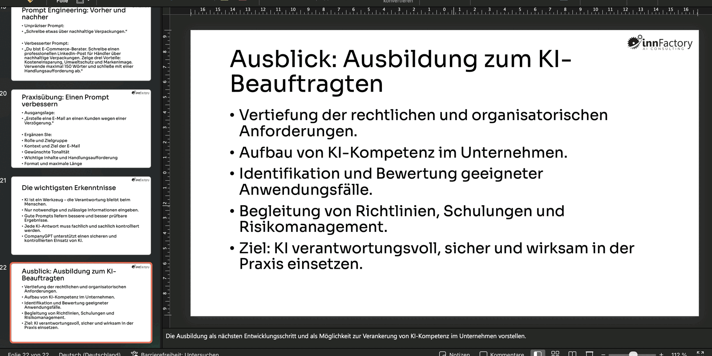
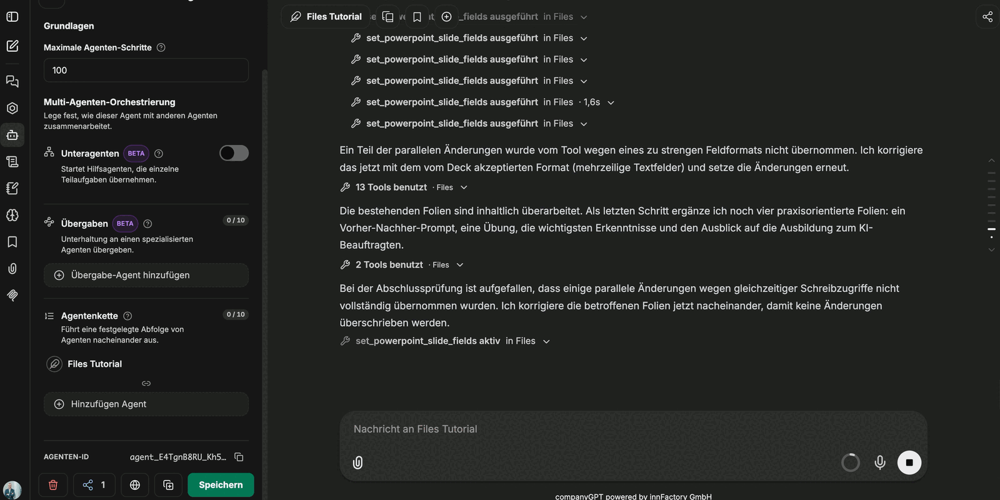

Präsentationen lassen sich nicht nur neu erzeugen, sondern auch **bestehende Foliensätze überarbeiten**. Sie laden die `.pptx`-Datei in den Chat, der Agent liest die Folien samt Layout und ändert gezielt, was Sie nennen. Design, Schriftart und Logo der Vorlage bleiben dabei erhalten.

## Ablauf

1. **Präsentation hochladen.** Die Datei wird an die Nachricht angehängt; der Upload läuft im Hintergrund.
2. **Prüfauftrag stellen.** Ein guter Einstieg ist eine Frage statt einer Anweisung, zum Beispiel *„Passt die Agenda zum Inhalt?"*. Der Agent liest den Foliensatz und antwortet mit einer Einschätzung.
3. **Änderung freigeben.** Erst danach folgt der Auftrag – etwa *„Passe die Agenda an."* Der Agent gibt die überarbeitete Datei als Download zurück.
4. **Inhalt verbessern lassen.** Auf die Frage, wie sich der Inhalt verbessern ließe, antwortet der Agent mit einer Liste von Vorschlägen, die Sie einzeln oder als Ganzes übernehmen können.

Im Beispiel wächst eine Schulungspräsentation so von einer Agenda mit vier Punkten auf einen Foliensatz mit **22 Folien**, ergänzt um „Prompt Engineering: Vorher und Nachher", eine Praxisübung, die wichtigsten Erkenntnisse und einen Ausblick.

## Vor größeren Änderungen: Schritte hochsetzen

Ein Umbau einer ganzen Präsentation besteht aus vielen einzelnen Werkzeugaufrufen – Folie lesen, Felder setzen, Folien anfügen, Ergebnis prüfen. Der Standardwert für **Maximale Agenten-Schritte** reicht dafür nicht aus.

:::note
Setzen Sie **Erweitert → Maximale Agenten-Schritte** vor dem Auftrag hoch – in der Aufnahme auf **100**. Läuft der Agent ins Limit, bricht er mitten in der Bearbeitung ab und die Präsentation bleibt halbfertig. Siehe [Agent einrichten](/de/company-gpt/addons/companyfiles/agent/#maximale-agenten-schritte).
:::

## Was der Agent selbst korrigiert

Bei umfangreichen Umbauten arbeitet der Agent teils parallel und merkt selbst, wenn dabei etwas verloren geht. In der Aufnahme meldet er zwei solche Fälle und behebt sie:

- Ein Teil der Änderungen wird vom Werkzeug **wegen eines zu strengen Feldformats** nicht übernommen – der Agent wiederholt sie im akzeptierten Format (mehrzeilige Textfelder).
- Einige Änderungen gehen durch **gleichzeitige Schreibzugriffe** verloren – der Agent korrigiert die betroffenen Folien anschließend nacheinander.

Beides passiert ohne Zutun, verlängert aber den Durchlauf. Es ist ein weiterer Grund, die Schrittzahl vorher großzügig zu setzen.

## Grenzen

:::caution
Textfelder, unter denen ein **Bild** liegt, kann companyFILES nicht verarbeiten. Diese Folien müssen nach der Bearbeitung von Hand nachgezogen werden.
:::

Auch sonst gilt: Das Ergebnis ist ein sehr weit gebrachter Rohentwurf, keine fertige Präsentation. Einzelne Folien brauchen danach noch Feinarbeit am Text und an der Anordnung. Der Nutzen liegt im Grundschritt – Struktur, Inhalt und Design stehen, und zwar durchgängig im Design der Ausgangsdatei.

## Vorlagen als Ausgangspunkt

Statt einer hochgeladenen Datei kann auch eine hinterlegte PowerPoint-Vorlage der Ausgangspunkt sein. Sie liegt dann dauerhaft in companyFILES und muss nicht jedes Mal angehängt werden – siehe [Vorlagen](/de/company-gpt/addons/companyfiles/vorlagen/).

Als Nächstes: [Vorlagen](/de/company-gpt/addons/companyfiles/vorlagen/).
