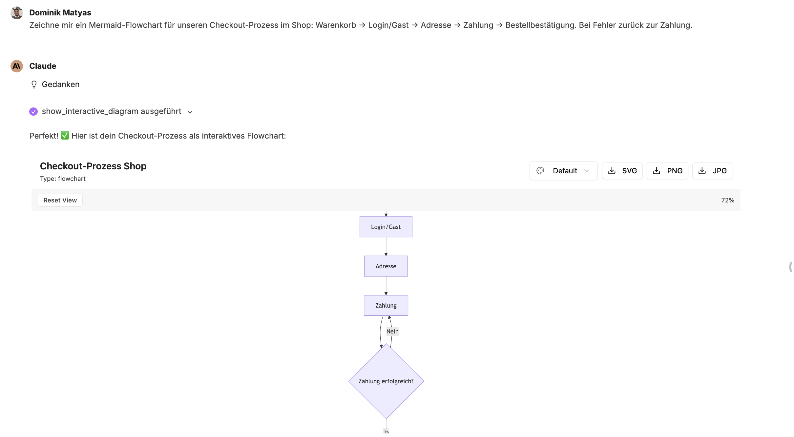
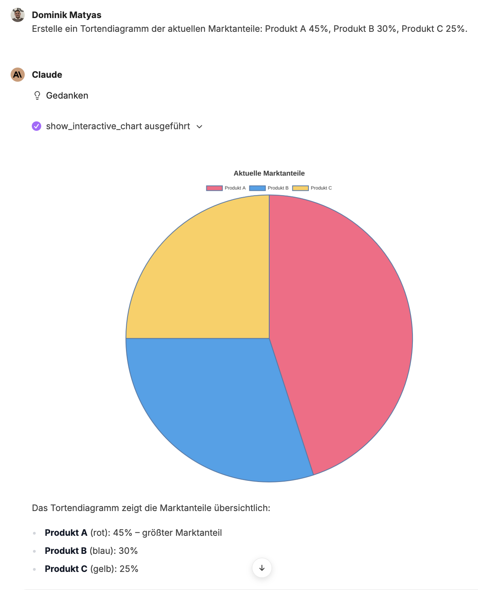
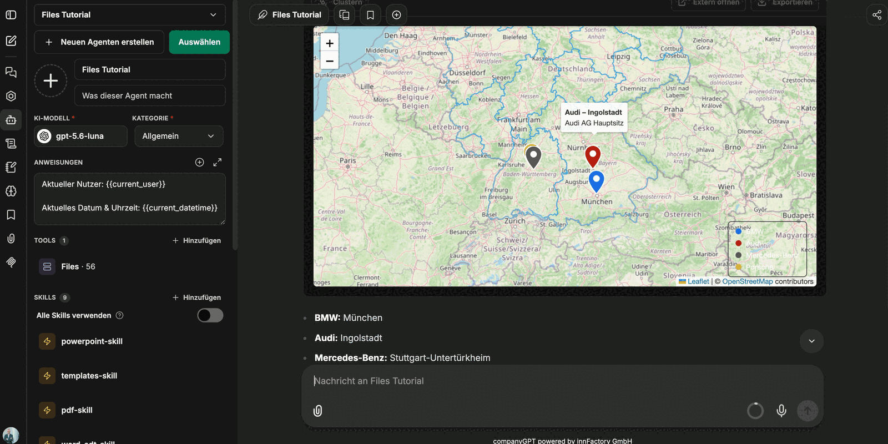

Rohe Zahlen können direkt als aussagekräftige Grafiken visualisiert werden. companyFILES kennt dafür drei Darstellungen, die im Chat interaktiv sind: **Charts** für Zahlenreihen, **Diagramme** für Abläufe und Strukturen und **Karten** für Standorte. Alles, was so entsteht, sammelt sich in der Oberfläche unter [Visualisierungen](/de/company-gpt/addons/companyfiles/oberflaeche/#visualisierungen).

## Interaktive Charts

Balken-, Linien-, Torten-, Scatter-, Bubble- oder Radar-Diagramme lassen sich aus Daten im Chat erzeugen – zum Beispiel direkt aus einer Tabelle, die zuvor erstellt wurde: *„Zeige mir den Umsatz als Diagramm."*

Über die Leiste oberhalb des Charts steuern Sie die Darstellung:

| Bedienelement | Wirkung |
|---|---|
| Diagrammtyp (z. B. **Bar**) | wechselt die Darstellungsform |
| **Zurücksetzen** | stellt die Ausgangsansicht wieder her |
| **+/- Zoom, Esc zurück** | Zoom in den Datenbereich; `Esc` führt zurück |
| **Tabelle** | schaltet zwischen Diagramm und zugrunde liegender Tabelle um |
| **Optionen** | Feineinstellungen der Darstellung, zum Beispiel Gitterlinien oder gestapelte Balken |
| **Exportieren** | **PNG (1x)**, **PNG (2x)**, **PNG (4x)**, **Copy CSV**, **Copy Image** |

Unterhalb des Charts liegt zusätzlich der Link **Diagramm als PNG herunterladen**.

:::tip[Hinweis]
Die Farben des Charts kommen aus den [Einstellungen](/de/company-gpt/addons/companyfiles/einstellungen/). Sind Primär- und Sekundärfarbe der Organisation gesetzt, erscheinen neue Charts automatisch in den Unternehmensfarben.
:::

## Mermaid-Diagramme

Per Prompt können Flowcharts, Sequenzdiagramme, Klassendiagramme und State-Machines generiert werden. Als Vorlage genügt ein beschriebener Ablauf – auch aus einem vorher erzeugten Dokument: Sie hängen das PDF an und bitten um ein Flussdiagramm.

Die Diagrammansicht im Chat lässt sich zoomen und über **Reset View** zurücksetzen; die aktuelle Vergrößerung steht als Prozentwert daneben. Über **Download PNG** wird das Diagramm als Bild gespeichert.

**Beispiel: Tortendiagramm**

## Karten

Standorte lassen sich auf einer interaktiven Karte darstellen. Der Prompt nennt nur die Orte oder die Organisationen – im Beispiel: *„Zeige die Hauptstandorte von BMW, Audi, Mercedes-Benz und Porsche auf einer Karte."*

Jede Markierung trägt eine Beschriftung, die Legende ordnet die Farben den Einträgen zu, und über die Bedienelemente steuern Sie die Ansicht:

| Bedienelement | Wirkung |
|---|---|
| **Clustern** | fasst nahe beieinanderliegende Markierungen zusammen |
| **Extern öffnen** | öffnet die Karte als eigene Seite |
| **Exportieren** | speichert die Karte als Bild |

Unterhalb der Karte listet der Agent die gefundenen Standorte noch einmal als Text auf.

:::note
Für Standorte, die nicht im Prompt stehen, braucht der Agent zusätzlich eine **Websuche** – siehe [Agent einrichten](/de/company-gpt/addons/companyfiles/agent/#weitere-werkzeuge-kombinieren). Erst damit findet er nicht nur den Ort, sondern den tatsächlich als Hauptsitz oder Konzernzentrale ausgewiesenen Standort.
:::

## Visualisierungen in Dokumente einbetten

Ein Chart muss nicht als Bild neben dem Dokument liegen. Der Bitte, das Diagramm in ein Word-Dokument zu übernehmen, folgt ein Dokument, in dem Text und Grafik zusammenstehen – Titel, Erläuterung und das eingebettete Diagramm.

Als Nächstes: [Präsentationen bearbeiten](/de/company-gpt/addons/companyfiles/praesentationen/).
