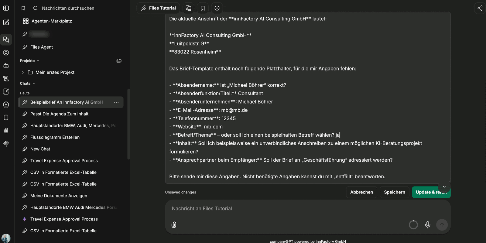

Vorlagen ermöglichen die wiederverwendbare Dokumentenerstellung mit standardisiertem Aufbau: Das Format wird einmal festgelegt, danach werden nur noch die Inhalte befüllt. Das lohnt sich überall dort, wo Dokumente sich im Aufbau gleichen – Briefe, Begleitschreiben, Besprechungsprotokolle, Angebotsvorlagen.

Sie können jedoch **nicht einfach ein fertiges Dokument hochladen** – das Dokument muss zuerst mit Platzhaltern vorbereitet werden.

## Vorlagen vorbereiten

Platzhalter sind **geschweifte Klammern mit einem Wort darin**: `{Platzhalter}`. Sie öffnen das Dokument in der nativen Anwendung (Word, Excel, PowerPoint) und setzen Platzhalter wie `{Firmenname}`, `{Datum}` oder `{Adresse}` an die Stellen, an denen CompanyGPT dynamische Inhalte einsetzen soll. Die Namen können Sie frei wählen, sie sollten jedoch aussagekräftig sein.

- **Word (`.docx`):** Platzieren Sie `{Platzhalter}` direkt im Dokumenttext. Beispiel: „Sehr geehrte/r `{Anrede}` `{Nachname}`, ..." oder eine Tabellenzelle mit `{Rechnungsbetrag}`
- **Excel (`.xlsx`):** Platzieren Sie `{Platzhalter}` in einzelne Zellen. Beispiel: Zelle A1 enthält `{Mitarbeitername}`, Zelle B1 enthält `{Abteilung}`
- **PowerPoint (`.pptx` / `.potx`):** Platzieren Sie `{Platzhalter}` in Textfelder auf Folien. Beispiel: Titelfolie mit `{Projektname}`, Inhaltsfolie mit `{Zusammenfassung}`

In der Beispielvorlage stehen die Platzhalter für Absender (`{from_name}`, `{from_title}`, `{from_company}`, `{from_email}`, `{from_phone}`, `{from_website}`), Empfänger (`{to_name}`, `{to_company}`, `{to_address_line1}`, `{to_address_line2}`) sowie `{date}`, `{topic}` und `{message}`.

:::tip[Hinweis]
Verwenden Sie aussagekräftige Platzhalternamen wie `{Kundenname}` statt `{K1}`. So erkennt CompanyGPT den Kontext und kann die Platzhalter zuverlässiger mit den richtigen Daten befüllen.
:::

:::caution
Ein normales, fertig ausgefülltes Dokument ohne Platzhalter kann nicht als Vorlage verwendet werden. CompanyGPT benötigt die `{Platzhalter}`-Markierungen, um zu erkennen, welche Stellen dynamisch ersetzt werden sollen.
:::

## Vorlagen hochladen und freigeben

Hochgeladen werden Vorlagen in der Oberfläche unter [Vorlage Hochladen](/de/company-gpt/addons/companyfiles/oberflaeche/#vorlage-hochladen). Der **Bereich** entscheidet danach über die Sichtbarkeit: **Benutzer** bedeutet, dass nur Sie selbst die Vorlage nutzen können; **Global** gibt sie für alle Benutzer der Organisation frei.

## Erweiterte Vorlagen-Syntax

Neben einfachen `{Platzhalter}`-Markierungen unterstützen Word-Vorlagen eine erweiterte Ausdrucks-Syntax für dynamische Inhalte wie beispielsweise Schleifen, um Zeilen in Tabellen zu erstellen.

### Tabellen-Schleifen in Word

Schleifen in Word-Tabellen werden über dedizierte Zeilen gesteuert. Die `FOR`- und `END-FOR`-Befehle stehen jeweils in einer eigenen Tabellenzeile:

| Name | Eingetreten seit |
|---|---|
| `{FOR person IN personen}` | |
| `{= $person.name}` | `{= $person.eintrittsjahr}` |
| `{END-FOR person}` | |

- Die **FOR-Zeile** markiert den Schleifenbeginn – sie wird beim Rendern entfernt.
- Die **Körper-Zeile** wird für jeden Eintrag im Array dupliziert.
- Die **END-FOR-Zeile** schließt die Schleife ab – sie wird ebenfalls entfernt.

:::caution
Die `FOR`- und `END-FOR`-Zeilen müssen **vollständige Tabellenzeilen** sein – platzieren Sie den Befehl in der ersten Zelle, die restlichen Zellen der Zeile bleiben leer. Befehle innerhalb einer Zelle einer normalen Zeile funktionieren nicht als Schleifensteuerung.
:::

## Vorlage im Chat verwenden

Nach dem Hochladen nennen Sie die Vorlage im Chat und geben die Daten für die Platzhalter an. Fehlen Angaben, fragt der Agent sie nach – er listet die offenen Platzhalter auf und schlägt teilweise schon Werte vor.

Die Angaben tragen Sie direkt in die Nachricht ein: Die eigene Nachricht lässt sich bearbeiten und über **Update & rerun** erneut abschicken, **Speichern** übernimmt die Änderung ohne neuen Durchlauf. Nicht benötigte Felder können Sie ausdrücklich als *entfällt* beantworten.

Anschließend erzeugt companyFILES das Dokument: Aufbau, Schriftbild und Akzentfarbe stammen unverändert aus der Vorlage, an den Stellen der Platzhalter stehen die gelieferten Inhalte.

Beispiel-Prompt: *„Erstelle eine Rechnung mit der Vorlage ‚Rechnungsvorlage'. Kundenname: Muster GmbH, Rechnungsbetrag: 1.500 €, Datum: 15.04.2026"*

:::tip[Hinweis]
Wenn immer dieselbe Vorlage zum Einsatz kommt, hinterlegen Sie sie in den Anweisungen eines eigenen [Agenten](/de/company-gpt/addons/companyfiles/agent/). Dann müssen Sie im Prompt nicht mehr nennen, welche Vorlage gemeint ist – der Agent arbeitet genauer und die Bedienung wird deutlich einfacher.
:::

## Dokumente ohne Vorlage

Wird keine Vorlage genutzt, greifen die [Einstellungen](/de/company-gpt/addons/companyfiles/einstellungen/): Farben, Typografie, Seitenlayout und Logo kommen dann aus dem Organisationsstandard beziehungsweise aus Ihren persönlichen Überschreibungen.
