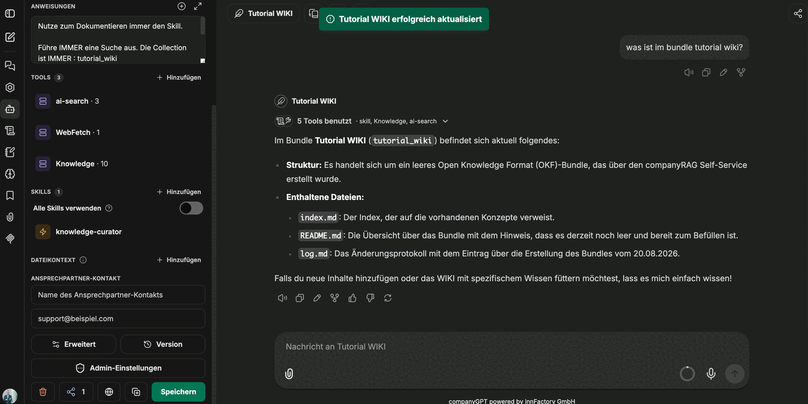

Ein Bundle wird nicht von Hand befüllt, sondern von einem Agenten. Dazu braucht der Agent drei Dinge: Zugriff auf die Suche, die Knowledge-Verbindung mit Schreibrechten und einen Skill, der die Regeln des Formats vorgibt. Angelegt wird er wie jeder andere Agent über **Agenten → Neuen Agenten erstellen**.

## Grundeinstellungen

| Feld | Empfehlung |
|---|---|
| Name | sprechender Name, zum Beispiel der Name des Bundles |
| KI-Modell | ein kleines, schnelles Modell genügt – die Arbeit besteht überwiegend aus Werkzeugaufrufen und Textformatierung |
| Kategorie | `Allgemein`, sofern keine eigene Kategorie vorgesehen ist |
| Anweisungen | kurze Systemanweisung, die auf den Skill und die Zielsammlung verweist |

Die Anweisungen bleiben knapp. Bewährt hat sich der Hinweis, zum Dokumentieren immer den Skill zu verwenden, verbunden mit der Nennung der Zielsammlung – im Beispiel: *„Nutze zum Dokumentieren immer den Skill. Führe IMMER eine Suche aus. Die Collection ist IMMER: tutorial_wiki."*

Über das Plus-Symbol am Feld **Anweisungen** lassen sich Kontextvariablen einsetzen, die beim Aufruf gefüllt werden:

| Variable | Zweck |
|---|---|
| Aktuelles Datum | Datum für das Feld `timestamp` einer Konzeptdatei |
| Aktueller Nutzer | wer die Änderung veranlasst hat |
| UTC ISO DatumZeit | Zeitstempel in maschinenlesbarer Form |

## Werkzeuge

Unter **Tools → Hinzufügen** kommen die Werkzeuge dazu:

- **ai-search**: die semantische Suche über die Sammlungen samt der Werkzeuge zum Lesen von Inhalten. Ohne sie kann der Agent nicht prüfen, was bereits dokumentiert ist.
- **Knowledge**: die Verbindung zu den OKF-Bundles – Lesen **und** Schreiben. Das ist das Werkzeug, mit dem Konzepte, Index und Protokoll geschrieben werden.
- **WebFetch**: optional, für Inhalte von außen. Siehe [Wissen erzeugen und pflegen](/de/company-gpt/addons/companyknowledge/wissen-erzeugen/).

Die Knowledge-Verbindung bringt zehn Werkzeuge mit. Die im Ablauf verwendeten sind:

| Werkzeug | Aufgabe |
|---|---|
| `okf_list_bundles` | verfügbare Bundles auflisten |
| `okf_read_index` | Index eines Bundles lesen |
| `okf_read_concept` | ein einzelnes Konzept lesen |
| `okf_write_concept` | ein Konzept schreiben |
| `okf_update_index` | Index nachziehen |
| `okf_append_log` | Eintrag im Änderungsprotokoll ergänzen |
| `okf_validate_bundle` | Bundle auf Fehler prüfen |
| `okf_commit` | Änderungen zurückschreiben |
| `okf_get_update_context` | ermitteln, was sich seit dem letzten Lauf geändert hat |

:::note
Die Aufnahme, aus der diese Seite entstanden ist, zeigt die vollständige Werkzeugliste der Knowledge-Verbindung nicht im Detail. Die Tabelle nennt die Werkzeuge, die im Ablauf tatsächlich vorkommen – die Verbindung meldet zehn.
:::

## Skill für die Regeln

Der Agent bekommt zusätzlich einen Skill, der beschreibt, **wie** mit dem Format umzugehen ist. Der Skill enthält keine Inhalte, sondern Regeln und Arbeitsabläufe. Im Beispiel heißt er `knowledge-curator`; er ist selbst angelegt und kein mitgelieferter Bestandteil des Produkts.

Bewährt haben sich diese Bestandteile:

**Regeln.** Konzepte klein und fokussiert halten, keine dünnen Stub-Seiten. `index.md` und `log.md` sind reserviert und werden ausschließlich über `okf_update_index` und `okf_append_log` gepflegt.

**Ablauf zum Anlegen von Wissen.**

1. `okf_list_bundles` aufrufen und das Ziel-Bundle mit dem Nutzer bestätigen.
2. Quellen sammeln – RAG-Suche, M365-Dokumente und -Transkripte, angehängte Dateien, GitHub-Repositories – und für jede Aussage die Belegstelle notieren.
3. Zuerst planen: die geplanten Konzepte mit Pfad, Typ und einzeiliger Beschreibung im Chat auflisten und den Umfang bestätigen lassen.
4. Jedes Konzept mit `okf_write_concept` schreiben und die Quellen im Referenzabschnitt zitieren.
5. `okf_update_index`, danach `okf_append_log` mit einem Eintrag, der die Änderung zusammenfasst.
6. `okf_validate_bundle` – gemeldete Fehler beheben.
7. `okf_commit` mit einer aussagekräftigen Meldung. Läuft das Bundle im Commit-Modus *Pull Request*, die PR-URL zur Prüfung nennen.

**Ablauf zum Aktualisieren von Wissen.** `okf_get_update_context` ermittelt, was sich geändert hat; gelesen werden **nur** die betroffenen Konzepte (`okf_read_index` → `okf_read_concept`). Bearbeitet wird gezielt: Bestehende Struktur und korrekte Formulierungen bleiben stehen, ersetzt wird nur, was unrichtig, unvollständig oder veraltet ist. Danach folgen dieselben Schritte 5 bis 7.

**Hinweise zum Abruf.** Für Fragen der Art „Was wissen wir über X?" durchsucht der Agent die RAG-Sammlung mit Metadatenfiltern auf `type` und `tags`.

:::tip[Hinweis]
Die Vorgabe, den Plan vor dem Schreiben im Chat abzustimmen, ist der wirksamste Teil des Skills: Sie verhindert, dass ein Agent in einem Durchgang zwanzig halbgare Konzepte anlegt, die anschließend jemand aufräumen muss.
:::

## Erste Prüfung

Ob die Einrichtung greift, zeigt eine einfache Frage im Chat nach dem Inhalt des Bundles. Der Agent liest den Index und antwortet mit dem tatsächlichen Zustand – bei einem frisch angelegten Bundle also mit dem Hinweis, dass es noch leer ist, und der Auflistung von `index.md`, `README.md` und `log.md` samt Datum des Eintrags im Protokoll.

Als Nächstes: [Wissen erzeugen und pflegen](/de/company-gpt/addons/companyknowledge/wissen-erzeugen/).
