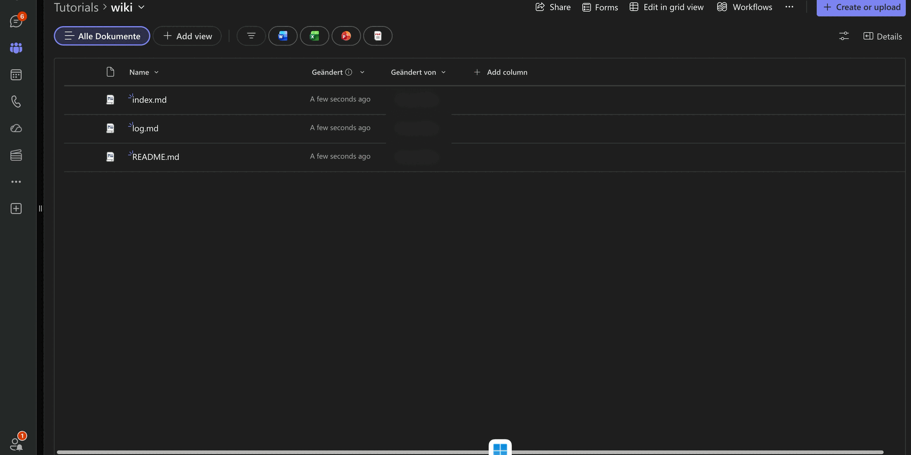

companyKNOWLEDGE beschreibt den Umgang mit Wissen im **Open Knowledge Format (OKF)**: Ein Wissensbestand liegt nicht in einer Datenbank, sondern als Sammlung von Markdown-Dateien in einem GitHub-Repository oder einem SharePoint-Ordner. Jede Datei beschreibt genau ein Konzept, eine kleine Vorformatierung am Dateianfang liefert Typ, Tags und Quelle, und zwei reservierte Dateien halten Inhaltsverzeichnis und Änderungsprotokoll aktuell.

Der praktische Nutzen liegt in der Arbeitsteilung: Das Pflegen eines Wissensbestands – Konzepte anlegen, Index nachziehen, Änderungen protokollieren – übernimmt ein Agent in CompanyGPT, während der Bestand selbst dort bleibt, wo er versioniert und geprüft werden kann. Da das Bundle gleichzeitig als Sammlung in companyRAG hängt, ist alles, was der Agent schreibt, unmittelbar durchsuchbar.

:::note
OKF-Bundles und die zugehörigen Agent-Werkzeuge sind derzeit **experimentell**. Struktur, Bezeichnungen und Bedienung können sich noch ändern.
:::

## Aufbau eines Bundles

Ein Bundle ist ein Ordner. Darin liegen Konzeptdateien und zwei reservierte Dateien:

| Datei | Rolle |
|---|---|
| `index.md` | Index, der auf die vorhandenen Konzepte verweist |
| `log.md` | Änderungsprotokoll; hält fest, was wann geschrieben wurde |
| `README.md` | Übersicht über das Bundle; wird beim Anlegen mit einem Hinweistext erzeugt |
| Konzeptdateien | je eine Markdown-Datei pro Konzept, in beliebig tief verschachtelten Unterordnern |

`index.md` und `log.md` werden nicht von Hand bearbeitet, sondern ausschließlich über die Werkzeuge der Knowledge-Verbindung fortgeschrieben. Unterordner sind erlaubt und erhalten jeweils einen eigenen Index.

## Aufbau einer Konzeptdatei

Jede Konzeptdatei beginnt mit einem Kopfbereich (Frontmatter), darunter folgt frei formulierter Markdown-Inhalt:

| Feld | Inhalt |
|---|---|
| `title` | Titel des Konzepts |
| `type` | Art des Konzepts, zum Beispiel `Produktübersicht` oder `Architektur` |
| `description` | ein bis zwei Sätze, worum es geht |
| `resource` | Quelle, auf die sich das Konzept bezieht – eine URL oder ein Dokument aus dem internen System |
| `tags` | Schlagworte für die Suche |
| `timestamp` | Datum des letzten Stands |

## Bundle anlegen

Ein OKF-Bundle entsteht im Wissensbereich als Sammlung: **companyRAG → Sammlungen → Sammlung erstellen**, dort als **Sammlungstyp** die Option **OKF-Bundle**.

Die Option ist im Dialog beschrieben mit: *„Verweisen Sie auf ein GitHub-Repository oder einen SharePoint-Ordner, um ein synchronisiertes Knowledge-Bundle zu erstellen."* Der anschließende Assistent führt in vier Schritten durch Details, Quelle, Speicherort und Bestätigung – die Schritte sind unter [OKF-Bundles](/de/company-gpt/addons/companyrag/okf-bundles/) beschrieben.

Bei der Quelle **SharePoint** wählen Sie den Speicherort in drei Stufen aus: zuerst **Website oder Team**, dann die **Bibliothek**, dann über **Ordner durchsuchen** den Zielordner. Im letzten Schritt zeigt der Assistent die Zusammenfassung mit Name, Sichtbarkeit, Quelle, Site, Bibliothek und Pfad.

Die Option **OKF-Grundgerüst anlegen, falls leer** ist dort standardmäßig aktiv. Sie legt in einem leeren Speicherort die Grundstruktur an, damit das Bundle nicht leer bleibt:

Direkt nach dem Erstellen wird die zugehörige Sammlung angelegt und eine erste Synchronisierung gestartet.

:::tip[Hinweis]
Für OKF-Bundles empfiehlt sich die Chunking-Strategie **Markdown-basiert**, da die Inhalte über Überschriften strukturiert sind. Siehe [Chunking-Strategien](/de/company-gpt/addons/companyrag/sammlungen/#chunking-strategien).
:::

## Wie geht es weiter?

- [Agent einrichten](/de/company-gpt/addons/companyknowledge/agent/) – Werkzeuge und Skill, die ein Agent zum Schreiben eines Bundles braucht.
- [Wissen erzeugen und pflegen](/de/company-gpt/addons/companyknowledge/wissen-erzeugen/) – von der Quelle zum geschriebenen Konzept, inklusive Indexierung in companyRAG.
