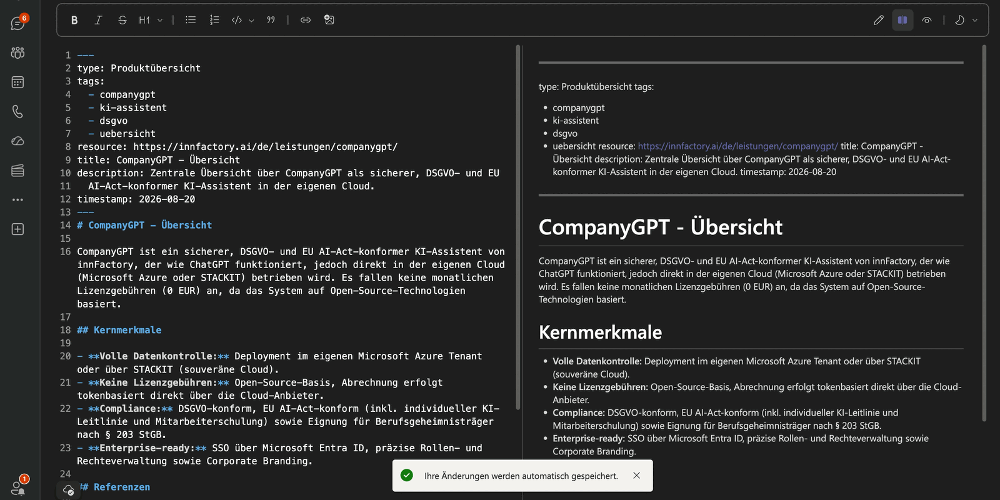
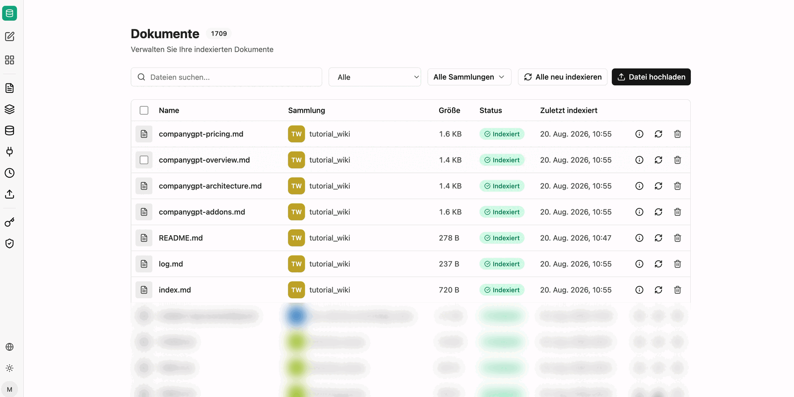

Steht das Bundle und ist der Agent eingerichtet, besteht die eigentliche Arbeit aus zwei Sätzen im Chat: Quelle nennen, Plan abnehmen. Alles Weitere – Dateien schreiben, Index nachziehen, Protokoll ergänzen, prüfen und zurückschreiben – erledigt der Agent.

## Quellen

Als Quelle taugt alles, worauf der Agent Zugriff hat: Sammlungen in companyRAG, Dokumente und Transkripte aus M365, angehängte Dateien, GitHub-Repositories. Für Inhalte aus dem Web kommt das Werkzeug **WebFetch** hinzu; im Beispiel genügt die Angabe einer Produktseite mit dem Auftrag, daraus eine Dokumentation anzulegen. Ebenso funktionieren PDFs und andere Dokumentarten.

:::note
WebFetch ist ein MCP-Server. Die einzelnen Funktionen tragen die Namen des zugrunde liegenden Dienstes (`firecrawl_scrape`, `firecrawl_map`, `firecrawl_search`, `firecrawl_crawl`, `firecrawl_check_crawl_status`, `firecrawl_extract`); für das reine Auslesen einer Seite genügt `firecrawl_scrape`.
:::

## Erst der Plan

Bevor geschrieben wird, antwortet der Agent mit einer Liste der geplanten Konzepte – Dateiname, Typ und eine Zeile Beschreibung je Eintrag:

Diese Zwischenstufe ist der richtige Zeitpunkt für Einwände: Ein Konzept zu viel, ein Typ falsch gewählt, eine Datei besser in einem Unterordner – hier kostet die Korrektur einen Satz, nach dem Schreiben kostet sie einen Aufräumlauf.

## Schreiben, prüfen, zurückschreiben

Nach der Bestätigung arbeitet der Agent den Plan ab und macht die Schritte im Chat sichtbar:

1. Die Konzepte werden geschrieben.
2. Der Index wird aktualisiert.
3. Das Änderungsprotokoll wird ergänzt.
4. Das Bundle wird validiert.
5. Die Änderungen werden zurückgeschrieben.

Bei einem Bundle im Commit-Modus *Pull Request* endet der Ablauf mit einem Änderungsvorschlag zur Prüfung statt mit einem direkten Commit. Damit lässt sich der Wissensbestand genauso behandeln wie Quellcode: Der Agent schlägt vor, ein Mensch gibt frei. Siehe [OKF-Bundles](/de/company-gpt/addons/companyrag/okf-bundles/).

## Das Ergebnis

Jede erzeugte Datei hat denselben Aufbau: Kopfbereich mit `type`, `tags`, `resource`, `title`, `description` und `timestamp`, darunter der Inhalt mit Überschriften und am Ende ein Abschnitt mit den Referenzen.

Der Inhalt bleibt kurz und verweist auf die weiterführenden Konzepte, statt sie zu wiederholen – so bleiben die Dateien einzeln lesbar und einzeln aktualisierbar.

## Automatische Indexierung

Weil das Bundle als Sammlung in companyRAG hängt, erscheinen die neuen Dateien ohne weiteres Zutun unter **Dateien** mit dem Status `Indexiert`:

Sobald eine Datei geschrieben wird, wird sie indexiert; bei Änderungen wird der Index aktualisiert. Damit ist der Kreis geschlossen: Der Agent schreibt das Wissen, und dasselbe Wissen ist unmittelbar über die Suche auffindbar – für Anwender im CompanyGPT und für andere Agenten über deren Werkzeuge.

:::tip[Hinweis]
Auch `index.md`, `log.md` und `README.md` werden mit indexiert. Wer bei der Suche nur die inhaltlichen Konzepte treffen möchte, filtert über die Metadaten `type` und `tags`.
:::

## Wie geht es weiter?

- [Dateien](/de/company-gpt/addons/companyrag/dateien/) – Zustand und Neuindexierung einzelner Dateien prüfen.
- [In CompanyGPT nutzen](/de/company-gpt/addons/companyrag/in-companygpt/) – die Sammlung in Chats und Agenten einsetzen.
