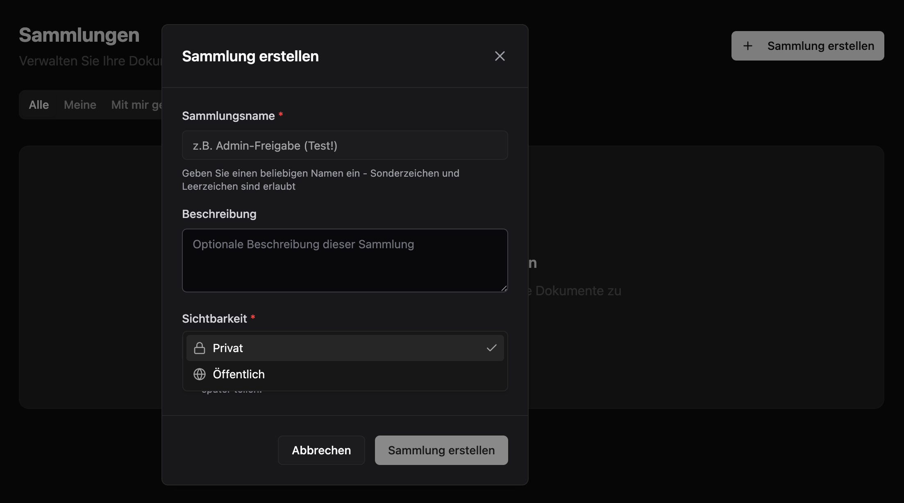
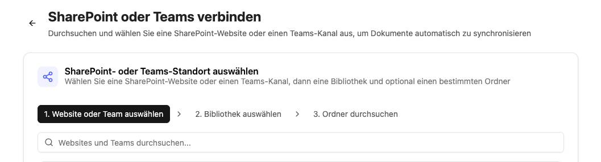

Mit dem CompanyRAG Addon können Sie große Mengen an Dokumenten für Ihre Agenten über die MCP-Schnittstelle verfügbar machen. Die Dokumente können aus unterschiedlichen Quellen indexiert werden und über die [RAG - Retrieval Augmented Generation](/de/prompt-engineering/prompt-techniken/rag)-Methodik integriert werden. Es gibt hierbei keine Limitierung was die Länge der einzelnen Dokumente oder die Gesamtzahl angeht.

Die Indexierung kann hierbei einmalig oder wiederkehrend, basierend auf Ihrem Anwendungsfall, implementiert werden.

## CompanyRAG-Benutzeroberfläche

Die Benutzeroberfläche ermöglicht es, einzelne und mehrere Dateien oder ganze Datenquellen zur Indexierung hinzuzufügen.
Die Oberfläche gliedert sich in:

import sidebarImg from "./rag-sidebar.png";

  
  

  

1. [Dateien](#dateien)
2. [Sammlungen](#sammlungen)
3. [Quellen](#quellen)
4. [Integrationen](#integrationen)
5. [Aufträge](#aufträge)
6. [Hochladen](#hochladen)
7. [API-Schlüssel](#api-schlüssel) *(nur für Administratoren)*
8. [Audit Protokoll](#audit-protokoll) *(nur für Administratoren)*

  

### Dateien

Eine Übersicht aller Dateien, die dem Service hinzugefügt wurden.
Die Übersicht enthält:

- **Name**: Dokumentenbezeichnung des Dokuments (teilweise gekürzt - Mouseover-Funktion für Vollanzeige)
- **Sammlung**: Die Sammlung, die der Datei zugewiesen wurde
- **Größe**: Dateigröße
- **Status**: Status des zugehörigen Auftrags
  - Abgeschlossen: Dokument wurde erfolgreich indexiert
  - Ausstehend: Auftrag der Indexierung steht noch aus
  - Fehlgeschlagen: Indexierung nicht erfolgreich
- **Zuletzt indexiert**: Datum und Zeit des letzten abgeschlossenen Indexierungsauftrags
- **Aktionen**:
  - Neu indexieren: Legt einen neuen Auftrag zur Indexierung an
  - Löschen: Löscht die Datei aus dem Service inklusive zugehörige Aufträge und indexierte Form

### Sammlungen

Sammlungen sind Speicherorte und ermöglichen es, Dokumente und Berechtigungen zu organisieren.

#### Sammlungen erstellen

Neben Namen und Beschreibung kann auch die Sichtbarkeit festgelegt werden:

- Privat: Nur Sie können auf diese Sammlung und damit verknüpfte Dokumente zugreifen. Sie können jedoch später weitere Freigaben hinzufügen.
- Öffentlich: Jeder kann die Sammlung sehen und Dateien daraus anzeigen.

Alle Sammlungen, die Sie besitzen, erscheinen unter dem Reiter `Meine`. Spezifisch für Sie geteilte Sammlungen (Rolle Admin oder Viewer) werden unter `Mit mir geteilt` angezeigt. Unter `Öffentlich` werden alle öffentlich sichtbaren Sammlungen angezeigt.

#### Sammlungen-Aktionen

  Teilen  Bearbeiten                       Löschen

- **Teilen:**
  - **Typ**: Mit einzelnen Nutzern, einer Entra-Gruppe oder der ganzen Organisation teilen.
  - **Rolle**: Viewer (Sammlung und zugehörige Dokumente können angezeigt werden) oder Admin (Sammlung und zugehörige Dokumente können bearbeitet werden)
    Nach Bestätigung durch `Add Share` wird die Freigabe erteilt und in die Liste `Current Shares` aufgenommen.
- **Bearbeiten**: Name und Beschreibung der Sammlung ändern.
- **Löschen**: Sammlung löschen.

:::danger
Das Löschen einer Sammlung löscht alle verknüpften Dokumente und Aufträge der Sammlung unwiderruflich!
:::

### Quellen

Unterschiedliche Quellen zur automatische Synchronisation von Daten in companyRAG.

#### Webcrawl 

Einzelne Webseiten, Listen (in CSV Dateien), sowie gesamte Website Sitemaps können gecrawlt und indexiert werden. Dabei können Sie einstellen, wie häufig das Crawling wiederholt werden soll. Bei einzelnen Seiten wird immer die gesamte Seite neu indexiert. Bei Sitemap Crawlings wir nur die Differenz anhand des letzten Crawls sowie des Änderungsdatums berücksichtigt.

Bei Sitemap Crawls kann über den `Path Prefix` bestimmt werden, welche Seiten indexiert werden. So würde beispielsweise `/news/` nur alle Seiten indexieren, die `/news` im Pfad haben.

#### SharePoint anbinden

Über den Button "+ SharePoint verbinden" startet die Auswahl.

1. **Website oder Team auswählen**: Auswahl der SharePoint-Website oder des Teams
2. **Bibliothek auswählen**: Bibliotheken der/des ausgewählten Website/Teams
3. **Ordner durchsuchen**: Auswahl des Ordners und der Dateitypen zur Synchronisierung. Festlegung der Sammlung, in die die Dateien synchronisiert werden sollen.

:::note
Nur Ordner sind auswählbar. Alle unterstützten Dateien in diesem Ordner und in darunter liegenden hierarchischen Ebenen (Unterordner) werden automatisch synchronisiert.
:::

Nach der Verbindung erscheint der Ordner unter "Alle Quellen" als Aktiv. Die Synchronisation muss einmalig über den Button "Jetzt synchronisieren" angestoßen werden. Anschließend werden die verbundenen Dokumente als Aufträge zur Synchronisation hinzugefügt und zukünftige Inhalte des Ordners automatisch synchronisiert.

#### Quellen-Aktionen

- **Jetzt synchronisieren**: Initiale/Manuelle Synchronisation starten
- **Pausieren/Fortsetzen**: Ausgewählte Quellen deaktivieren oder reaktivieren
- **Löschen**: Entfernen der Datenquelle - Bereits synchronisierte Dateien bleiben in der Sammlung bestehen

### Integrationen

Eine Übersicht aller angebundenen Drittsysteme (wie SharePoint, Firecrawl oder Custom-APIs), die als automatische Datenquellen dienen.
Die Übersicht enthält:

- **Name**: Die selbst gewählte Bezeichnung der eingerichteten Integration.
- **Typ**: Die Art der Schnittstelle (z. B. *SharePoint* für Dateiordner, *Firecrawl* für Webseiten-Inhalte oder *Custom*).
- **Status**: Der Verbindungsstatus zum externen System:
  - Aktiv: Die Verbindung steht und ist betriebsbereit.
  - Fehlerhaft / Abgelaufen: Die Verbindung ist unterbrochen oder die Anmeldung muss erneuert werden.
- **Aktionen**:
  - Verbindung testen / Re-Autorisieren: Prüft die Erreichbarkeit oder erneuert abgelaufene Zugriffsrechte (z. B. durch erneuten Login).
  - Löschen: Trennt die Verbindung zum Drittsystem dauerhaft. *(Bereits importierte Dateien bleiben in den Sammlungen erhalten, werden jedoch nicht mehr automatisch aktualisiert).*

### Aufträge

Indexierungsaufträge und Status anzeigen

Status:

- Ausstehend: Das Dokument wird demnächst indexiert
- Läuft: Das Dokument wird gerade indexiert
- Abgeschlossen: Das Dokument wurde indexiert
- Fehlgeschlagen: Das Dokument konnte nicht indexiert werden. Weitere Informationen können der Spalte "Fehler" entnommen werden.

Aktionen:

- Löschen: Löscht den Auftrag aus der Warteschlange oder dem Verlauf. Status Abgeschlossen → Indexierte Datei bleibt bestehen. Status Ausstehend → Die Datei wird nicht indexiert. Laufende Prozesse können nicht gelöscht werden.
- Wiederholen

### Hochladen

Einzelne und mehrere Dateien manuell zur Indexierung hochladen.

Unterstützte Formate: PDF, DOCX, DOC, TXT, MD, RTF, HTML, HTM, XML, CSV, JSON, EML, XLSX, XLS, PPTX, PPT

### API-Schlüssel *(nur für Administratoren)*

Hier können Administratoren API-Schlüssel erstellen und verwalten, um andere Programme und eigene Tools sicher mit dem RAG-Service zu verbinden.

Die Übersicht zeigt:

- **Name**: Der frei gewählte Name des Schlüssels (z. B. „Intranet-Suche“), um ihn später zuzuordnen.
- **Schlüssel**: Der gekürzte API-Schlüssel (z. B. `sk-...1a2b`), um ihn zu identifizieren.
- **Erstellt am / Zuletzt verwendet**: Zeigt, wann der Schlüssel erstellt und wann er das letzte Mal für eine Abfrage genutzt wurde.
- **Aktionen**:
  - **Erstellen**: Generiert einen neuen Schlüssel. *(Achtung: Der Schlüssel wird nur einmalig direkt nach der Erstellung komplett angezeigt. Kopiere ihn sofort an einen sicheren Ort!)*
  - **Löschen (Widerrufen)**: Sperrt den Schlüssel sofort und unwiderruflich. Alle damit verknüpften Programme verlieren sofort den Zugriff.

### Audit-Protokoll *(nur für Administratoren)*

Das Audit-Protokoll ist ein lückenloses Protokoll (Logbuch), das alle wichtigen Änderungen und Aktivitäten im RAG-Service aufzeichnet. Es dient Administratoren zur Sicherheit, Nachvollziehbarkeit und zur schnellen Fehlersuche.

Die Übersicht zeigt:

- **Zeitstempel**: Das genaue Datum und die Uhrzeit der Aktivität.
- **Akteur (Nutzer)**: Wer die Aktion durchgeführt hat (z. B. ein bestimmter Administrator oder ein automatisierter API-Schlüssel).
- **Aktion**: Was genau getan wurde (z. B. „Datei gelöscht“, „Integration erstellt“, „Sammlung geteilt“ oder „API-Schlüssel widerrufen“).
- **Details**: Zusätzliche Informationen zum Ereignis (z. B. der Name der betroffenen Datei oder die ID der geänderten Sammlung).
- **Suche & Filter**: Ermöglicht es, das Protokoll gezielt nach bestimmten Zeiträumen, Nutzern oder bestimmten Aktionen zu durchsuchen.

## CompanyRAG in CompanyGPT

Über den [MCP Server](/de/company-gpt/integrationen/mcp-server/) `ai-search` lässt sich der RAG-Service mit CompanyGPT verbinden, um indexierte Dokumente über alle (dem Nutzer zur Verfügung stehenden) Sammlungen zu durchsuchen
(s. [Ähnlichkeitssuche](/de/prompt-engineering/prompt-techniken/rag/#rag-workflow-für-die-dateiverarbeitung)).

Folgende spezialisierte Such-Tools für die RAG-Collection – von semantischer Suche über Dokument-Abruf bis zur Metadaten-Filterung – stehen dabei zur Verfügung:

1. **search_content**:
   Semantische Ähnlichkeitssuche für allgemeine Anfragen. Standardwahl für die meisten Nutzerfragen.
   Erforderliche Parameter: `query` (Suchtext), `source` (Technischer Name der Sammlung)
   Optional: `topK` (Anzahl Ergebnisse: Standard 5, max. 20)

2. **find_content_by_source**:
   Abrufen aller Inhalte aus einem spezifischen Dokument. Nutzen bei Anfragen zu einzelnen Dokumenten (z.B. "Was steht in Dokumentation.md?").
   Erforderliche Parameter: `source` (Dokumentname), `collection` (Technischer Name der Sammlung)

3. **find_content_by_metadata**:
   Filterung von Inhalten nach Metadaten-Attributen. Nutzen bei gefilterten Ergebnissen (z.B. "Alle dringenden Aufgaben von 2026").
   Erforderliche Parameter: `filter` (JSON-Objekt mit Operatoren `$and`, `$or`, `$not`), `collection` (Technischer Name der Sammlung)

Der MCP Server kann für einen erleichterten Umgang einem [Agenten](/de/company-gpt/agenten/) hinzugefügt werden.

Eine Schritt-für-Schritt-Anleitung zum Einrichten eines Such-Agenten mit passender Anweisung finden Sie im Tutorial **[CompanyRAG in CompanyGPT nutzen](/de/tutorials/addons/companyrag-in-companygpt/).**

## Downloads 

- [companyRAG Windows Syncer 2.6.2](/downloads/companyRAG-syncer-windows-v2.6.2.zip)