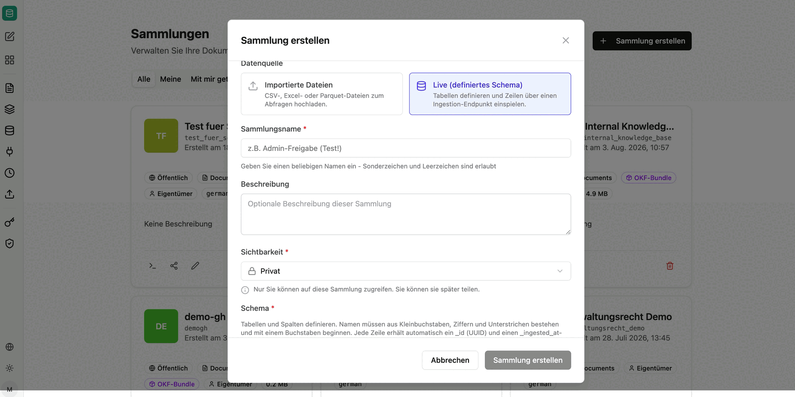
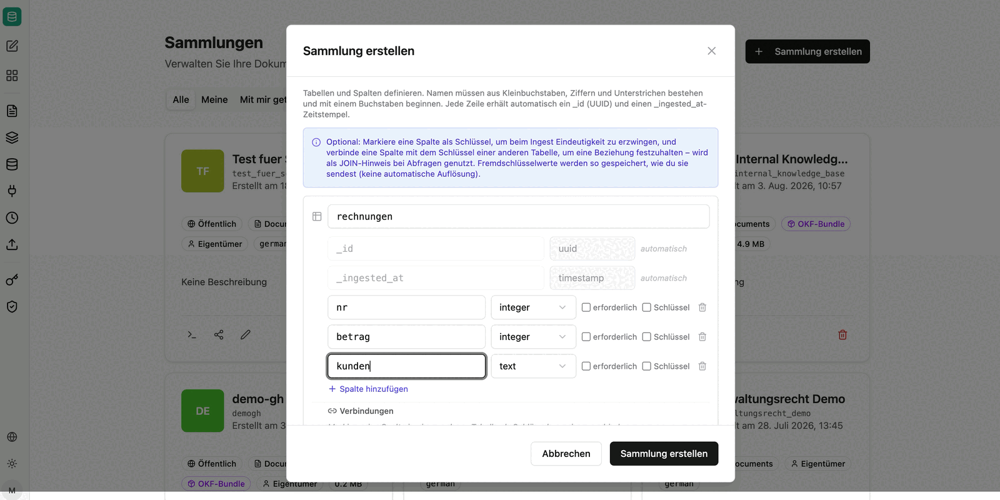

Datensatzsammlungen enthalten keine Dokumente, sondern Tabellen. Sie eignen sich für alles, was ohnehin tabellarisch vorliegt – Verkaufszahlen, Bestellungen, Stammdaten – und beantworten damit Fragen nach Summen, Mengen und Ranglisten, die eine semantische Suche nicht beantworten kann.

Beim Erstellen wählen Sie die Datenquelle:

- **Importierte Dateien**: CSV-, Excel- oder Parquet-Dateien zum Abfragen hochladen.
- **Live (definiertes Schema)**: Tabellen selbst definieren und Zeilen über einen Ingestion-Endpunkt einspielen.

## Importierte Dateien

Die Daten sollten immer in tabellarischer Form vorliegen. Möglich sind einzelne Tabellen ebenso wie mehrere zusammenhängende Tabellen – eine Excel-Arbeitsmappe kann beispielsweise mehrere Blätter enthalten, die gemeinsam importiert und über Joins abgefragt werden.

Der Import ist auch als [Quelle](/de/company-gpt/addons/companyrag/quellen/) möglich, etwa aus einem SharePoint-Ordner. Damit werden aktualisierte Dateien automatisch nachgezogen. Beim Synchronisieren werden die Dateien lediglich auf Validität geprüft und stehen dadurch sehr schnell zur Verfügung.

## Live definiertes Schema

Sie definieren Tabellen und Spalten mit Datentypen (`text`, `integer`, `numeric`, `boolean`, `timestamp`, `date`). Namen müssen aus Kleinbuchstaben, Ziffern und Unterstrichen bestehen und mit einem Buchstaben beginnen. Jede Zeile erhält automatisch `_id` (UUID) und `_ingested_at` (Zeitstempel).

Optional markieren Sie eine Spalte als **Schlüssel**, um beim Einspielen Eindeutigkeit zu erzwingen, und verbinden eine Spalte mit dem Schlüssel einer anderen Tabelle, um eine Beziehung festzuhalten. Diese Beziehung wird bei Abfragen als JOIN-Hinweis genutzt.

### Zeilen einspielen

Nach dem Erstellen steht ein Endpunkt pro Tabelle bereit. Der Aufruf erwartet ein Objekt mit einem `rows`-Array; jedes Objekt darin entspricht einer Zeile. Pro Aufruf können beliebig viele Zeilen übergeben werden, sodass ein Drittsystem die Tabelle kontinuierlich befüllen kann.

Die genaue Endpunkt-URL wird in der Sammlung angezeigt. Details zu Pfaden, Parametern und Antworten finden Sie in der [companyRAG API-Referenz](/de/api/company-rag-api/).

Für den Zugriff wird ein [API-Schlüssel](/de/company-gpt/addons/companyrag/api-schluessel/) benötigt.

:::danger
Ein API-Schlüssel handelt immer im Namen der Person, die ihn erstellt hat. Wird er weitergegeben, kann die empfangende Person über die Schnittstelle auf Inhalte zugreifen, die sie selbst nicht sehen dürfte. Jede Person und jedes System sollte einen eigenen Schlüssel erhalten.
:::

## Abfragen

Datensatzsammlungen werden nicht über die Content-Suche, sondern über die SQL-Tools des MCP-Servers `ai-search` abgefragt. Ein Agent kann damit das Schema lesen, Tabellen beschreiben und Abfragen über mehrere Tabellen mit Joins ausführen.

Welche Tools dafür aktiviert werden und welcher Prompt sich bewährt hat, beschreibt [companyRAG in CompanyGPT nutzen](/de/company-gpt/addons/companyrag/in-companygpt/).
