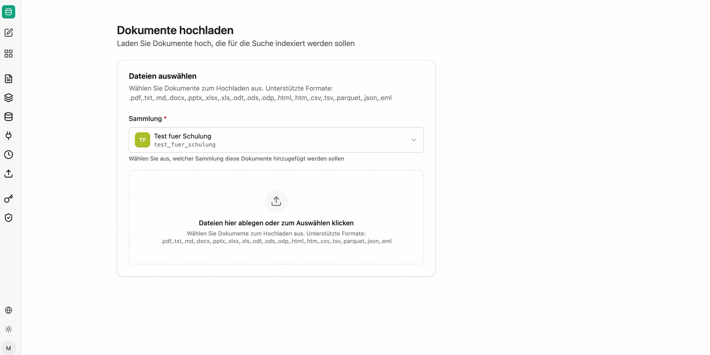

Über **Hochladen** fügen Sie einzelne oder mehrere Dateien direkt einer Sammlung hinzu. Das ist der schnellste Weg, um einen Bestand zu testen oder einmalige Dokumente zu ergänzen. Für wiederkehrende Bestände verwenden Sie stattdessen eine [Quelle](/de/company-gpt/addons/companyrag/quellen/).

Ablauf:

1. **Sammlung** auswählen, welcher die Dokumente hinzugefügt werden sollen.
2. Dateien in die Ablagefläche ziehen oder über Klick auswählen.
3. Der Upload wird als Auftrag angelegt und indexiert; den Status sehen Sie unter [Aufträge](/de/company-gpt/addons/companyrag/auftraege/).

## Unterstützte Formate

`.pdf`, `.txt`, `.md`, `.docx`, `.pptx`, `.xlsx`, `.xls`, `.odt`, `.ods`, `.odp`, `.html`, `.htm`, `.csv`, `.tsv`, `.parquet`, `.json`, `.eml`

:::note
Manuell hochgeladene Dokumente haben keine Quellverlinkung auf ein Originalsystem. Wenn Ihre Agenten in den Antworten auf die Originaldatei verlinken sollen, synchronisieren Sie die Dokumente stattdessen über eine [Quelle](/de/company-gpt/addons/companyrag/quellen/) wie SharePoint.
:::

Für tabellarische Daten, die per SQL abgefragt werden sollen, sind `.csv`, `.xlsx` und `.parquet` in einer [Datensatzsammlung](/de/company-gpt/addons/companyrag/datensaetze/) besser geeignet als eine Dokumentensammlung.
