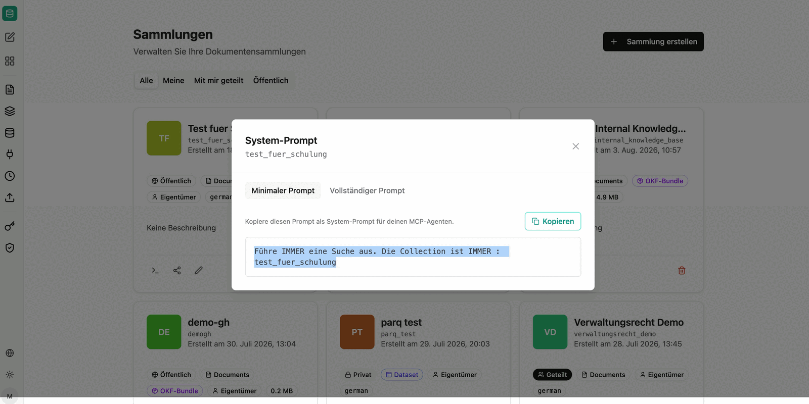
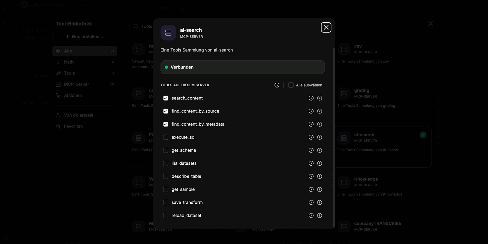
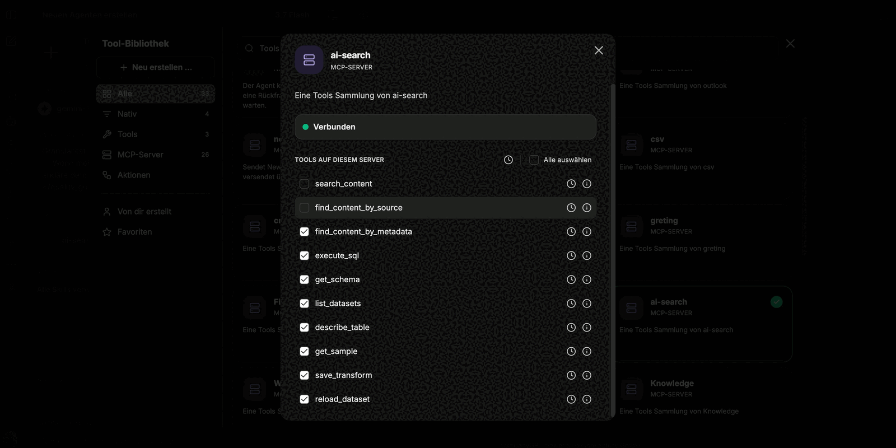
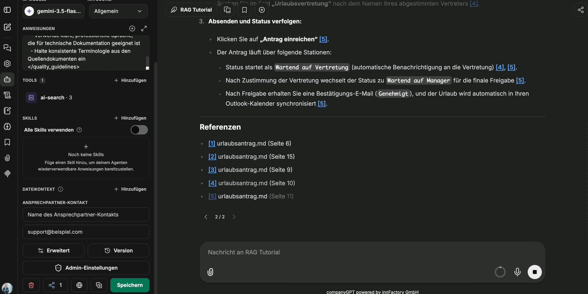
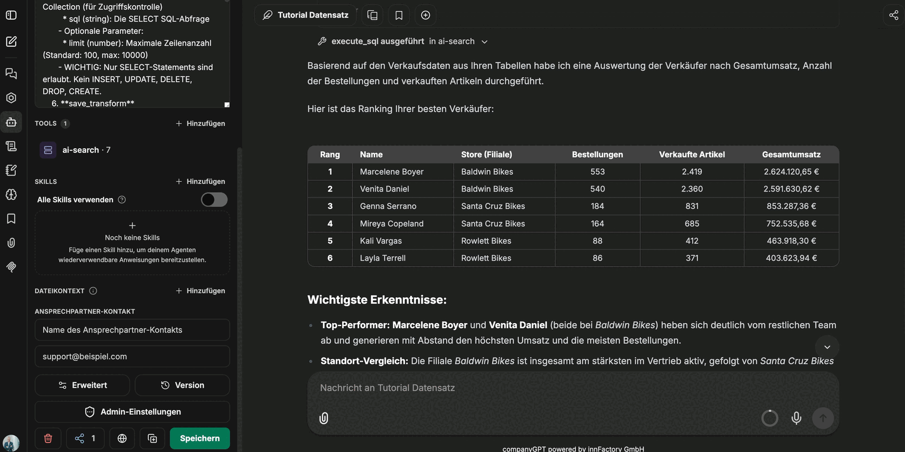

Über den [MCP Server](/de/company-gpt/integrationen/mcp-server/) `ai-search` lässt sich der RAG-Service mit CompanyGPT verbinden, um indexierte Dokumente über alle dem Nutzer zur Verfügung stehenden Sammlungen zu durchsuchen (s. [Ähnlichkeitssuche](/de/prompt-engineering/prompt-techniken/rag/#rag-workflow-für-die-dateiverarbeitung)).

Der MCP Server kann für einen erleichterten Umgang einem [Agenten](/de/company-gpt/agenten/) hinzugefügt werden.

## Beispiel-Prompt aus der Sammlung

Jede Sammlung stellt einen vorbereiteten System-Prompt bereit, in dem der technische Name der Sammlung bereits eingetragen ist. Sie erreichen ihn über das Terminal-Symbol an der Sammlung und kopieren ihn direkt in Ihren Agenten.

- **Minimaler Prompt**: Kurze Anweisung, die vor allem sicherstellt, dass der Agent immer sucht und die richtige Sammlung verwendet.
- **Vollständiger Prompt**: Ausführliche Variante, die zusätzlich das Antwortformat und die Quellenangaben vorgibt. Sie standardisiert die Ausgaben und erhöht die Qualität der Antworten deutlich.

:::tip[Hinweis]
Beginnen Sie mit dem vollständigen Prompt. Ohne Formatvorgabe fallen die Antworten knapp aus und enthalten keine Quellen.
:::

## Tools auswählen

Beim Agenten wird der MCP-Server `ai-search` hinzugefügt; anschließend aktivieren Sie die Tools, die zum Typ der Sammlung passen.

### Content-Such-Tools für Dokumentensammlungen

1. **search_content**:
   Semantische Ähnlichkeitssuche für allgemeine Anfragen. Standardwahl für die meisten Nutzerfragen.
   Erforderliche Parameter: `query` (Suchtext), `source` (Technischer Name der Sammlung)
   Optional: `topK` (Anzahl Ergebnisse: Standard 5, max. 20)

2. **find_content_by_source**:
   Abrufen aller Inhalte aus einem spezifischen Dokument. Nutzen bei Anfragen zu einzelnen Dokumenten (z. B. „Was steht in Dokumentation.md?").
   Erforderliche Parameter: `source` (Dokumentname), `collection` (Technischer Name der Sammlung)

3. **find_content_by_metadata**:
   Filterung von Inhalten nach Metadaten-Attributen. Nutzen bei gefilterten Ergebnissen (z. B. „Alle dringenden Aufgaben von 2026").
   Erforderliche Parameter: `filter` (JSON-Objekt mit Operatoren `$and`, `$or`, `$not`), `collection` (Technischer Name der Sammlung)

### SQL-Tools für Datensätze und strukturierte Daten

Für [Datensatzsammlungen](/de/company-gpt/addons/companyrag/datensaetze/) und [strukturierte Daten aus Dokumenten](/de/company-gpt/addons/companyrag/strukturierte-daten/) werden statt der Content-Such-Tools die SQL-basierten Tools aktiviert:

- **execute_sql**: Führt eine SQL-Abfrage über die Tabellen der Sammlung aus.
  Erforderliche Parameter: `collection` (Technischer Name der Sammlung, dient der Zugriffskontrolle), `sql` (die SELECT-Abfrage)
  Optional: `limit` (maximale Zeilenanzahl: Standard 100, max. 10000)
- **get_schema**: Liest das Schema der Sammlung – welche Tabellen und Spalten vorhanden sind.
- **list_datasets**: Listet die verfügbaren Datensätze auf.
- **describe_table**: Beschreibt eine einzelne Tabelle im Detail.
- **get_sample**: Liefert Beispielzeilen einer Tabelle, um Werte und Formate einzuschätzen.
- **save_transform** und **reload_dataset**: Weiterführende Tools zum Speichern von Transformationen und zum erneuten Laden eines Datensatzes.

:::note
Es sind ausschließlich SELECT-Statements erlaubt. Schreibende Anweisungen wie `INSERT`, `UPDATE`, `DELETE`, `DROP` oder `CREATE` werden abgelehnt. Zeilen werden ausschließlich über den Ingestion-Endpunkt einer Datensatzsammlung eingespielt.
:::

Die vollständige Beschreibung jedes Tools zeigt das Info-Symbol in der Tool-Bibliothek.

## Antworten mit Quellen

Im Verlauf sind die verwendeten Chunks einsehbar, sodass nachvollziehbar bleibt, worauf eine Antwort beruht. Gibt der Prompt Quellenangaben vor, führt der Agent die genutzten Dokumente zusätzlich am Ende der Antwort auf.

:::note
Eine klickbare Quellverlinkung auf die Originaldatei entsteht nur bei Dokumenten, die über eine [Quelle](/de/company-gpt/addons/companyrag/quellen/) synchronisiert wurden – etwa aus SharePoint. Bei manuell hochgeladenen Dateien wird die Quelle benannt, aber nicht verlinkt.
:::

Bei Datensatzsammlungen führt der Agent die Abfrage aus und stellt das Ergebnis als Tabelle dar – auch über mehrere Tabellen mit Joins.

:::tip[Hinweis]
Achten Sie darauf, dass im Prompt die richtige Sammlung eingetragen ist. Zeigt ein Agent auf eine andere Sammlung, bleibt die Antwort leer oder unpassend, obwohl die Daten vorhanden sind.
:::

Eine Schritt-für-Schritt-Anleitung zum Einrichten eines Such-Agenten mit passender Anweisung finden Sie im Tutorial **[CompanyRAG in CompanyGPT nutzen](/de/tutorials/addons/companyrag-in-companygpt/).**
