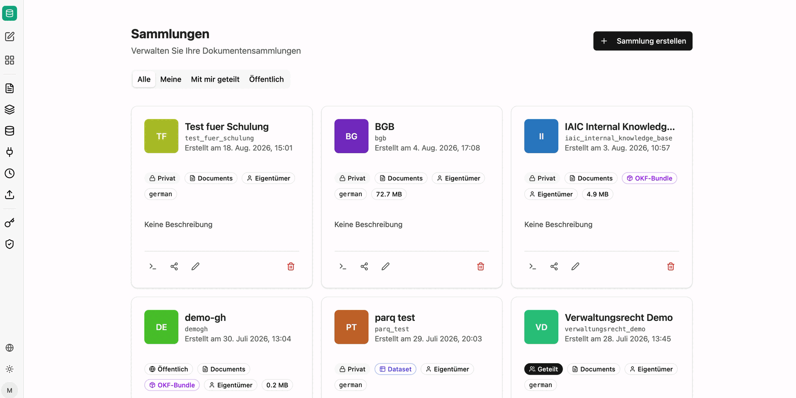

Mit dem companyRAG Addon können Sie große Mengen an Dokumenten für Ihre Agenten über die MCP-Schnittstelle verfügbar machen. Die Dokumente können aus unterschiedlichen Quellen indexiert werden und über die [RAG - Retrieval Augmented Generation](/de/prompt-engineering/prompt-techniken/rag/)-Methodik integriert werden. Es gibt hierbei keine Limitierung was die Länge der einzelnen Dokumente oder die Gesamtzahl angeht.

Die Indexierung kann hierbei einmalig oder wiederkehrend, basierend auf Ihrem Anwendungsfall, implementiert werden. Neben der klassischen semantischen Suche kann companyRAG aus denselben Dokumenten auch [strukturierte Daten extrahieren](/de/company-gpt/addons/companyrag/strukturierte-daten/) und [tabellarische Datensätze](/de/company-gpt/addons/companyrag/datensaetze/) per SQL abfragbar machen.

Erreichbar ist companyRAG für entsprechend berechtigte Nutzer im Bereich **Wissen**.

## Arten von Sammlungen

Alle Inhalte in companyRAG liegen in Sammlungen. Der Typ einer Sammlung entscheidet, wie die Inhalte abgelegt und abgefragt werden. In der Übersicht ist er als Badge an jeder Sammlung sichtbar.

| Typ | Inhalt | Abfrage |
|---|---|---|
| **Documents** | Dokumente aus Upload, SharePoint, Nextcloud, Google Drive, GitHub oder Web-Crawl | Semantische Suche und Volltextsuche; optional zusätzlich [strukturierte Felder](/de/company-gpt/addons/companyrag/strukturierte-daten/) |
| **Dataset** | Tabellen aus CSV-, Excel- und Parquet-Dateien oder über einen Ingestion-Endpunkt | SQL-Abfragen über eine oder mehrere Tabellen, inklusive Joins |
| **OKF-Bundle** | Markdown-Wissenssammlungen im [Open Knowledge Format](/de/company-gpt/addons/companyrag/okf-bundles/) in GitHub oder SharePoint | Wie eine Dokumentensammlung |

## companyRAG-Benutzeroberfläche

Die Benutzeroberfläche ermöglicht es, einzelne und mehrere Dateien oder ganze Datenquellen zur Indexierung hinzuzufügen.
Die Oberfläche gliedert sich in folgende Bereiche:

import sidebarImg from "./rag-sidebar-neu.png";

  
  

- [Sammlungen](/de/company-gpt/addons/companyrag/sammlungen/) – Speicherorte für Dokumente und Berechtigungen
- [Dateien](/de/company-gpt/addons/companyrag/dateien/) – alle indexierten Dateien mit Status
- [Hochladen](/de/company-gpt/addons/companyrag/hochladen/) – einzelne und mehrere Dateien manuell indexieren
- [Quellen](/de/company-gpt/addons/companyrag/quellen/) – automatische Synchronisation aus angebundenen Systemen
- [Integrationen](/de/company-gpt/addons/companyrag/integrationen/) – Verbindungen zu SharePoint, Nextcloud, Google Drive, GitHub und Web-Crawl
- [Aufträge](/de/company-gpt/addons/companyrag/auftraege/) – Indexierungsaufträge und deren Status
- [API-Schlüssel](/de/company-gpt/addons/companyrag/api-schluessel/) *(nur für Administratoren)*
- [Audit-Protokoll](/de/company-gpt/addons/companyrag/audit-protokoll/) *(nur für Administratoren)*

## Weiterführende Themen

- [Strukturierte Daten aus Dokumenten](/de/company-gpt/addons/companyrag/strukturierte-daten/) – typisierte Felder aus wiederkehrenden Dokumentenarten extrahieren
- [Datensatzsammlungen](/de/company-gpt/addons/companyrag/datensaetze/) – Tabellen importieren oder live über einen Endpunkt befüllen
- [OKF-Bundles](/de/company-gpt/addons/companyrag/okf-bundles/) – Wissenssammlungen als Markdown in GitHub oder SharePoint
- [companyRAG in CompanyGPT nutzen](/de/company-gpt/addons/companyrag/in-companygpt/) – MCP-Server `ai-search`, Tools und Agenten

## Downloads

- [companyRAG Windows Syncer 2.6.2](/downloads/companyRAG-syncer-windows-v2.6.2.zip)
