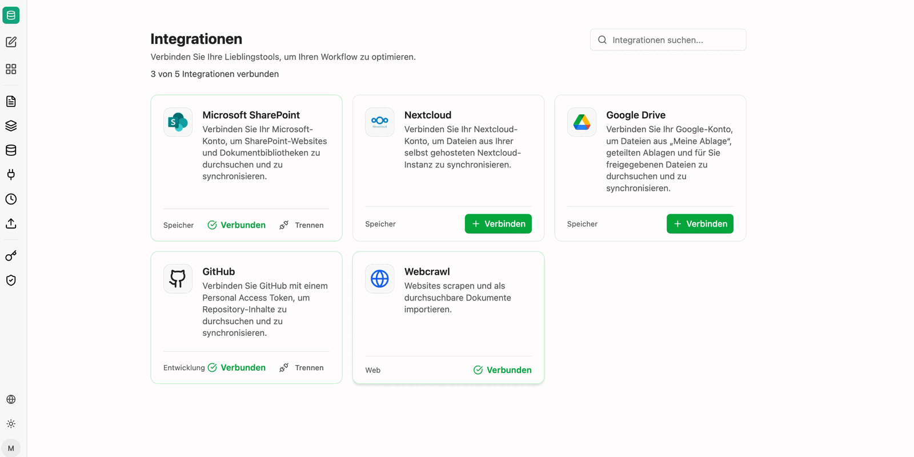

Integrationen sind die Verbindungen zu den Drittsystemen, aus denen companyRAG Dokumente beziehen kann. Eine Integration wird einmal verbunden und anschließend von beliebig vielen [Quellen](/de/company-gpt/addons/companyrag/quellen/) genutzt.

Die Übersicht zeigt je Integration den Namen, die Kategorie (Speicher, Entwicklung, Web) und den Verbindungsstatus. Verbundene Integrationen lassen sich über **Trennen** wieder lösen.

## Verfügbare Integrationen

| Integration | Zweck | Authentifizierung |
|---|---|---|
| **Microsoft SharePoint** | SharePoint-Websites und Dokumentbibliotheken durchsuchen und synchronisieren | Anmeldung mit dem Microsoft-Konto |
| **Nextcloud** | Dateien aus einer selbst gehosteten Nextcloud-Instanz synchronisieren | URL, Benutzername und App-Passwort |
| **Google Drive** | Dateien aus „Meine Ablage", geteilten Ablagen und für Sie freigegebenen Dateien synchronisieren | OAuth-Anmeldung mit dem Google-Konto |
| **GitHub** | Repository-Inhalte durchsuchen und synchronisieren | Personal Access Token |
| **Web-Crawl** | Websites scrapen und als durchsuchbare Dokumente importieren | Keine Anmeldung erforderlich |

:::note
Wird eine Integration getrennt, bleiben bereits importierte Dateien in den Sammlungen erhalten, werden jedoch nicht mehr automatisch aktualisiert. Läuft eine Anmeldung ab, verbinden Sie die Integration erneut, um die Synchronisation fortzusetzen.
:::

Ist eine Integration verbunden, legen Sie den konkret zu synchronisierenden Ordner, das Repository oder die Sitemap unter [Quellen](/de/company-gpt/addons/companyrag/quellen/) an. GitHub und SharePoint dienen zusätzlich als Speicherort für [OKF-Bundles](/de/company-gpt/addons/companyrag/okf-bundles/).
