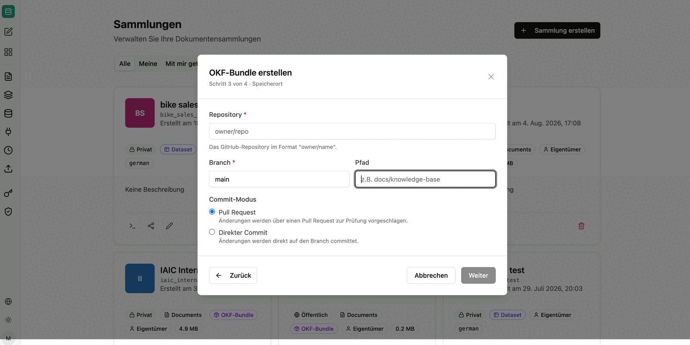

OKF-Bundles sind Wissenssammlungen im **Open Knowledge Format** – einem offengelegten, quelloffenen Format, das Wissen als Markdown-Dateien mit einer definierten Ordnerstruktur beschreibt. Das Wissen bleibt damit dort, wo es versioniert und geprüft werden kann: in einem GitHub-Repository oder einem SharePoint-Ordner.

Da das Bundle als Sammlung verbunden ist, sind seine Inhalte automatisch in companyRAG durchsuchbar.

:::note
OKF-Bundles sind aktuell experimentell. Struktur und Bedienung können sich noch ändern.
:::

## Bundle anlegen

Das Anlegen erfolgt in vier Schritten.

**Schritt 1 – Details:** Bundle-Name, optionale Beschreibung und Sichtbarkeit.

**Schritt 2 – Quelle:** Auswahl, wo das Wissen liegt.

- **GitHub**: Markdown-Dateien in einem GitHub-Repository, synchronisiert von einem Branch.
- **SharePoint**: Markdown-Dateien in einem SharePoint-Dokumentbibliotheksordner.

**Schritt 3 – Speicherort:** Bei GitHub geben Sie Repository im Format `owner/name`, Branch und optional einen Pfad an. Innerhalb eines leeren Repositorys oder des angegebenen Unterpfads wird die OKF-Struktur inklusive Index- und Log-Datei angelegt.

Über den **Commit-Modus** legen Sie fest, wie Änderungen zurückgeschrieben werden:

- **Pull Request**: Änderungen werden über einen Pull Request zur Prüfung vorgeschlagen.
- **Direkter Commit**: Änderungen werden direkt auf den Branch committet.

Bei SharePoint wählen Sie stattdessen den Zielordner; dort wird das OKF-Bundle inklusive Unterordner abgelegt.

**Schritt 4 – Bestätigung:** Im letzten Schritt bestätigen Sie die Angaben; anschließend wird das Bundle angelegt und als Sammlung verbunden.

## Bundles pflegen

In CompanyGPT steht ein Agent bereit, der OKF-Bundles und die darin enthaltenen Markdown-Dateien selbst erstellen und fortschreiben kann. In Kombination mit dem Commit-Modus *Pull Request* entsteht daraus ein prüfbarer Ablauf: Der Agent schlägt Änderungen am Wissensbestand vor, ein Mensch gibt sie frei.

:::tip[Hinweis]
Für OKF-Bundles empfiehlt sich die Chunking-Strategie **Markdown-basiert**, da die Inhalte über Überschriften strukturiert sind. Siehe [Chunking-Strategien](/de/company-gpt/addons/companyrag/sammlungen/#chunking-strategien).
:::

Voraussetzung ist eine verbundene [GitHub- oder SharePoint-Integration](/de/company-gpt/addons/companyrag/integrationen/).
