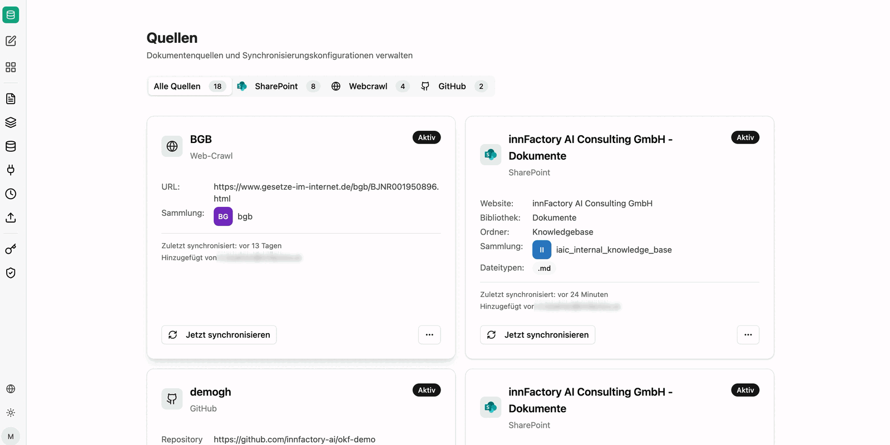
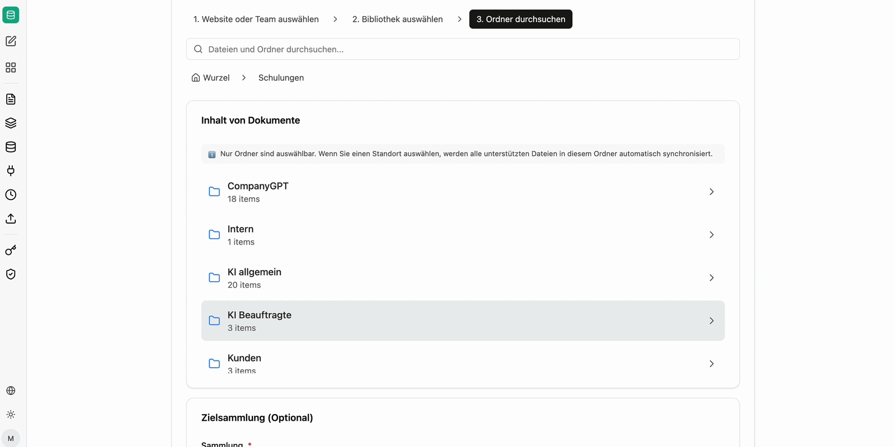
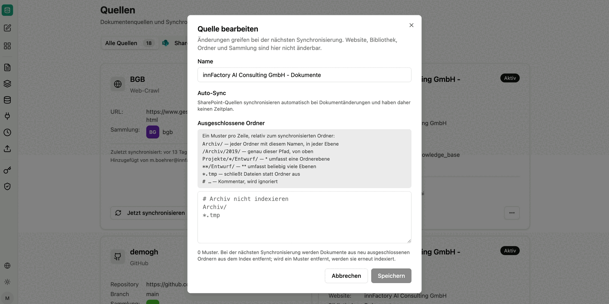

Quellen verbinden companyRAG dauerhaft mit einem Drittsystem und synchronisieren Dokumente automatisch in eine [Sammlung](/de/company-gpt/addons/companyrag/sammlungen/). Neue und geänderte Dateien werden nachgezogen, ohne dass Sie sie erneut hochladen müssen.

Voraussetzung ist eine verbundene [Integration](/de/company-gpt/addons/companyrag/integrationen/).

Die Übersicht lässt sich nach System filtern und zeigt je Quelle die Konfiguration, die Zielsammlung, den Zeitpunkt der letzten Synchronisation und die Person, die sie angelegt hat.

## Web-Crawl

Einzelne Webseiten, Listen (in CSV-Dateien) sowie gesamte Website-Sitemaps können gecrawlt und indexiert werden. Dabei können Sie einstellen, wie häufig das Crawling wiederholt werden soll. Bei einzelnen Seiten wird immer die gesamte Seite neu indexiert. Bei Sitemap-Crawlings wird nur die Differenz anhand des letzten Crawls sowie des Änderungsdatums berücksichtigt.

Für ganze Websites wechseln Sie auf den Reiter `Sitemap`. Über den **Pfadpräfix-Filter** bestimmen Sie, welche Seiten indexiert werden: `/tutorials/` importiert beispielsweise nur URLs, deren Pfad mit `/tutorials/` beginnt.

## SharePoint anbinden

Über den Button „+ SharePoint verbinden" startet die Auswahl.

1. **Website oder Team auswählen**: Auswahl der SharePoint-Website oder des Teams
2. **Bibliothek auswählen**: Bibliotheken der/des ausgewählten Website/Teams
3. **Ordner durchsuchen**: Auswahl des Ordners und der Dateitypen zur Synchronisierung. Festlegung der Sammlung, in die die Dateien synchronisiert werden sollen.

:::note
Nur Ordner sind auswählbar. Alle unterstützten Dateien in diesem Ordner und in darunter liegenden hierarchischen Ebenen (Unterordner) werden automatisch synchronisiert.
:::

Nach der Verbindung erscheint der Ordner unter „Alle Quellen" als Aktiv. Die Synchronisation muss einmalig über den Button „Jetzt synchronisieren" angestoßen werden. Anschließend werden die verbundenen Dokumente als Aufträge zur Synchronisation hinzugefügt und zukünftige Inhalte des Ordners automatisch synchronisiert.

:::tip[Berechtigungen]
Bei der Synchronisation werden die Berechtigungen des Quellsystems mit übergeben. Ein Nutzer sieht über companyRAG damit niemals mehr Inhalte, als er über die SharePoint-Oberfläche sehen würde.
:::

## Nextcloud, Google Drive und GitHub

Nextcloud, Google Drive und GitHub funktionieren nach demselben Prinzip: Integration verbinden, Quelle anlegen, Ordner beziehungsweise Repository durchsuchen und die zu indexierenden Dateitypen sowie die Zielsammlung festlegen.

## Synchronisationsintervall

Je Quelle legen Sie fest, wie oft synchronisiert wird: **nur manuell**, **stündlich**, **täglich** oder **wöchentlich**.

Jeder Lauf überträgt nur die Differenz – also Inhalte mit neuerem Änderungsdatum, die noch nicht synchronisiert wurden. Unveränderte Dokumente werden nicht erneut indexiert.

## Ordner ausschließen

Bei SharePoint-Quellen können Sie unter **Bearbeiten** einzelne Bereiche ausschließen, etwa Entwürfe oder Archive. Die zulässige Syntax ist direkt im Dialog beschrieben.

## Quellen-Aktionen

- **Jetzt synchronisieren**: Initiale/manuelle Synchronisation starten
- **Bearbeiten**: Name, Synchronisationsintervall und ausgeschlossene Ordner anpassen
- **Pausieren/Fortsetzen**: Ausgewählte Quellen deaktivieren oder reaktivieren
- **Löschen**: Entfernen der Datenquelle – bereits synchronisierte Dateien bleiben in der Sammlung bestehen

Den Fortschritt der Läufe verfolgen Sie unter [Aufträge](/de/company-gpt/addons/companyrag/auftraege/).
