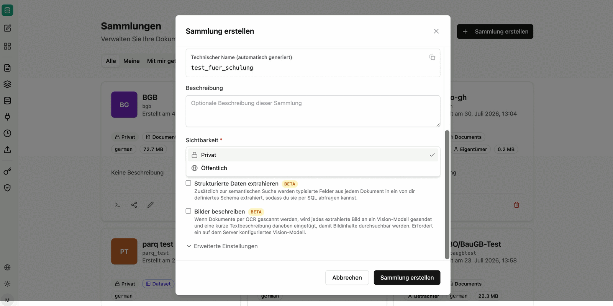
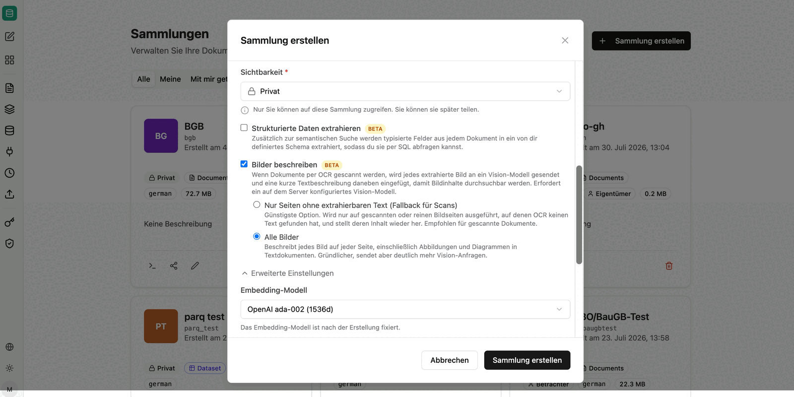

Sammlungen sind Speicherorte und ermöglichen es, Dokumente und Berechtigungen zu organisieren. Jede Sammlung ist unabhängig durchsuchbar, und jede Freigabe wird auf Ebene der Sammlung erteilt.

Alle Sammlungen, die Sie besitzen, erscheinen unter dem Reiter `Meine`. Spezifisch für Sie geteilte Sammlungen (Rolle Admin oder Betrachter) werden unter `Mit mir geteilt` angezeigt. Unter `Öffentlich` werden alle öffentlich sichtbaren Sammlungen angezeigt.

## Sammlung erstellen

Beim Erstellen legen Sie Name, Beschreibung und Sichtbarkeit fest. Der technische Name wird automatisch aus dem Namen generiert – er wird später in Agenten-Prompts und in den MCP-Tools als `collection` bzw. `source` verwendet.

Bei der Sichtbarkeit stehen zwei Optionen zur Verfügung:

- **Privat**: Nur Sie können auf diese Sammlung und die damit verknüpften Dokumente zugreifen. Sie können die Sammlung jederzeit später teilen.
- **Öffentlich**: Alle Nutzer Ihrer Organisation können die Sammlung sehen und Dateien daraus anzeigen – ausschließlich unternehmensintern.

Zusätzlich können zwei Verarbeitungsoptionen aktiviert werden:

- **Strukturierte Daten extrahieren** *(BETA)*: Zusätzlich zur semantischen Suche werden typisierte Felder aus jedem Dokument in ein von Ihnen definiertes Schema extrahiert und per SQL abfragbar. Siehe [Strukturierte Daten aus Dokumenten](/de/company-gpt/addons/companyrag/strukturierte-daten/).
- **Bilder beschreiben** *(BETA)*: Bildinhalte werden über ein Vision-Modell in Text überführt (siehe unten).

## Erweiterte Einstellungen

| Einstellung | Bedeutung |
|---|---|
| **Embedding-Modell** | Modell für die Vektorisierung der Inhalte, z. B. `OpenAI ada-002 (1536d)`. |
| **Suchsprache** | Sprache für die Volltextsuche, die zusätzlich zur KI-Suche ausgeführt wird. Sie sollte zur Sprache der Inhalte passen, damit Füllwörter korrekt entfernt und Wortformen richtig reduziert werden. |
| **Chunking-Strategie** | Wie Dokumente für die Suche in Abschnitte aufgeteilt werden (siehe unten). |
| **Chunk-Größe** | Anzahl der Zeichen pro Chunk. Standard: 1000. |
| **Chunk-Überlappung** | Anzahl der Zeichen, die sich zwischen aufeinanderfolgenden Chunks überlappen. Standard: 200. |

:::note
Embedding-Modell, Suchsprache und Chunking-Strategie sind nach der Erstellung der Sammlung fixiert und können nachträglich nicht mehr geändert werden. Prüfen Sie diese Einstellungen daher vor dem Anlegen – insbesondere bei großen Beständen, die sonst neu indexiert werden müssten.
:::

### Chunking-Strategien

- **Zeichenbasiert (Standard)**: Feste Chunk-Größe mit Überlappung, standardmäßig 1000 Zeichen mit 200 Zeichen Überlappung. Geeignet für gemischte Bestände ohne verlässliche Struktur.
- **Markdown-basiert**: Alles zwischen zwei Überschriften bildet einen Chunk. Empfohlen für Wikis, Dokumentationen und [OKF-Bundles](/de/company-gpt/addons/companyrag/okf-bundles/).
- **Semantisch (absatzbasiert)**: Jeder Absatz bildet einen Chunk. Geeignet für Texte mit klar abgegrenzten Absätzen.

## Bilder beschreiben

Alle Dokumente – etwa als PDF hochgeladene Scans – laufen durch eine OCR-Pipeline. Wenn OCR keinen Text findet oder Abbildungen inhaltlich relevant sind, kann companyRAG jedes Bild an ein Vision-Modell senden und eine kurze Textbeschreibung an der passenden Stelle im Dokument einfügen. Dadurch werden Bildinhalte durchsuchbar.

- **Nur Seiten ohne extrahierbaren Text (Fallback für Scans)**: Günstigste Option. Wird nur auf gescannten oder reinen Bildseiten ausgeführt, auf denen OCR keinen Text gefunden hat, und stellt deren Inhalt wieder her. Empfohlen für gescannte Dokumente.
- **Alle Bilder**: Beschreibt jedes Bild auf jeder Seite, einschließlich Abbildungen und Diagrammen in Textdokumenten. Gründlicher, sendet aber deutlich mehr Vision-Anfragen.

:::note
Die Bildbeschreibung erfordert ein auf dem Server konfiguriertes Vision-Modell.
:::

## Sammlungen-Aktionen

- **Teilen:**
  - **Typ**: Mit einzelnen Nutzern, einer Entra-Gruppe oder der ganzen Organisation teilen.
  - **Rolle**: Betrachter (Sammlung und zugehörige Dokumente können angezeigt und durchsucht werden) oder Admin (Sammlung und zugehörige Dokumente können bearbeitet werden, inklusive Hochladen und Löschen von Dateien). Die Rolle Eigentümer hat die volle Kontrolle über die Sammlung.
    Nach Bestätigung durch `Add Share` wird die Freigabe erteilt und in die Liste `Current Shares` aufgenommen.
- **Bearbeiten**: Name und Beschreibung der Sammlung ändern.
- **Löschen**: Sammlung löschen.

:::note
Mit der ganzen Organisation geteilte Sammlungen werden immer nur mit Lesezugriff freigegeben, damit nicht jeder Nutzer Inhalte verändern kann. Individuelle Freigaben können dagegen die Rolle Admin erhalten.
:::

:::danger
Das Löschen einer Sammlung löscht alle verknüpften Dokumente und Aufträge der Sammlung unwiderruflich!
:::

## Weiter

- Inhalte hinzufügen: [Hochladen](/de/company-gpt/addons/companyrag/hochladen/) oder [Quellen](/de/company-gpt/addons/companyrag/quellen/)
- Sammlung abfragen: [companyRAG in CompanyGPT nutzen](/de/company-gpt/addons/companyrag/in-companygpt/)
