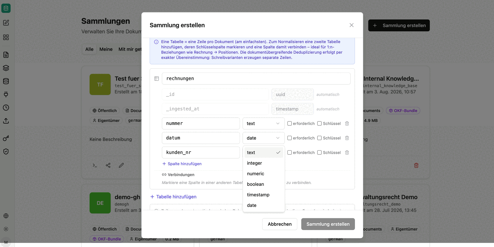
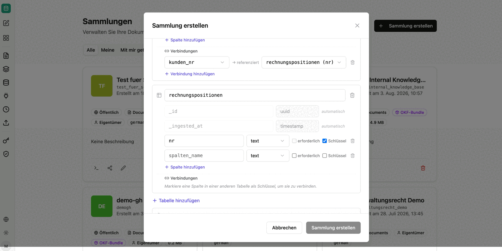

Eine reine RAG-Suche findet Textstellen, kann aber keine Summen, Mengen oder Ranglisten berechnen. Für wiederkehrende Dokumentenarten – Rechnungen, Verträge, Prüfberichte – kann companyRAG deshalb zusätzlich **strukturierte Daten** aus den Dokumenten extrahieren: Ein Sprachmodell füllt ein von Ihnen definiertes Tabellenschema, das anschließend per SQL abfragbar ist.

Damit stehen für dieselbe Sammlung zwei Zugriffswege bereit, die sich kombinieren lassen: die semantische Suche über den Text und die strukturierte Abfrage über die extrahierten Felder.

Aktivieren Sie die Option **Strukturierte Daten extrahieren** *(BETA)* beim [Erstellen der Sammlung](/de/company-gpt/addons/companyrag/sammlungen/#sammlung-erstellen).

:::note
Diese Funktion befindet sich in der Beta-Phase. Prüfen Sie die extrahierten Werte bei kritischen Auswertungen stichprobenartig gegen die Originaldokumente.
:::

## Schema definieren

Der einfachste Fall ist eine Tabelle mit einer Zeile pro Dokument. Je Spalte legen Sie Namen und Datentyp fest und markieren optional, ob das Feld erforderlich ist oder als Schlüssel dient.

Verfügbare Datentypen: `text`, `integer`, `numeric`, `boolean`, `timestamp`, `date`.

Namen müssen aus Kleinbuchstaben, Ziffern und Unterstrichen bestehen und mit einem Buchstaben beginnen. Jede Zeile erhält automatisch die Felder `_id` (UUID) und `_ingested_at` (Zeitstempel).

Zusätzlich lässt sich beschreiben, welche Informationen extrahiert werden sollen, und die Anzahl der auszuwertenden Seiten pro Dokument begrenzen – etwa auf die ersten fünf Seiten, wenn die relevanten Angaben immer am Anfang stehen. Das reduziert Kosten und Laufzeit.

## Mehrere Tabellen und Beziehungen

Für 1:n-Beziehungen – etwa eine Rechnung mit mehreren Positionen – fügen Sie eine zweite Tabelle hinzu, markieren dort die Schlüsselspalte und verbinden eine Spalte der ersten Tabelle damit.

Die Verbindung wird bei Abfragen als JOIN-Hinweis genutzt. Aus einem Dokument entstehen dann mehrere Zeilen in der Positionstabelle, während die Kopfdaten einmalig in der ersten Tabelle liegen.

:::note
Die dokumentübergreifende Deduplizierung erfolgt über exakte Übereinstimmung: Abweichende Schreibweisen desselben Werts erzeugen separate Zeilen. Fremdschlüsselwerte werden so gespeichert, wie sie extrahiert wurden – es findet keine automatische Auflösung statt.
:::

## Abfragen

Die extrahierten Tabellen werden über die SQL-Tools des MCP-Servers `ai-search` abgefragt, genau wie [Datensatzsammlungen](/de/company-gpt/addons/companyrag/datensaetze/). Welche Tools ein Agent dafür benötigt, beschreibt [companyRAG in CompanyGPT nutzen](/de/company-gpt/addons/companyrag/in-companygpt/).
