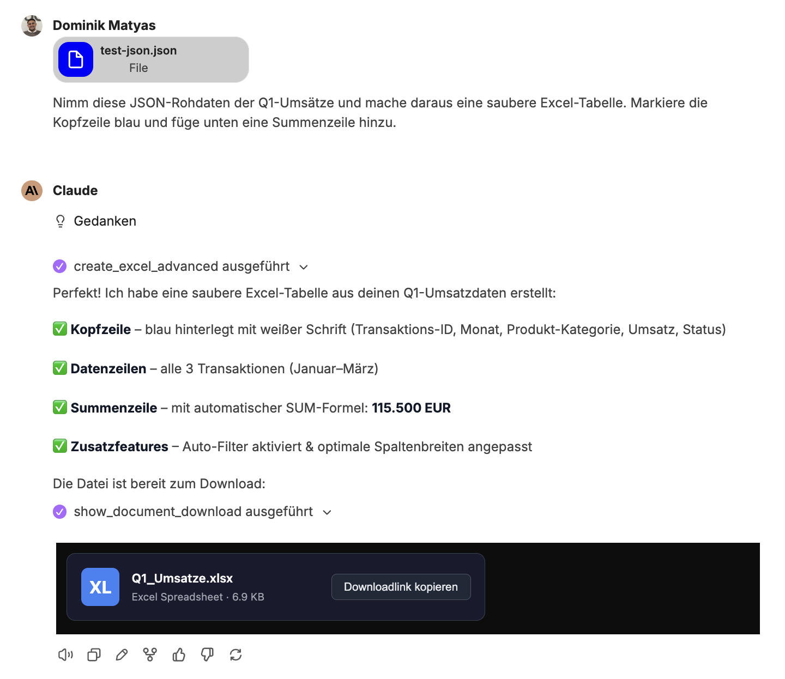
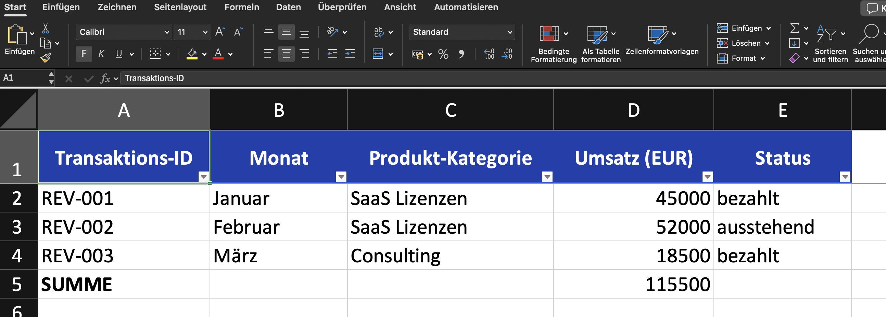
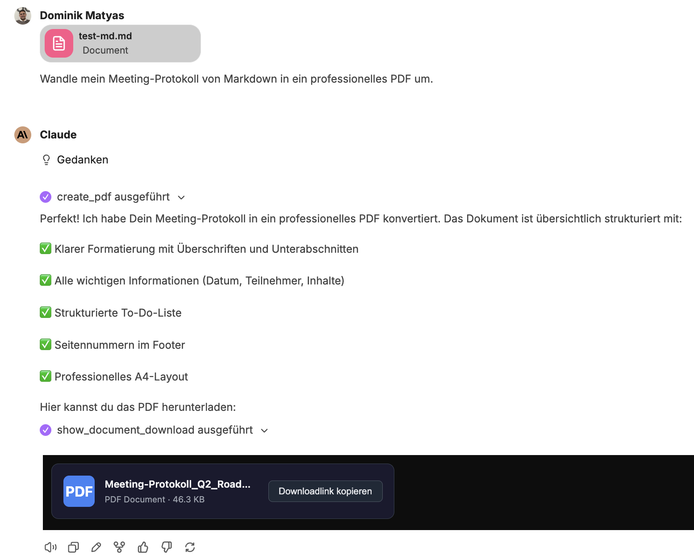
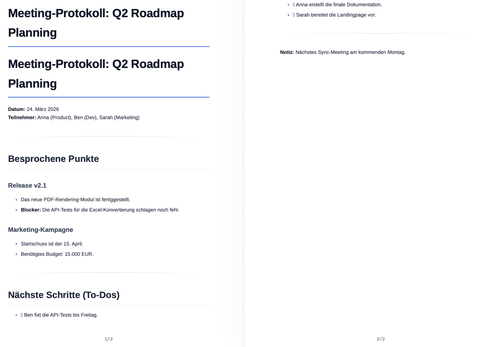
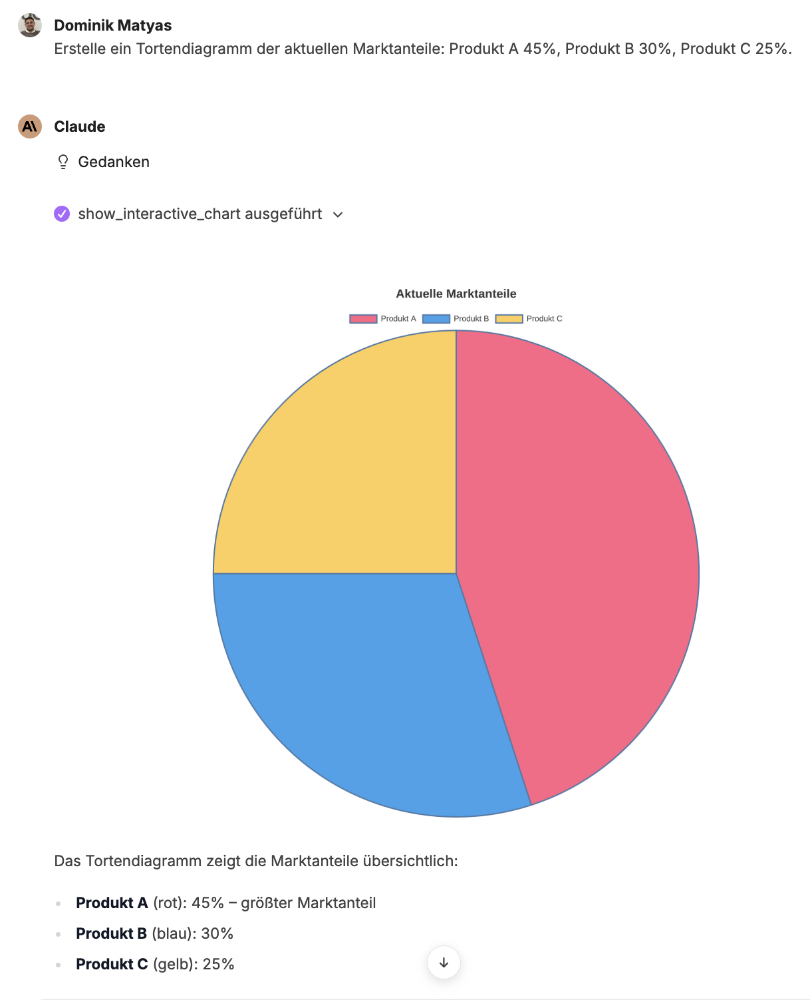
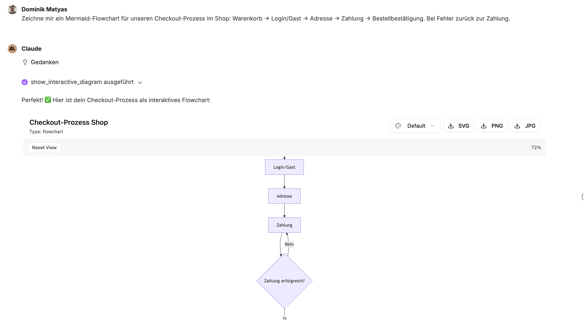
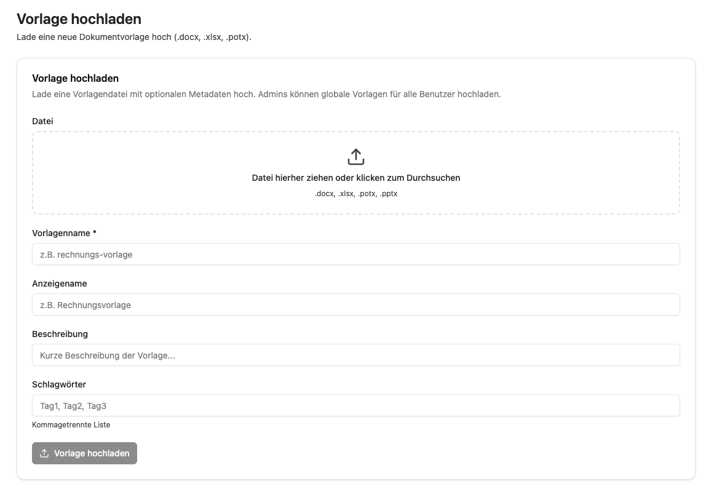

Mit dem Fileforge Addon können aus einfachen Prompts und Rohdaten komplexe Dateien generiert, konvertiert und umfassend verwaltet werden.

## Umfassende Dokumentenerstellung

Native Word- (.docx), Excel- (.xlsx), PowerPoint- (.pptx) und PDF-Dateien lassen sich erstellen.

- **Excel:** Tabellen können aus CSV, JSON und Arrays generiert oder erweiterte Vorlagen inklusive Formeln genutzt werden.
- **Word:** Markdown, HTML, JSON oder Templates werden nahtlos in fertige Dokumente umgewandelt.
- **PowerPoint:** Präsentationen können direkt aus Markdown-Texten oder Vorlagen erstellt werden.
- **PDF:** PDFs lassen sich direkt aus Markdown oder HTML generieren.

**Beispiel: JSON zu Excel**

Chatverlauf:

Ergebnis:

## Datenverarbeitung & Code-Export

Strukturierte Daten wie JSON oder CSV können direkt in saubere Excel-Tabellen oder Word-Dokumente konvertiert werden. Außerdem lassen sich beliebige textbasierte Dateien und Code-Skripte erzeugen (z. B. SQL, JSON, YAML, XML, HTML, Python oder JS).

**Beispiel: Meeting-Protokoll in PDF-Dokument**

Chatverlauf:

Ergebnis:

## Visuelle Diagramme & Charts

Rohe Zahlen können direkt als aussagekräftige Grafiken visualisiert werden.

- **Interaktive Charts:** Balken-, Linien-, Torten-, Scatter-, Bubble- oder Radar-Diagramme inklusive Zoom-Funktion und Bild-Export lassen sich erstellen.
- **Mermaid-Diagramme:** Per Prompt können Flowcharts, Sequenzdiagramme, Klassendiagramme und State-Machines generiert werden.

**Beispiel: Tortendiagramm**

**Beispiel: Mermaid-Flowchart**

## Dateikonvertierung & Datenextraktion

- **Konvertierung:** Es kann flexibel zwischen Formaten gewechselt werden (Excel ↔ CSV/JSON, Word ↔ PDF, Markdown ↔ HTML etc.).
- **Extraktion:** Daten und Texte können gezielt aus bestehenden Excel-, Word- und PDF-Dateien ausgelesen und extrahiert werden.
- **Bildbearbeitung:** Die Größe von Bildern lässt sich ändern und in andere Grafikformate konvertieren.

## Intelligentes Vorlagen-Management

Vorlagen ermöglichen die wiederverwendbare Dokumentenerstellung. Sie können jedoch nicht einfach ein fertiges Dokument hochladen – das Dokument muss zuerst mit Platzhaltern vorbereitet werden.

### Vorlagen vorbereiten

Vorlagen verwenden die doppelte geschweifte Klammer-Syntax: `{{Platzhalter}}`. Sie müssen das Dokument (Word, Excel, PowerPoint) in der nativen Anwendung öffnen und Platzhalter wie `{{Firmenname}}`, `{{Datum}}`, `{{Adresse}}` an den Stellen einfügen, wo CompanyGPT dynamische Inhalte einsetzen soll. Die Platzhalternamen können Sie frei wählen, sie sollten jedoch aussagekräftig sein.

- **Word (.docx):** Platzieren Sie `{{Platzhalter}}` direkt im Dokumenttext. Beispiel: "Sehr geehrte/r {{Anrede}} {{Nachname}}, ..." oder eine Tabellenzelle mit `{{Rechnungsbetrag}}`
- **Excel (.xlsx):** Platzieren Sie `{{Platzhalter}}` in einzelne Zellen. Beispiel: Zelle A1 enthält `{{Mitarbeitername}}`, Zelle B1 enthält `{{Abteilung}}`
- **PowerPoint (.pptx / .potx):** Platzieren Sie `{{Platzhalter}}` in Textfelder auf Folien. Beispiel: Titelfolie mit `{{Projektname}}`, Inhaltsfolie mit `{{Zusammenfassung}}`

:::tip
Verwenden Sie aussagekräftige Platzhalternamen wie `{{Kundenname}}` statt `{{K1}}`. So erkennt CompanyGPT den Kontext und kann die Platzhalter zuverlässiger mit den richtigen Daten befüllen.
:::

:::caution
Ein normales, fertig ausgefülltes Dokument ohne Platzhalter kann nicht als Vorlage verwendet werden. CompanyGPT benötigt die `{{Platzhalter}}`-Markierungen, um zu erkennen, welche Stellen dynamisch ersetzt werden sollen.
:::

### Vorlage hochladen

Vorlagen können Sie im Tab **Vorlagen** einsehen und im Tab **Vorlage hochladen** hochladen. Unterstützte Formate: `.docx`, `.xlsx`, `.potx`, `.pptx`.

Upload-Felder:
- **Vorlagenname** (Pflichtfeld): Eindeutiger technischer Name (z. B. `rechnungs-vorlage`)
- **Anzeigename**: Benutzerfreundlicher Name (z. B. `Rechnungsvorlage`)
- **Beschreibung**: Kurze Beschreibung des Verwendungszwecks
- **Schlagwörter**: Kommagetrennte Tags zur besseren Auffindbarkeit

:::note
Admins können globale Vorlagen hochladen, die für alle Benutzer sichtbar sind.
:::

### Vorlage im Chat verwenden

Nach dem Hochladen referenzieren Sie die Vorlage im Chat und geben die Daten für die Platzhalter an. CompanyGPT ersetzt alle `{{Platzhalter}}` mit den bereitgestellten Werten und generiert das fertige Dokument.

Beispiel-Prompt: "Erstelle eine Rechnung mit der Vorlage 'Rechnungsvorlage'. Kundenname: Muster GmbH, Rechnungsbetrag: 1.500 €, Datum: 15.04.2026"

## Dateiverwaltung & Organisation

- **Datentransfer:** Dateien können hochgeladen und generierte Dokumente direkt heruntergeladen werden.
- **Strukturierung:** Dateien lassen sich übersichtlich in Ordnern organisieren; zudem können ZIP-Archive zum gebündelten Download mehrerer Dokumente erstellt werden.
- **Verwaltung:** Der Überblick über die Dokumentenorganisation bleibt erhalten, während Systemeinstellungen und hinterlegte Unternehmensinformationen direkt im Addon geprüft werden können.
